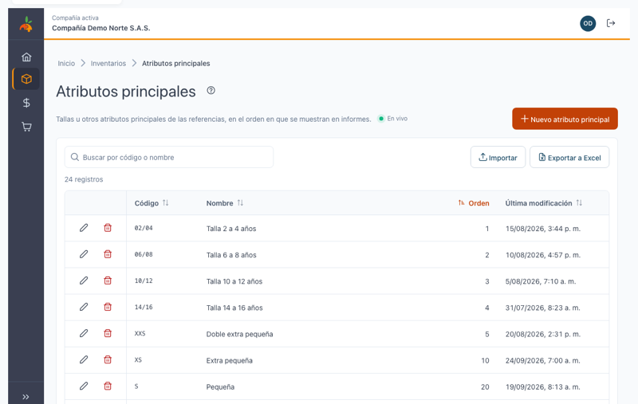
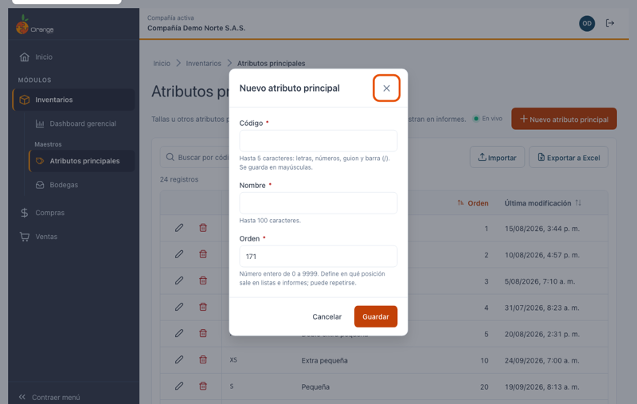
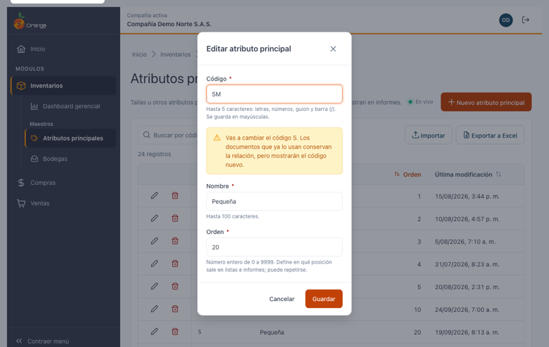
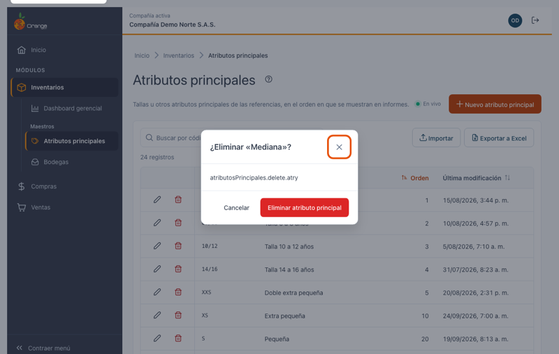

[Regresar a Inventarios](../readme.md)

---

# 📏 Atributos principales

---

## 📋 Descripción

Los **atributos principales** son las características con las que se combinan las referencias para formar sus variantes. Casi siempre son las **tallas**: `XS`, `S`, `M`, `L`, o tallas dobles como `02/04` y `06/08`. Junto con el atributo secundario (por ejemplo, el color), definen cada variante de una referencia.

Cada atributo tiene un **Orden**, que indica en qué posición aparece en los informes, las matrices de tallas y las listas. Así las tallas salen en su orden lógico (`XS`, `S`, `M`, `L`…) y no en orden alfabético.

En esta pantalla puede **consultar, crear, editar, eliminar, exportar e importar** los atributos principales de la compañía con la que está trabajando.

> 📘 La búsqueda, el orden, la paginación, la exportación y la ayuda funcionan igual en todas las tablas: ver [Manejo general de la información](../../Generales/manejo-general-informacion.md).

> 💡 Cada pestaña del navegador trabaja con **una compañía**. El nombre y el color de la compañía se ven en el título de la pestaña y en la barra superior.

---

## 🎯 Acceso

1. En el menú principal, haga clic en **Inventarios**.
2. En **Maestros**, haga clic en **Atributos principales**.

---

## 🖥️ Pantalla principal

| Elemento | Para qué sirve |
|----------|----------------|
| **?** (junto al título) | Abre esta ayuda en un panel lateral, sin salir de la pantalla. |
| **En vivo** | La pantalla está conectada: los cambios de otros usuarios aparecen solos. Ver *Cambios de otros usuarios* más abajo. |
| **Nuevo atributo** | Crea un atributo principal. |
| **Buscar por código o nombre** | Filtra el listado mientras escribe. No distingue mayúsculas ni tildes. |
| **Importar** | Crea o actualiza atributos desde un archivo de Excel. Ver [Importar atributos principales](atributos-principales-importar.md). |
| **Exportar a Excel** | Descarga el listado (con el filtro y el orden que tenga en pantalla). |
| **Lápiz** / **Papelera** | Editar o eliminar el atributo de esa fila. Siempre están en la **primera columna**, visibles aunque la tabla tenga que desplazarse. |
| **Orden** | Posición del atributo en informes y matrices. Al abrir la pantalla, la tabla viene ordenada por esta columna y, si dos atributos tienen el mismo orden, por código. |
| **Encabezados** | Un clic ordena de forma ascendente, el segundo descendente y el tercero vuelve al orden inicial. |
| **Filas por página** y paginación | Cambian cuántos atributos ve y la página. |

> 📱 En el celular cada atributo se muestra como una tarjeta, con las acciones arriba.

**¿No ve algún botón?** Cada acción depende de los permisos de su perfil sobre la opción Atributos principales:

| Permiso | Qué habilita |
|---------|--------------|
| Consultar | Ver la pantalla |
| Crear | **Nuevo atributo** |
| Actualizar | **Lápiz** (editar) |
| Eliminar | **Papelera** (eliminar) |
| Exportar | **Exportar a Excel** e **Importar** |

---

## ➕ Crear un atributo principal

1. Haga clic en **Nuevo atributo**.
2. Complete los campos y haga clic en **Guardar** (o presione **Enter**).

| Campo | Obligatorio | Reglas | Ejemplo |
|-------|:-----------:|--------|---------|
| **Código** | ✅ | Hasta 5 caracteres: letras, números, guion y barra (`/`). Se guarda **siempre en MAYÚSCULAS** (lo convierte mientras escribe). No se puede repetir en la compañía. | `M`, `06/08` |
| **Nombre** | ✅ | Hasta 100 caracteres, sin comas ni punto y coma. | `Mediana` |
| **Orden** | ✅ | Número entero de 0 a 9999. **Puede repetirse.** Al crear, el sistema propone el siguiente al mayor que ya existe, para que el nuevo atributo quede al final; puede cambiarlo. | `3` |

Al guardar verá el mensaje **"Atributo principal … creado."** y el atributo aparece en el listado, en la posición que le corresponde según su orden.

> 💡 **¿Cómo numerar el orden?** Use el orden en que quiere ver las tallas en los informes, por ejemplo `XS` = 1, `S` = 2, `M` = 3, `L` = 4. Si deja espacios (10, 20, 30…), después podrá intercalar una talla nueva (15) sin cambiar las demás. Si dos atributos tienen el mismo orden, se muestran por código.

### ¿Qué puede salir mal?

| Mensaje | Qué hacer |
|---------|-----------|
| Escribe el código… / Escribe el nombre… / Escribe el orden… | Complete el campo. |
| Usa solo letras, números, guion y barra (máximo 5). | Quite espacios, tildes u otros símbolos del código, o acórtelo. |
| El nombre no puede tener comas ni punto y coma (máximo 100). | Corrija el nombre. |
| El orden debe ser un número entero entre 0 y 9999. | Quite decimales o signos. |
| Ya existe un atributo principal con el código … | Use otro código. |

---

## ✏️ Editar un atributo principal

1. Haga clic en el **lápiz** del atributo.
2. Cambie el código, el nombre o el orden y haga clic en **Guardar**.

> ⚠️ **Cambiar el código** está permitido y no afecta las referencias ni los movimientos que ya usan el atributo. Verá un aviso porque los **informes, las exportaciones y los archivos externos** mostrarán el código nuevo, y una plantilla de importación con el código anterior crearía otro atributo.

Para **reordenar** las tallas, edite el **Orden** de cada una. Los informes y matrices toman el nuevo orden de inmediato.

Si otro usuario eliminó el atributo mientras lo editaba, verá **"Este atributo principal ya no existe"** y desaparecerá del listado.

---

## 🗑️ Eliminar un atributo principal

1. Haga clic en la **papelera** del atributo.
2. Confirme con **Eliminar**.

Un atributo **no se puede eliminar** si tiene información relacionada: si alguna referencia lo usa en sus variantes (tallas y colores), o si es el atributo principal configurado en los datos de la compañía. En ese caso verá:

> No se puede eliminar … : tiene información relacionada en otros módulos.

---

## 📤 Exportar a Excel

Haga clic en **Exportar a Excel**. Se descarga `atributos-principales_AAAA-MM-DD.xlsx` con **todos** los atributos del filtro actual (no solo la página visible), con las columnas **Código, Nombre, Orden y Última modificación**, el encabezado fijo y filtros de Excel. El orden queda como número y las fechas como fechas de Excel.

---

## 📥 Importar desde Excel

Para crear muchos atributos, cambiar sus nombres o reordenarlos de una vez, use **Importar**. Vea el paso a paso en [Importar atributos principales desde Excel](atributos-principales-importar.md).

---

## 🔄 Cambios de otros usuarios (en vivo)

Si otra persona crea, modifica, elimina o importa atributos principales mientras usted tiene abierta esta pantalla, **no tiene que recargar**: el listado se pone al día solo, sin perder lo que buscó, el orden ni la página.

- Las filas nuevas o modificadas se **resaltan** unos segundos.
- Abajo a la derecha aparece un aviso, por ejemplo *"Otro usuario creó el atributo principal Doble extra grande."*
- Junto a la descripción verá **En vivo** mientras la conexión esté activa. Si se interrumpe, dice **Reconectando…**; al volver, la pantalla se actualiza sola.

**Si estaba editando ese mismo atributo:**

| Qué hizo el otro usuario | Qué verá | Qué puede hacer |
|--------------------------|----------|-----------------|
| Lo modificó | *"Otro usuario modificó este atributo principal mientras lo editabas. Si guardas, reemplazarás sus cambios."* | **Ver sus cambios** para cargar lo que él guardó, o **Guardar** para dejar lo suyo. |
| Lo eliminó | *"Otro usuario eliminó este atributo principal. Ya no se puede guardar."* | **Cancelar**. El botón Guardar queda deshabilitado. |

Si estaba por confirmar la eliminación de un atributo que otro ya eliminó, el diálogo se cierra con el aviso *"Otro usuario ya eliminó el atributo principal…"*.

> ℹ️ Los cambios que usted hace en esta misma pestaña no generan avisos. Los cambios hechos desde la versión anterior de OrangeERP no se avisan al instante: se reflejan al volver a esta pestaña después de un rato o al recargar.

---

## ❓ Preguntas frecuentes

**¿Para qué sirve el Orden?**
Define en qué posición aparece cada talla en los informes, las matrices de tallas y las listas. Sin él, las tallas saldrían en orden alfabético (`L`, `M`, `S`, `XL`…).

**¿Puedo repetir el Orden?**
Sí. Si dos atributos tienen el mismo orden, se muestran por código. Para controlar la posición exacta, use números distintos.

**¿Por qué el código quedó en mayúsculas?**
Los códigos siempre se guardan en mayúsculas para que no haya dos atributos "iguales" escritos distinto.

**¿Por qué no encuentro un atributo que sí existe?**
Revise que esté en la compañía correcta (título de la pestaña) y borre el texto del buscador con la **✕**.

**No veo "En vivo".**
La conexión en vivo no está disponible en este momento (por ejemplo, por la red de su empresa). La pantalla funciona igual; para ver cambios de otros usuarios, recargue la página.

**La "Última modificación" de algunos atributos muestra una hora distinta.**
Las fechas se guardan en hora universal y se muestran en la hora de su equipo; algunos atributos modificados en la versión anterior pueden verse desplazados hasta que se ajusten sus fechas.
