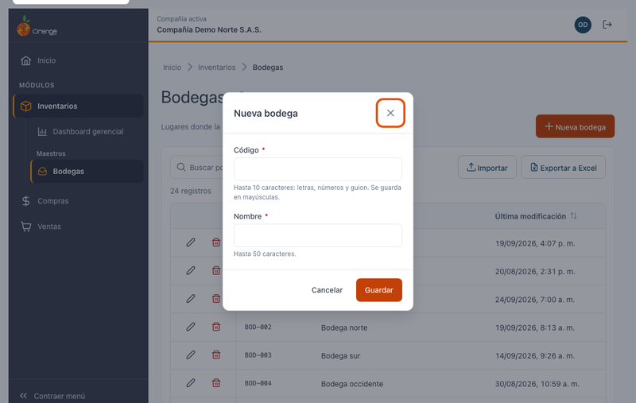
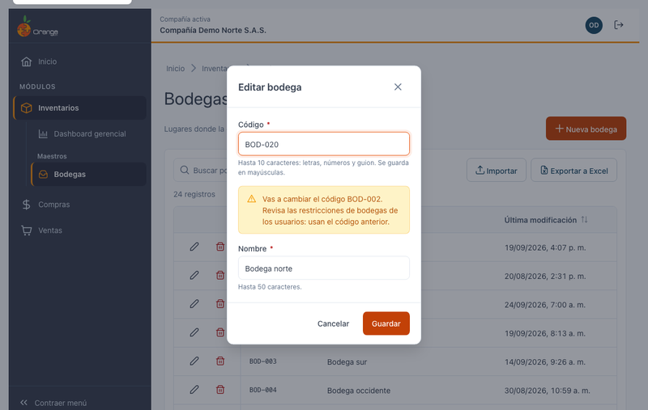
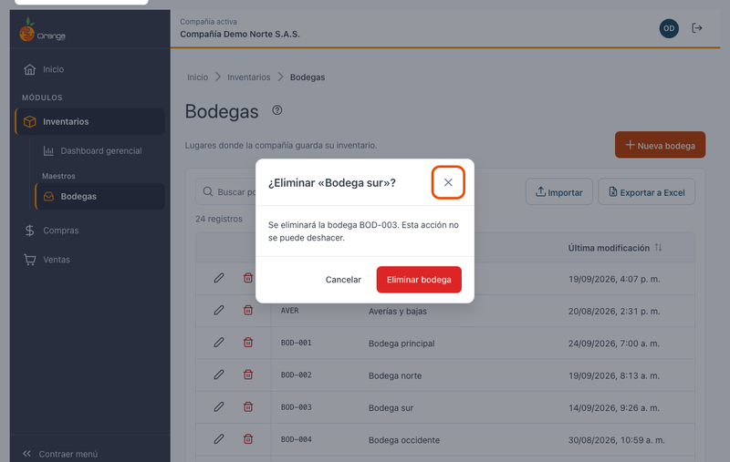

[Regresar a Inventarios](../readme.md)

---

# 📦 Bodegas

---

## 📋 Descripción

Las **bodegas** son los lugares, físicos o lógicos, donde la compañía guarda su inventario: la bodega principal, un punto de venta, la mercancía en tránsito, las devoluciones, etc.

En esta pantalla puede **consultar, crear, editar, eliminar, exportar e importar** las bodegas de la compañía con la que está trabajando.

> 📘 La búsqueda, el orden, la paginación, la exportación y la ayuda funcionan igual en todas las tablas: ver [Manejo general de la información](../../Generales/manejo-general-informacion.md).

> 💡 Cada pestaña del navegador trabaja con **una compañía**. El nombre y el color de la compañía se ven en el título de la pestaña y en la barra superior.

---

## 🎯 Acceso

1. En el menú principal, haga clic en **Inventarios**.
2. En **Maestros**, haga clic en **Bodegas**.

---

## 🖥️ Pantalla principal

| Elemento | Para qué sirve |
|----------|----------------|
| **?** (junto al título) | Abre esta ayuda en un panel lateral, sin salir de la pantalla. |
| **En vivo** | La pantalla está conectada: los cambios de otros usuarios aparecen solos. Ver *Cambios de otros usuarios* más abajo. |
| **Nueva bodega** | Crea una bodega. |
| **Buscar por código o nombre** | Filtra el listado mientras escribe. No distingue mayúsculas ni tildes: "transito" encuentra "Mercancía en tránsito". |
| **Importar** | Crea o actualiza bodegas desde un archivo de Excel. Ver [Importar bodegas](bodegas-importar.md). |
| **Exportar a Excel** | Descarga el listado (con el filtro y el orden que tenga en pantalla). |
| **Lápiz** / **Papelera** | Editar o eliminar la bodega de esa fila. Siempre están en la **primera columna**, visibles aunque la tabla tenga que desplazarse. |
| **Encabezados** | Un clic ordena de forma ascendente, el segundo descendente y el tercero quita el orden. |
| **Filas por página** y paginación | Cambian cuántas bodegas ve y la página. |

> 📱 En el celular cada bodega se muestra como una tarjeta, con las acciones arriba.

**¿No ve algún botón?** Cada acción depende de los permisos de su perfil sobre la opción Bodegas:

| Permiso | Qué habilita |
|---------|--------------|
| Consultar | Ver la pantalla |
| Crear | **Nueva bodega** |
| Actualizar | **Lápiz** (editar) |
| Eliminar | **Papelera** (eliminar) |
| Exportar | **Exportar a Excel** e **Importar** |

---

## ➕ Crear una bodega

1. Haga clic en **Nueva bodega**.
2. Complete los campos y haga clic en **Guardar** (o presione **Enter**).

| Campo | Obligatorio | Reglas | Ejemplo |
|-------|:-----------:|--------|---------|
| **Código** | ✅ | Hasta 10 caracteres: letras, números y guion. Se guarda **siempre en MAYÚSCULAS** (lo convierte mientras escribe). No se puede repetir en la compañía. | `BOD-001` |
| **Nombre** | ✅ | Hasta 50 caracteres, sin comas ni punto y coma. | `Bodega principal` |

Al guardar verá el mensaje **"Bodega … creada."** y la bodega aparece en el listado.

### ¿Qué puede salir mal?

| Mensaje | Qué hacer |
|---------|-----------|
| Escribe el código de la bodega. / Escribe el nombre de la bodega. | Complete el campo. |
| Usa solo letras, números y guion (máximo 10). | Quite espacios, tildes u otros símbolos del código. |
| El nombre no puede tener comas ni punto y coma (máximo 50). | Corrija el nombre. |
| Ya existe una bodega con el código … | Use otro código. |

---

## ✏️ Editar una bodega

1. Haga clic en el **lápiz** de la bodega.
2. Cambie el código o el nombre y haga clic en **Guardar**.

> ⚠️ **Cambiar el código** está permitido, pero verá un aviso: las **restricciones de bodegas de los usuarios** se guardan por código y seguirán usando el código anterior. Revíselas después del cambio.

Si otro usuario eliminó la bodega mientras la editaba, verá **"Esta bodega ya no existe"** y desaparecerá del listado.

---

## 🗑️ Eliminar una bodega

1. Haga clic en la **papelera** de la bodega.
2. Confirme con **Eliminar bodega**.

Una bodega **no se puede eliminar** si tiene información relacionada en otros módulos (movimientos, inventarios físicos, referencias o tipos de movimiento que la usen por defecto, cajeros, o restricciones de usuarios). En ese caso verá:

> No se puede eliminar … : tiene información relacionada en otros módulos.

---

## 📤 Exportar a Excel

Haga clic en **Exportar a Excel**. Se descarga `bodegas_AAAA-MM-DD.xlsx` con **todas** las bodegas del filtro actual (no solo la página visible), con el encabezado fijo y filtros de Excel. Las fechas quedan como fechas de Excel.

---

## 📥 Importar desde Excel

Para crear muchas bodegas o cambiar sus nombres de una vez, use **Importar**. Vea el paso a paso en [Importar bodegas desde Excel](bodegas-importar.md).

---

## 🔄 Cambios de otros usuarios (en vivo)

Si otra persona crea, modifica, elimina o importa bodegas mientras usted tiene abierta esta pantalla, **no tiene que recargar**: el listado se pone al día solo, sin perder lo que buscó, el orden ni la página.

- Las filas nuevas o modificadas se **resaltan** unos segundos.
- Abajo a la derecha aparece un aviso, por ejemplo *"Otro usuario creó la bodega Almacén sur."*
- Junto a la descripción verá **En vivo** mientras la conexión esté activa. Si se interrumpe, dice **Reconectando…**; al volver, la pantalla se actualiza sola.

**Si estaba editando esa misma bodega:**

| Qué hizo el otro usuario | Qué verá | Qué puede hacer |
|--------------------------|----------|-----------------|
| La modificó | *"Otro usuario modificó esta bodega mientras la editabas. Si guardas, reemplazarás sus cambios."* | **Ver sus cambios** para cargar lo que él guardó, o **Guardar** para dejar lo suyo. |
| La eliminó | *"Otro usuario eliminó esta bodega. Ya no se puede guardar."* | **Cancelar**. El botón Guardar queda deshabilitado. |

Si estaba por confirmar la eliminación de una bodega que otro ya eliminó, el diálogo se cierra con el aviso *"Otro usuario ya eliminó la bodega…"*.

> ℹ️ Los cambios que usted hace en esta misma pestaña no generan avisos. Los cambios hechos desde la versión anterior de OrangeERP no se avisan al instante: se reflejan al volver a esta pestaña después de un rato o al recargar.

---

## ❓ Preguntas frecuentes

**¿Por qué el código quedó en mayúsculas?**
Los códigos de bodega siempre se guardan en mayúsculas para que no haya dos bodegas "iguales" escritas distinto.

**¿Por qué no encuentro una bodega que sí existe?**
Revise que esté en la compañía correcta (título de la pestaña) y borre el texto del buscador con la **✕**.

**No veo "En vivo".**
La conexión en vivo no está disponible en este momento (por ejemplo, por la red de su empresa). La pantalla funciona igual; para ver cambios de otros usuarios, recargue la página.

**La "Última modificación" de algunas bodegas muestra una hora distinta.**
Las fechas se guardan en hora universal y se muestran en la hora de su equipo; algunas bodegas modificadas en la versión anterior pueden verse desplazadas hasta que se ajusten sus fechas.
