[Regresar a Referencias](referencias.md)

---

# 🏷️ Detalle de una referencia

---

## 📋 Descripción

La **página de detalle** es donde se crea, se consulta y se modifica una referencia. Reúne todos sus datos en pestañas:

| Pestaña | Qué contiene |
|---------|--------------|
| **General** | Código, nombres, clasificación (subgrupo y unidad), comportamiento, tipo de producto y control sanitario. |
| **Impuestos y costos** | IVA y porcentajes de costo. |
| **Contabilidad** | Cuentas contables de ventas y de devoluciones. |
| **Variantes** | Las combinaciones de la referencia (por ejemplo talla y color), cada una con su código de barras, precios y niveles de inventario. |
| **Proveedores** | Los proveedores que venden la referencia, con su código y su valor. |
| **Producción** | Solo en referencias **semielaboradas**: los materiales que consume, sus operaciones de fabricación y el costo estimado por unidad. |
| **Inventario** | Solo si la referencia **maneja inventarios**: las existencias por bodega y por variante a una fecha. |
| **Movimientos** | Solo si la referencia **maneja inventarios**: los documentos que movieron cada variante (kardex), con el saldo después de cada uno. |
| **Foto y documentos** | La foto principal de la referencia y sus documentos adjuntos (fichas técnicas, certificados u otros archivos). |

Las tres primeras pestañas forman la **cabecera** de la referencia y se guardan juntas con **Guardar referencia**. Las variantes, los proveedores y las filas de producción se guardan **cada una en su propio diálogo**, en el momento; la foto y los documentos también se suben o se eliminan en el momento. **Inventario** y **Movimientos** son de consulta: no modifican nada.

Las pestañas **Producción**, **Inventario** y **Movimientos** aparecen solo cuando la referencia ya está guardada con *Semielaborada* o *Maneja inventarios (kardex)* marcadas. Si marca una de esas casillas, guarde la referencia para ver la pestaña.

> 📘 Para buscar, copiar, eliminar o exportar referencias, vea [Referencias](referencias.md). Para crear o actualizar muchas a la vez, vea [Importar referencias desde Excel](referencias-importar.md).

---

## 🎯 Acceso

- **Crear:** en [Referencias](referencias.md), haga clic en **Nueva referencia**.
- **Consultar o editar:** en [Referencias](referencias.md), haga clic en el **lápiz** de la referencia (o en el **ojo**, si su perfil solo permite consultar).

Puede guardar el enlace de la página en favoritos o compartirlo: el enlace incluye la pestaña que está viendo (por ejemplo, abre directamente **Contabilidad**).

---

## 🖥️ Partes de la página

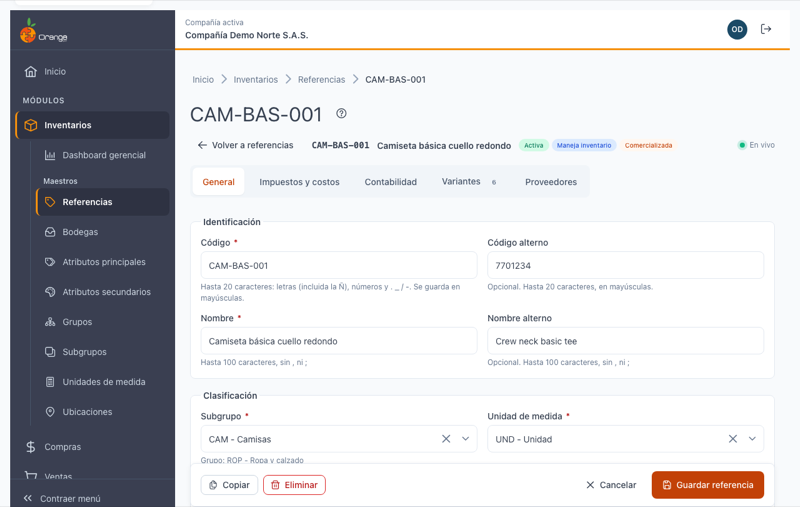

| Elemento | Para qué sirve |
|----------|----------------|
| **?** (junto al título) | Abre esta ayuda en un panel lateral. |
| **Volver a referencias** | Regresa al listado. Si hay cambios sin guardar, le pregunta antes (ver *Salir sin guardar*). |
| **Foto, código y nombre** | Identifican la referencia que tiene abierta. Si tiene foto, se ve en miniatura: haga clic en ella para verla en grande. |
| **Etiquetas** | Resumen de la referencia: **Activa** o **Inactiva**, **Maneja inventario**, **Comercializada**, **Material**, **Semielaborada**. Cambian en cuanto marca o desmarca las casillas. |
| **En vivo** | La página está conectada y le avisa si otro usuario cambia esta referencia. |
| **Pestañas** | Cambian la sección visible sin perder lo escrito. Una pestaña con errores muestra un **contador rojo**; **Variantes** muestra cuántas variantes hay. Si no caben en una línea, pasan a una segunda. |
| **Copiar** / **Eliminar** (abajo a la izquierda) | Solo al editar. Funcionan igual que en el listado: ver [Referencias](referencias.md). |
| **Cancelar** / **Guardar referencia** (abajo a la derecha) | Descartan o guardan los cambios de la cabecera (General, Impuestos y costos, Contabilidad). La barra queda fija abajo mientras se desplaza. |

---

## ➕ Crear una referencia

1. En el listado, haga clic en **Nueva referencia**. El cursor queda en **Código**.
2. Llene la pestaña **General** (como mínimo: código, nombre, subgrupo y unidad de medida).
3. Revise **Impuestos y costos** (si la referencia liquida IVA, elija los tres impuestos) y, si aplica, **Contabilidad**.
4. Haga clic en **Guardar referencia**.

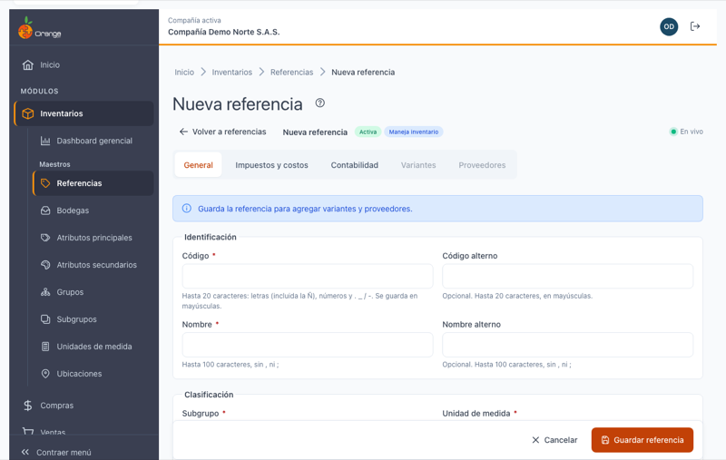

Al crear vienen marcadas **Activa**, **Maneja inventarios (kardex)** y **Liquida IVA**; revíselas antes de guardar. Las pestañas **Variantes** y **Proveedores** están deshabilitadas con el aviso *"Guarda la referencia para agregar variantes y proveedores."*

Al guardar verá **"Referencia … creada"** y la página pasa sola a la pestaña **Variantes**, con el aviso *"Referencia creada. Ahora agrega sus variantes con su precio y código de barras."* Continúe en *Variantes*.

> 💡 Una referencia sin variantes no se puede usar en compras, ventas ni movimientos de inventario: agregue al menos una.

---

## 📝 Pestaña General

| Sección | Campo | Obligatorio | Reglas y ejemplo |
|---------|-------|:-----------:|------------------|
| **Identificación** | **Código** | ✅ | Hasta 20 caracteres: letras (incluida la Ñ), números y `. _ / -`, **sin espacios**. Se escribe **en MAYÚSCULAS** automáticamente. No se puede repetir en la compañía. Ej.: `CAM-BAS-001`, `PIÑA-01`, `A.10/2`. |
| | **Código alterno** | | Otro código con que conoce la referencia (por ejemplo, el del fabricante). Hasta 20 caracteres, en mayúsculas. Se puede repetir. También sirve para buscarla en el listado. |
| | **Nombre** | ✅ | Hasta 100 caracteres, **sin comas ni punto y coma**. Ej.: `Camiseta básica cuello redondo`. |
| | **Nombre alterno** | | Hasta 100 caracteres, sin comas ni punto y coma. Ej.: el nombre en otro idioma. |
| **Clasificación** | **Subgrupo** | ✅ | Búsquelo por código o nombre. Debajo aparece su grupo (`Grupo: ROP - Ropa y calzado`). |
| | **Unidad de medida** | ✅ | Búsquela por código o nombre. Ej.: `UND - Unidad`. |
| | **Bodega por defecto** | | La bodega que se propone en los movimientos. |
| | **Tercero principal** | | Busque por documento o nombre. Solo aparecen terceros **activos**. |
| | **Categoría** | | Hasta 5 caracteres. |
| | **Composición** | | Hasta 100 caracteres. Ej.: `100 % algodón`. |
| | **Posición arancelaria** | | Hasta 50 caracteres. |
| **Comportamiento** | **Activa** | | Desmarcada, la referencia deja de verse en el listado por defecto (filtro *Activas*). |
| | **Maneja inventarios (kardex)** | | Lleva existencias y costo por bodega. |
| | **Aparece en el catálogo del punto de venta** / **Favorita en el punto de venta** / **Se imprime en la comanda** | | Cómo se comporta en el punto de venta. |
| **Tipo de producto** | **Comercializada** | | Se compra y se vende sin transformarla. Al marcarla se desmarcan y deshabilitan *Es material* y *Semielaborada*: una referencia comercializada no puede ser ninguna de las dos. |
| | **Es material o insumo** | | Al marcarla aparece **Tipo de material** (obligatorio): Materia prima, Insumos, Proceso, Mano de obra, Indirecto (CIF), Herramienta o Aseo y papelería. |
| | **Semielaborada o producida** | | La referencia se fabrica. Ver la nota de abajo. |
| **Control sanitario y de calidad** | **Tipo de riesgo** | | Bajo (I), Moderado (II) o Alto (III). |
| | **Tipo de clasificación** | | Reactivo o Dispositivo médico. |
| | **Registro sanitario Invima** / **Clasificación IARC** | | Texto de hasta 50 caracteres (acepta letras y guiones). |
| | **Exige fecha de vencimiento en los movimientos** / **Verifica criterios de aceptación al recibir** / **Exige lote en los movimientos** | | Controles que se aplican al registrar movimientos. |

### Elegir un dato de otra tabla (subgrupo, unidad, bodega, tercero, impuestos, cuentas…)

1. Haga clic en el campo. Se abre una lista con los primeros datos, como `Código - Nombre`.
2. Escriba parte del código o del nombre para filtrar; si hay muchos, desplácese hacia abajo y se cargan más.
3. Elija el dato. Con la **✕** del campo lo deja vacío (en los campos que no son obligatorios).

Si un dato que tenía la referencia ya no existe en la compañía, el campo aparece en rojo con *"Ya no está disponible. Elige otro valor."*: elija otro para poder guardar.

### Cambiar el código

Puede cambiar el código de una referencia existente. Verá el aviso *"Vas a cambiar el código … Los movimientos conservan la relación, pero los informes, las exportaciones y las plantillas de importación mostrarán o buscarán el código nuevo."* Si vuelve a escribir el código original, el aviso desaparece.

> ℹ️ **Referencias semielaboradas:** al guardar la referencia con *Semielaborada* marcada aparece la pestaña **Producción** (ver más abajo). Si desmarca *Semielaborada* en una referencia que ya lo era, verá *"Si desmarcas Semielaborada, la pestaña Producción se oculta pero los consumos y las operaciones se conservan."*: nada se borra, y si la vuelve a marcar, recupera su producción.

---

## 💰 Pestaña Impuestos y costos

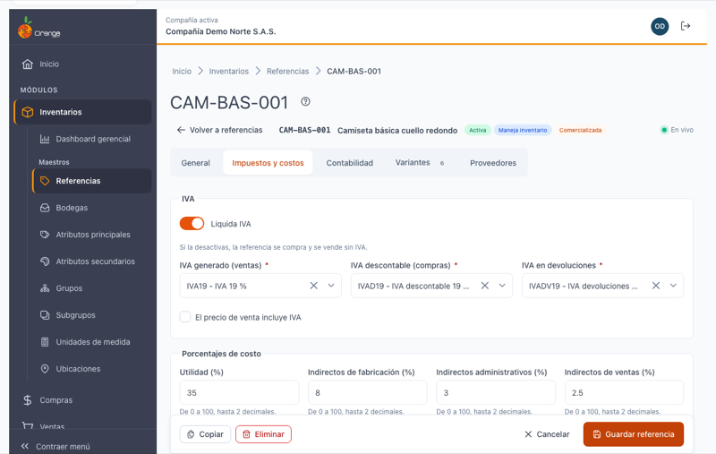

**IVA**

| Campo | Qué hace |
|-------|----------|
| **Liquida IVA** | Encendido (por defecto), la referencia se compra y se vende con IVA y se muestran los tres impuestos. Apagado, se ocultan y al guardar **se borran los tres impuestos** y la marca de IVA incluido. |
| **IVA generado (ventas)** ✅ | El IVA que se cobra al vender. |
| **IVA descontable (compras)** ✅ | El IVA que se descuenta al comprar. |
| **IVA en devoluciones** ✅ | El IVA de las devoluciones. |
| **El precio de venta incluye IVA** | Marque si los precios de las variantes ya traen el IVA. |

Los tres impuestos son **obligatorios** cuando la referencia liquida IVA.

**Porcentajes de costo**: **Utilidad**, **Indirectos de fabricación**, **Indirectos administrativos** e **Indirectos de ventas**, en porcentaje de **0 a 100** con hasta 2 decimales (escriba `35` para 35 %).

---

## 📒 Pestaña Contabilidad

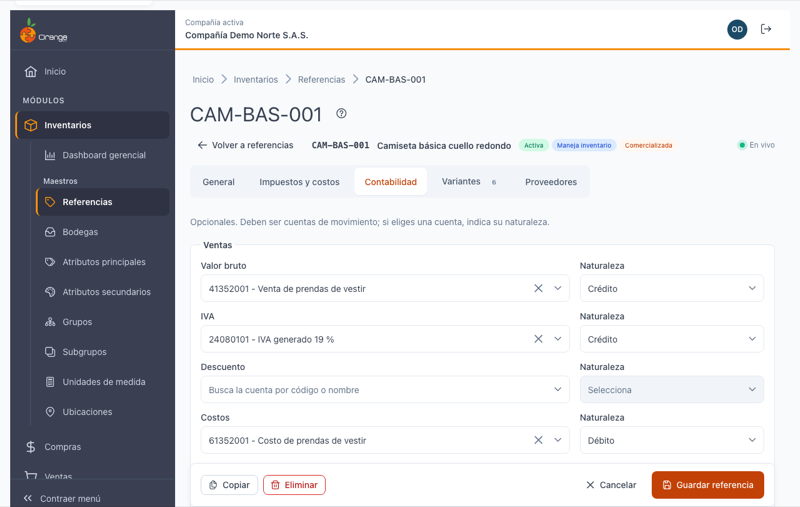

Las cuentas se agrupan en dos secciones. **Todas son opcionales.**

| Sección | Conceptos |
|---------|-----------|
| **Ventas** | Valor bruto · IVA · Descuento · Costos · Inventario |
| **Devoluciones** | Valor bruto · Descuento · IVA |

En cada fila:

1. En la cuenta, busque por código o nombre. Solo aparecen **cuentas de movimiento**.
2. Si la **Naturaleza** estaba vacía, se propone la de la cuenta (*Propuesta según la cuenta*); puede cambiarla a **Crédito** o **Débito**.
3. Si elige una cuenta, la naturaleza es obligatoria. Si borra la cuenta, la naturaleza se borra y se deshabilita.

---

## 💾 Guardar los cambios

Haga clic en **Guardar referencia**. Se guardan juntas las pestañas **General**, **Impuestos y costos** y **Contabilidad**; verá **"Referencia … actualizada"** y **se queda en la página**, para seguir con las variantes o los proveedores.

### Si hay errores: el contador de errores

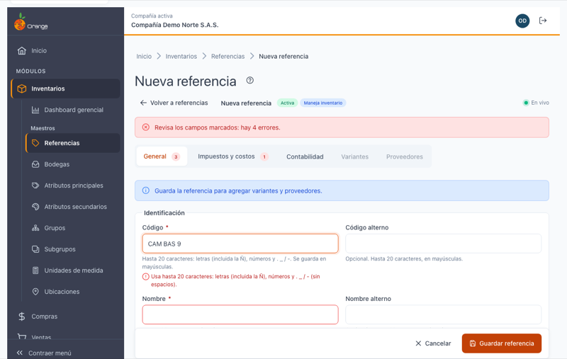

Si falta algo o hay un dato inválido, no se guarda nada y:

- Arriba aparece *"Revisa los campos marcados: hay N errores."*
- Cada pestaña con errores muestra un **contador rojo** con su número de errores.
- Se abre la **primera pestaña con errores** (en el orden General → Impuestos y costos → Contabilidad) y el cursor va al primer campo marcado.

Corrija los campos marcados en cada pestaña y vuelva a guardar. Lo que escribió no se pierde.

| Mensaje | Qué hacer |
|---------|-----------|
| Escribe el código de la referencia. / Escribe el nombre de la referencia. | Complete el campo. |
| Usa hasta 20 caracteres: letras (incluida la Ñ), números y . _ / - (sin espacios). | Quite espacios, tildes u otros símbolos del código, o acórtelo. |
| El nombre admite hasta 100 caracteres y no puede tener comas ni punto y coma. | Corrija o acorte el nombre. |
| Ya existe una referencia con el código … | Use otro código. |
| Elige el subgrupo. / Elige la unidad de medida. | Elija el dato en el buscador. |
| Elige el tipo de material. | Marcó *Es material o insumo*: elija el tipo. |
| Elige el impuesto: la referencia liquida IVA. | Complete los tres impuestos, o apague *Liquida IVA*. |
| Escribe un porcentaje de 0 a 100 con hasta 2 decimales. | Corrija el porcentaje. |
| Indica la naturaleza de la cuenta. | Eligió una cuenta sin naturaleza: elija Crédito o Débito. |
| Ya no está disponible. Elige otro valor. | El dato (subgrupo, impuesto, cuenta…) ya no existe o lo eliminó otro usuario: elija otro. |
| Tu perfil ya no permite esta acción. Recarga la página para ver tus permisos actuales. | Sus permisos cambiaron mientras trabajaba. Recargue la página. |
| No se pudo guardar la referencia. Inténtalo de nuevo. | Falló la conexión o el servidor. Lo escrito se conserva: vuelva a guardar. |
| La referencia ya no existe. Otro usuario la eliminó. | No se puede guardar. Vuelva al listado. |

---

## 🎨 Pestaña Variantes

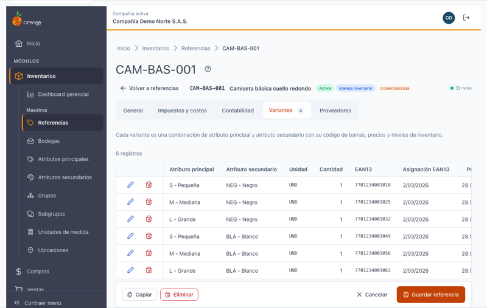

Cada **variante** es una combinación de **atributo principal** y **atributo secundario** (por ejemplo, talla *M - Mediana* y color *NEG - Negro*), con su propio código de barras, precios y niveles de inventario. La variante se nombra así: *Mediana / Negro*.

La tabla muestra: Atributo principal · Atributo secundario · Unidad · Cantidad · EAN13 · Asignación EAN13 · Precio 1 · Costo esperado · Participación. Con el **lápiz** la edita y con la **papelera** la elimina. Si la referencia maneja inventarios, **Ver movimientos** abre la pestaña **Movimientos** con esa variante.

### Agregar o editar una variante

1. Haga clic en **Agregar variante** (o en el **lápiz** de una variante).
2. Llene los datos del diálogo.
3. Haga clic en **Guardar variante**. Verá **"Variante … agregada"** (o *actualizada*) y la tabla se actualiza.

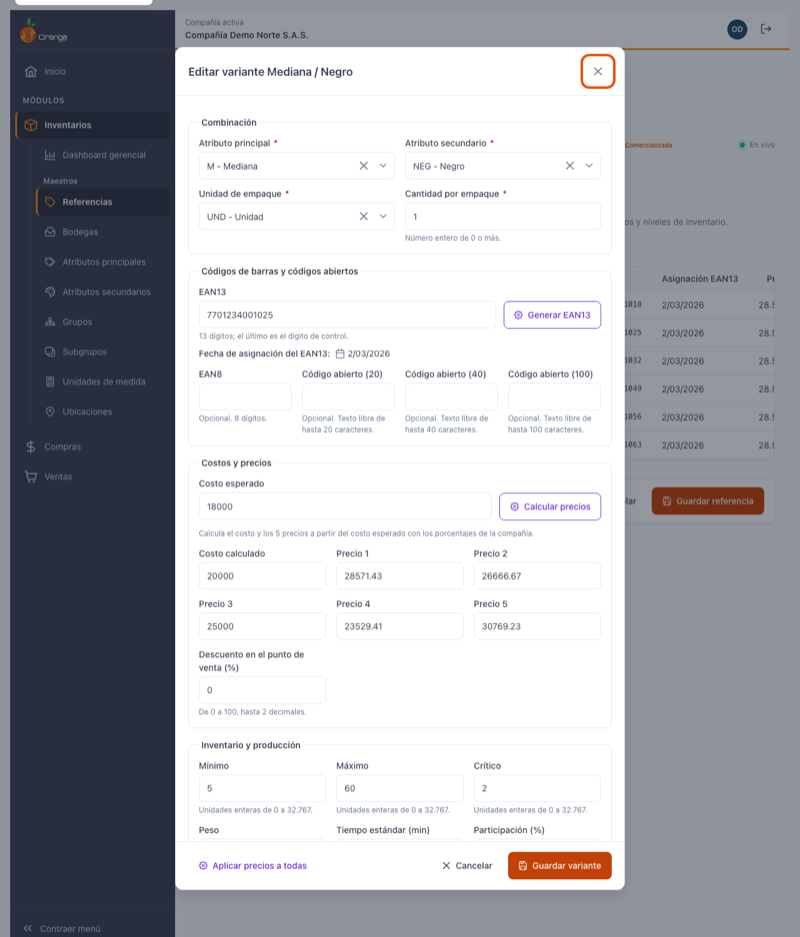

| Sección | Campo | Reglas |
|---------|-------|--------|
| **Combinación** | **Atributo principal** ✅, **Atributo secundario** ✅ | Búsquelos por código o nombre. La combinación no se puede repetir en la referencia (*"Ya existe la variante … en esta referencia."*). |
| | **Unidad de empaque** ✅ | Por defecto, la unidad de la referencia. |
| | **Cantidad por empaque** ✅ | Número entero de 0 o más. |
| **Códigos de barras y códigos abiertos** | **EAN13** | 13 dígitos; el último es el **dígito de control**. Si no cuadra, el mensaje le dice cuál debería ser (*"… (debería ser 8)"*). No se puede repetir en la compañía. |
| | **Fecha de asignación del EAN13** | Solo lectura. Ver abajo. |
| | **EAN8** | Opcional. 8 dígitos. |
| | **Código abierto (20)**, **(40)**, **(100)** | Opcionales. Texto libre de hasta 20, 40 o 100 caracteres. |
| **Costos y precios** | **Costo esperado**, **Costo calculado**, **Precio 1** a **Precio 5** | Valores de 0 o más, con hasta 2 decimales. |
| | **Descuento en el punto de venta (%)** | De 0 a 100, hasta 2 decimales. |
| **Inventario y producción** | **Mínimo**, **Máximo**, **Crítico** | Unidades enteras de 0 a 32.767. |
| | **Peso**, **Tiempo estándar (min)** | Hasta 2 decimales. |
| | **Participación (%)** | De 0 a 100. |

> 📱 En el celular el diálogo ocupa toda la pantalla y las secciones se apilan.

### Generar EAN13

Si la variante no tiene código de barras propio, haga clic en **Generar EAN13**: el sistema arma un código válido y único con el **prefijo EAN13 de la compañía** y su consecutivo, y lo escribe en el campo.

- El número queda **reservado** aunque después no guarde la variante: la próxima vez se genera el siguiente.
- Si aparece *"La compañía no tiene configurado el prefijo para generar códigos EAN13."*, pida que se configure el prefijo en los datos de la compañía o escriba el código a mano.

### Fecha de asignación del EAN13

Debajo del EAN13 se ve la **Fecha de asignación del EAN13**. No se escribe: la pone el sistema.

| Lo que ve | Significa |
|-----------|-----------|
| 📅 una fecha (por ejemplo `2/03/2026`) | Día en que se asignó el EAN13 actual. |
| **Se asignará hoy al guardar** | Escribió o generó un EAN13 nuevo: al guardar, la fecha será la de hoy. |
| **Sin EAN13** | La variante no tiene código de barras. |
| **—** | El código viene de la versión anterior sin fecha registrada. |

Si cambia otros datos de la variante sin tocar el EAN13, la fecha no cambia.

### Calcular precios

Con **Calcular precios** no tiene que calcular a mano el costo y los cinco precios:

1. Escriba el **Costo esperado** (mayor que 0).
2. Haga clic en **Calcular precios**. Se llenan el **Costo calculado** y **Precio 1** a **Precio 5** con los porcentajes configurados en la compañía, y verá *"Precios calculados con los porcentajes de la compañía. Revísalos antes de guardar."*
3. Revise o ajuste los valores y haga clic en **Guardar variante**. Nada se guarda hasta ese momento.

> 💡 Si la compañía no tiene porcentajes de precios configurados, el diálogo lo avisa y, al calcular, el costo calculado y los precios quedan iguales al costo esperado.

### Aplicar precios a todas

Al **editar** una variante, abajo a la izquierda está **Aplicar precios a todas**. Copia el **costo esperado**, el **costo calculado**, los **5 precios** y el **descuento** de esa variante a **todas** las variantes de la referencia (útil cuando todas las tallas valen lo mismo).

1. Deje la variante con los precios correctos.
2. Haga clic en **Aplicar precios a todas** y confirme con **Aplicar a todas**.
3. Verá **"Precios aplicados a N variantes"** y las filas se resaltan.

### Eliminar una variante

Haga clic en la **papelera** de la variante y confirme con **Eliminar variante**. Si la variante ya se usó (tiene movimientos u otra información), no se elimina: *"No se puede eliminar la variante …: tiene movimientos u otra información relacionada."*

---

## 🚚 Pestaña Proveedores

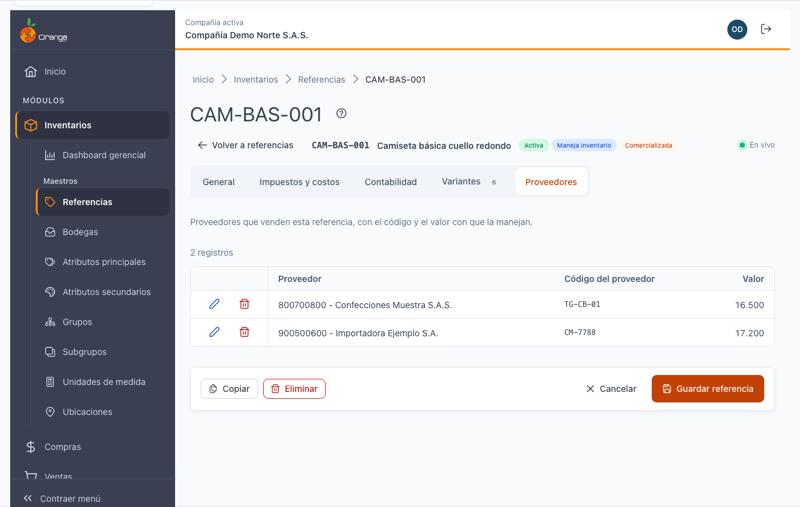

Aquí registra los **proveedores que venden esta referencia**, con el código y el valor con que la manejan. La tabla muestra **Proveedor** (`NIT - Nombre`), **Código del proveedor** y **Valor**.

**Agregar o editar un proveedor**

1. Haga clic en **Agregar proveedor** (o en el **lápiz** de un proveedor).
2. En **Proveedor**, busque por NIT o nombre.
3. Escriba el **Código de la referencia en el proveedor** (hasta 20 caracteres; se escribe en mayúsculas).
4. Escriba el **Valor** (mayor que 0, hasta 2 decimales).
5. Haga clic en **Guardar proveedor**. Verá **"Proveedor … agregado"** (o *actualizado*).

Un proveedor no se puede repetir en la misma referencia: *"Este proveedor ya está en la referencia."*

**Quitar un proveedor**: haga clic en la **papelera** (**Quitar proveedor**) y confirme. Solo se quita la relación con esta referencia; el proveedor sigue existiendo.

---

## 🏭 Pestaña Producción

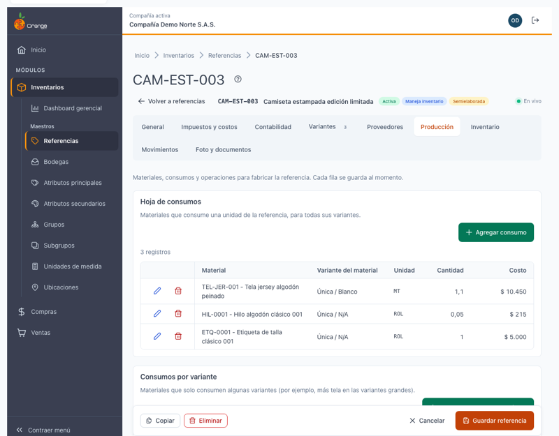

Aparece solo en las referencias **semielaboradas** (las que se fabrican). Aquí registra **qué materiales consume** una unidad de la referencia, **qué operaciones** se hacen para fabricarla y ve **cuánto cuesta** en materiales. Tiene cuatro secciones: **Hoja de consumos**, **Consumos por variante**, **Costo estimado por unidad** y **Operaciones**.

Cada fila se guarda **al momento**, en su propio diálogo (**Guardar**), como las variantes: no hace falta **Guardar referencia**. Verá **"… agregado"**, **"… actualizado"** o **"… eliminado"** y la fila se resalta unos segundos.

### Hoja de consumos

Los materiales que consume **una unidad** de la referencia, **para todas sus variantes**. La tabla muestra **Material** (`Código - Nombre`), **Variante del material**, **Unidad**, **Cantidad** y **Costo** (cantidad × costo esperado de la variante del material). Debajo verá el *Costo estimado de materiales por unidad*.

1. Haga clic en **Agregar consumo** (o en el **lápiz** de un consumo).
2. En **Material o semielaborado**, busque por código o nombre. Solo aparecen referencias marcadas como material o como semielaboradas.
3. Elija la **Variante del material** (por ejemplo, el color de la tela).
4. Escriba la **Cantidad por unidad**: mayor que 0, hasta 2 decimales, **en la unidad del material** (por ejemplo, `1.20` metros de tela).
5. Haga clic en **Guardar**.

| Mensaje | Qué hacer |
|---------|-----------|
| Esa variante del material ya está en la hoja de consumos. | Edite la fila que ya existe en lugar de agregar otra. |
| La referencia no puede consumirse a sí misma. | Elija otro material. |
| Escribe una cantidad mayor que 0 con hasta 2 decimales. | Corrija la cantidad. |

### Consumos por variante

Para los materiales que **solo consumen algunas variantes**, o que consumen distinto (por ejemplo, más tela en las tallas grandes). La tabla muestra **Variante de la referencia**, **Material**, **Variante del material** y **Cantidad**.

- Al **agregar** (**Agregar consumo por variante**), en **Variantes de la referencia** puede elegir **varias** a la vez: se crea una fila por cada variante.
- Al **editar** una fila, cambia solo esa variante.
- Si una variante ya consume ese material verá *"La variante … ya consume ese material."*

### Costo estimado por unidad

Una tabla con una fila por variante de la referencia: **Consumos comunes** (los de la hoja de consumos) + **Propios de la variante** (sus consumos por variante) = **Costo por unidad**. Arriba se ve el total de los consumos comunes.

Se calcula con el **costo esperado** de cada variante del material y **se recalcula solo** cuando agrega, cambia o quita un consumo en cualquiera de las dos secciones; las variantes afectadas se resaltan unos segundos.

### Operaciones

La **ruta de fabricación**: las operaciones en orden de **secuencia**, con su **tiempo** y la operación de la que **dependen**. Arriba verá un resumen como *"7 operaciones · tiempo total 29 min · ruta crítica 25,75 min"*: el tiempo total suma todas las operaciones y la ruta crítica, solo las de la cadena más larga (ver *Diagrama de flujo*).

1. Haga clic en **Agregar operación** (o en el **lápiz** de una operación).
2. Llene el diálogo y haga clic en **Guardar**.

| Campo | Reglas |
|-------|--------|
| **Operación** ✅ | Búsquela en el catálogo de operaciones. No se puede repetir en la ruta (*"Esa operación ya está en la ruta."*). |
| **Secuencia** ✅ | Número entero mayor que 0; define el orden. Se propone la siguiente de 10 en 10. No se puede repetir (*"Ya hay una operación con la secuencia …"*). |
| **Tiempo (min)** ✅ | Mayor que 0, hasta 2 decimales. |
| **Depende de** | La operación que debe terminar antes. Solo se ofrecen operaciones **de esta referencia con secuencia menor**; se propone la última. Elija **Ninguna** si es la primera. |

### Diagrama de flujo y ruta crítica

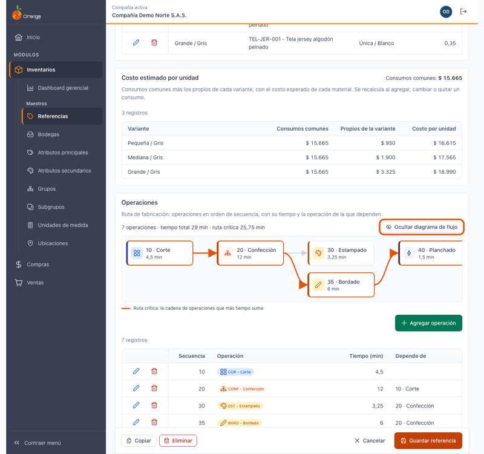

Haga clic en **Ver diagrama de flujo** para ver la ruta como un dibujo (con **Ocultar diagrama de flujo** lo cierra). El diagrama también se abre solo después de guardar una operación, para que vea dónde quedó.

- Cada recuadro es una operación, con su icono y color, su secuencia, su nombre y su tiempo.
- Las **flechas** van de la operación de la que se depende a la que depende de ella: lo que está a la izquierda se hace antes.
- La **ruta crítica** (resaltada, con su leyenda) es la cadena de operaciones que **más tiempo suma**: si una de ellas se demora, se demora toda la fabricación.

La tabla de abajo tiene los mismos datos que el diagrama.

### Eliminar un consumo o una operación

Haga clic en la **papelera** de la fila y confirme con **Eliminar**.

**Una operación de la que otras dependen no se puede eliminar**: el diálogo dice *"No se puede eliminar: … dependen de esta operación. Cámbiales la dependencia y vuelve a intentarlo."* y no ofrece el botón **Eliminar**. Primero edite esas operaciones para que dependan de otra (o de **Ninguna**) y luego elimine la que quería. Esto también aplica si la operación la usa otra referencia: el aviso le dice cuáles.

### Filas marcadas con **Revisar**

Algunas filas vienen de la versión anterior con datos que hoy no se permiten. Se marcan con la etiqueta **Revisar** y arriba verá *"Hay filas marcadas con Revisar: vienen así de la versión anterior. Se conservan; al editarlas se aplican las reglas."* Al pasar sobre la etiqueta verá el motivo:

| Motivo | Qué significa |
|--------|---------------|
| Material repetido en la hoja | La misma variante del material aparece dos veces. |
| Depende de una operación de otra referencia | La dependencia apunta a una operación que no es de esta ruta. |
| Secuencia repetida o dependencia con secuencia mayor | Dos operaciones tienen la misma secuencia, o una depende de otra que va después. |
| La variante del material no corresponde al material | La variante guardada no es del material de la fila. |

Estas filas **no impiden trabajar**: se conservan tal cual. Cuando edite una, se le piden los datos correctos. En el diagrama se dibujan con borde discontinuo y ⚠.

---

## 📦 Pestaña Inventario

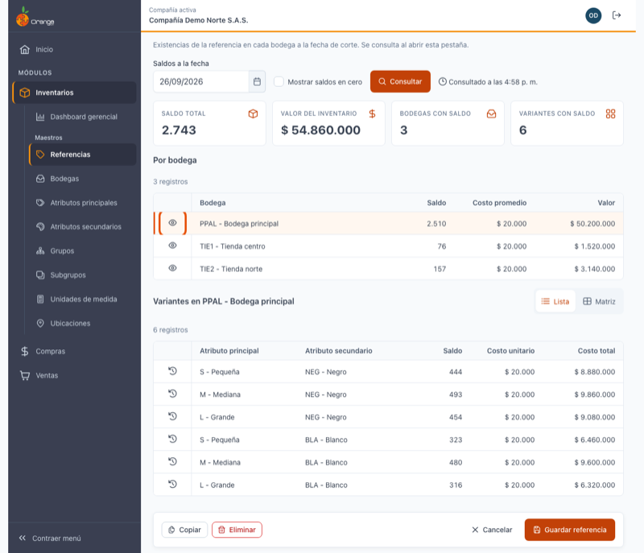

Muestra las **existencias** de la referencia en cada bodega a una fecha. Es solo de consulta. Aparece si la referencia **maneja inventarios (kardex)**.

La consulta se hace **al abrir la pestaña** (no al abrir la referencia), así que el resto del detalle carga rápido.

| Elemento | Para qué sirve |
|----------|----------------|
| **Saldos a la fecha** | La fecha de corte. Por defecto, hoy; no admite fechas futuras. |
| **Mostrar saldos en cero** | Apagado (por defecto), oculta las bodegas y variantes sin existencias. Enciéndalo para verlas todas. |
| **Consultar** | Vuelve a consultar con la fecha y la casilla elegidas. Mientras consulta dice *Consultando…*. |
| **Consultado a las HH:MM** | La hora de la consulta. Los saldos **no se actualizan solos**: son una foto de ese momento. Para ver lo último, haga clic en **Consultar**. |
| **Saldo total**, **Valor del inventario**, **Bodegas con saldo**, **Variantes con saldo** | Resumen de la referencia a la fecha de corte. |
| **Por bodega** | Una fila por bodega con **Saldo**, **Costo promedio** y **Valor**. Con **Ver** (el ojo) elige la bodega y la fila se resalta. |
| **Variantes en …** | Las variantes de la bodega elegida, en **Lista** o **Matriz** (ver abajo). |

### Ver las variantes en lista o en matriz

Elija una bodega con **Ver** y, en **Vista**, cambie entre:

- **Lista**: una fila por variante con **Atributo principal**, **Atributo secundario**, **Saldo**, **Costo unitario** y **Costo total**. El botón **Ver movimientos** de cada fila lo lleva a la pestaña **Movimientos** ya filtrada por esa variante y esa bodega.
- **Matriz**: las filas son los atributos secundarios (por ejemplo, colores) y las columnas los atributos principales (por ejemplo, tallas), con totales por fila, por columna y general. Las celdas con saldo se resaltan, los saldos negativos se ven en rojo y las celdas vacías no tienen saldo. Cada celda **suma todos los lotes y ubicaciones** de la variante.

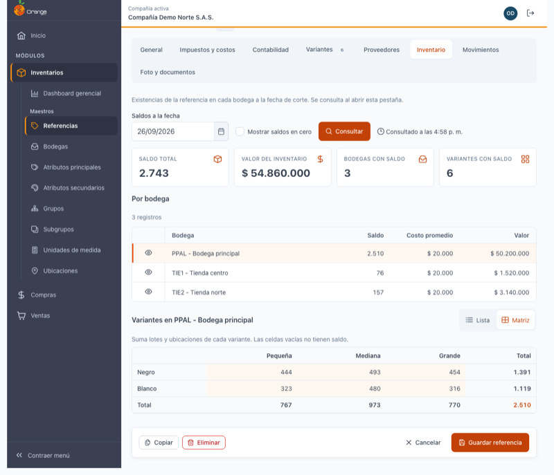

Si la referencia no tiene existencias a esa fecha verá *"Sin saldos a esta fecha"*. Pruebe con otra fecha o encienda **Mostrar saldos en cero**.

---

## 🔁 Pestaña Movimientos

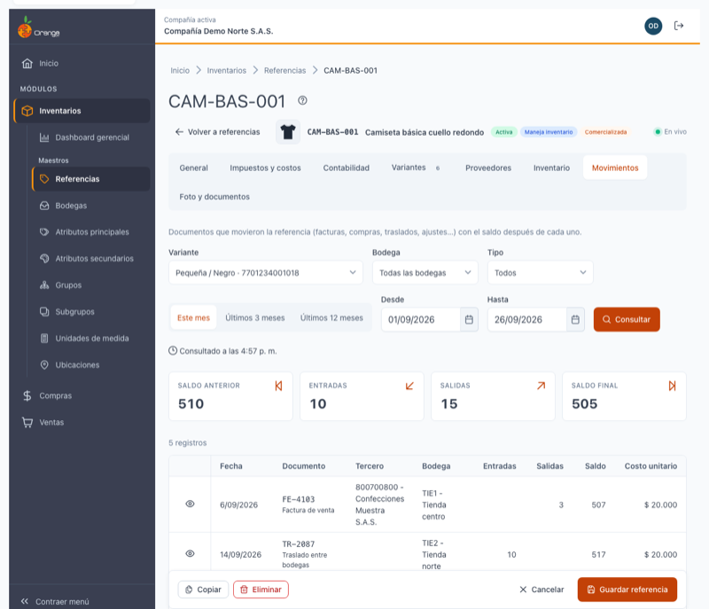

Es el **kardex** de la referencia: los documentos que movieron cada variante (facturas, compras, traslados, ajustes…) con el **saldo después de cada uno**. Es solo de consulta. Aparece si la referencia **maneja inventarios (kardex)**.

Al abrir la pestaña se consulta **la primera variante**, en **todas las bodegas**, **este mes**. Cada cambio de filtro vuelve a consultar.

| Filtro | Opciones |
|--------|----------|
| **Variante** ✅ | Una variante de la referencia, como *Pequeña / Negro · 7701234001018* (con su EAN13). Puede escribir para buscarla. |
| **Bodega** | Vacía = **Todas las bodegas**. Búsquela por código o nombre; con la **✕** vuelve a todas. |
| **Tipo** | Todos · Solo entradas · Solo salidas. |
| **Periodo** | Atajos **Este mes** (por defecto), **Últimos 3 meses** y **Últimos 12 meses**, o las fechas **Desde** y **Hasta** (luego haga clic en **Consultar**). |

> ⚠️ El periodo puede ser **de hasta 12 meses**. Si elige uno más largo verá *"El periodo puede ser de hasta 12 meses. Para periodos más largos usa el reporte Kardex de inventarios."* y no se consulta. Si *Desde* es posterior a *Hasta*, verá *"La fecha Desde debe ser anterior o igual a Hasta."*

**Resumen del periodo**: **Saldo anterior** (al empezar el periodo) · **Entradas** · **Salidas** · **Saldo final**.

**La tabla** muestra los documentos del más antiguo al más reciente (el mismo día, primero las entradas):

| Columna | Qué muestra |
|---------|-------------|
| **Fecha** | Fecha del documento. |
| **Documento** | Prefijo y consecutivo (por ejemplo `FV-10234`) y, debajo, el tipo de movimiento. Los documentos anulados llevan la etiqueta **Anulado** y no suman al saldo. |
| **Tercero** | Cliente, proveedor u otro tercero del documento. |
| **Bodega** | Bodega del movimiento. En los traslados, debajo dice *Traslado a …*. |
| **Entradas** / **Salidas** | Cantidades que entraron o salieron. |
| **Saldo** | Existencia de la variante **después** de ese documento (saldo corrido). |
| **Costo unitario** | Costo del movimiento. |

La tabla se pagina (20 filas por defecto); la hora de la consulta se ve en **Consultado a las HH:MM**, igual que en Inventario. Si no hay movimientos verá *"Sin movimientos en este periodo"*: cambie el periodo, la variante o la bodega.

> 💡 También llega aquí desde **Ver movimientos** en la pestaña **Variantes** o en **Inventario**: la pestaña se abre con la variante (y la bodega) ya elegidas.

### Ver un documento

Haga clic en **Ver documento** (el ojo) de un movimiento. Se abre un diálogo con:

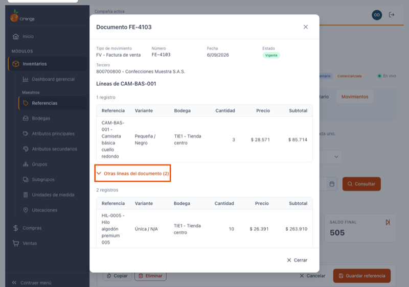

- **Encabezado**: tipo de movimiento, número, fecha, estado (*Vigente* o *Anulado*), tercero, documento de referencia y observaciones.
- **Líneas de …**: primero, **solo las líneas de esta referencia** (variante, bodega, cantidad, precio o costo y subtotal).
- **Otras líneas del documento (N)**: el resto de las líneas, plegadas. Haga clic para desplegarlas; se muestran por páginas, porque un documento puede tener miles de líneas.
- **Totales**: *Total cantidad* y el total del documento, rotulado **precio de venta** en los documentos de ventas o **costo** en los demás (compras, traslados, producción, ajustes…).

Por ahora el documento solo se consulta aquí: se podrá abrir en su módulo cuando ese módulo esté disponible en esta versión.

---

## 🖼️ Pestaña Foto y documentos

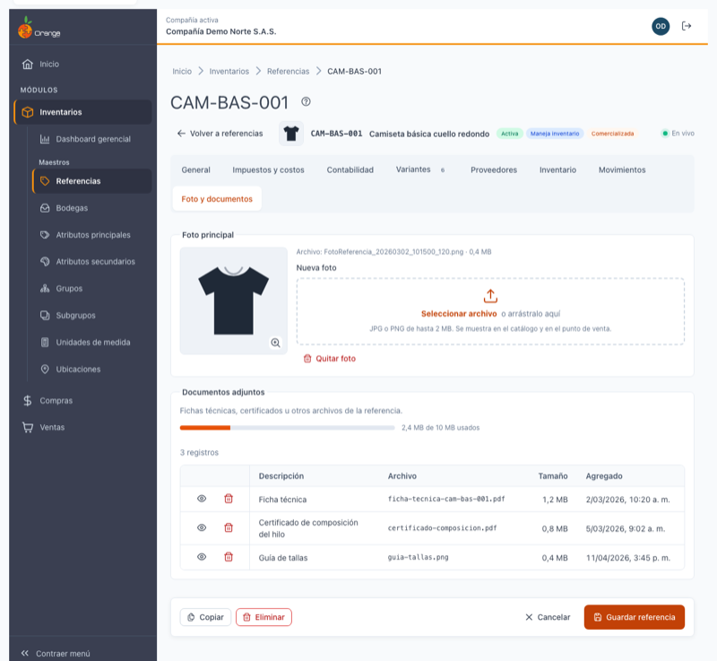

Aquí ve y cambia la **foto principal** de la referencia y sus **documentos adjuntos**. Aparece cuando la referencia ya está guardada (en una referencia nueva está deshabilitada hasta el primer guardado). Todo se sube o se elimina **en el momento**: no hace falta **Guardar referencia**.

La foto y los documentos son los mismos que se ven en la versión anterior de OrangeERP: lo que agregue o quite aquí, se ve también allá.

### Foto principal

La foto se muestra en el catálogo y en el punto de venta, y en miniatura junto al nombre de la referencia, arriba en esta página. Al lado de la foto verá el nombre del archivo y su tamaño. Si la referencia no tiene foto, verá *"Esta referencia no tiene foto."*

- **Ver la foto en grande**: haga clic en la foto (o en la miniatura de arriba).
- **Cambiar la foto**: en **Nueva foto**, haga clic en **Seleccionar archivo** o arrastre la imagen al recuadro. Debe ser **JPG o PNG de hasta 2 MB**. Se sube de inmediato (verá *"Subiendo la foto…"*) y luego **"Foto de … actualizada"**. La nueva foto reemplaza a la anterior.
- **Quitar la foto**: haga clic en **Quitar foto** y confirme. Verá **"Foto de … quitada"**; la referencia deja de mostrarse con foto en el catálogo y en el punto de venta.

Si el archivo no sirve, se avisa al elegirlo y no se sube nada:

| Mensaje | Qué hacer |
|---------|-----------|
| *"La foto debe ser JPG o PNG."* | Guarde la imagen como JPG o PNG. |
| *"La foto pesa … ; el máximo es 2 MB."* | Reduzca la imagen (menos resolución o más compresión) y vuelva a elegirla. |

### Documentos adjuntos

Son fichas técnicas, certificados u otros archivos de la referencia. Se admiten **PDF, imágenes (JPG, PNG, GIF, BMP), Word y Excel**.

Cada referencia tiene un **cupo de 10 MB** para sus documentos. La barra muestra cuánto va usado, por ejemplo *"2,4 MB de 10 MB usados"*; se pone roja cuando queda poco espacio. Los tamaños se muestran en **MB con un decimal** (los archivos muy pequeños, en KB). La foto no cuenta en este cupo.

La tabla muestra **Descripción**, **Archivo**, **Tamaño** y **Agregado** (fecha y hora en que se subió), con dos botones en la primera columna. Si el nombre del archivo es muy largo se ve cortado con **«…»**; pase el mouse sobre él para ver el nombre completo.

Los botones son:

| Botón | Qué hace |
|-------|----------|
| **Ojo** (Abrir) | Los **PDF e imágenes** se abren en otra pestaña del navegador. Los archivos de **Word y Excel** se descargan a su equipo con su nombre. |
| **Papelera** (Eliminar) | Elimina el documento (ver abajo). |

Si el archivo ya no está disponible, verá *"No se pudo abrir el archivo. Es posible que ya no esté disponible."*

**Agregar un documento**

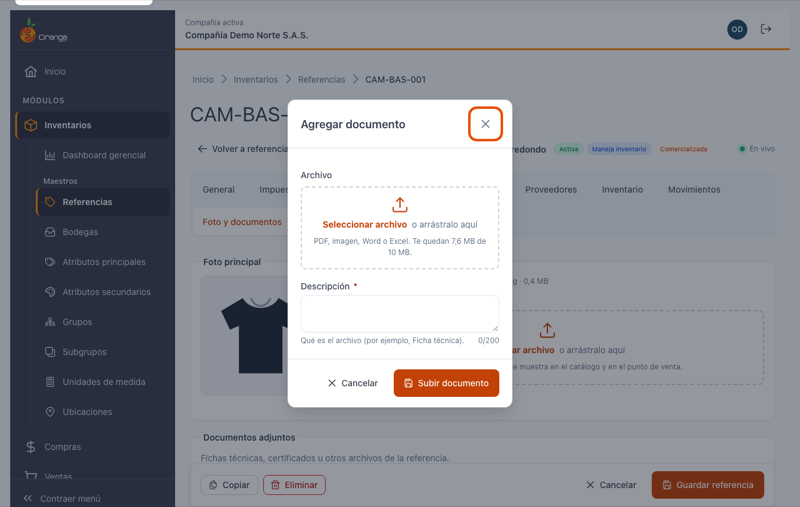

1. Haga clic en **Agregar documento**.
2. En **Archivo**, haga clic en **Seleccionar archivo** o arrastre el archivo al recuadro. Debajo le indica cuánto espacio le queda (por ejemplo, *"Te quedan 7,6 MB de 10 MB."*).
3. Revise la **Descripción** (obligatoria, hasta 200 caracteres): si estaba vacía, se propone con el nombre del archivo (`manual-de-lavado.pdf` → *manual de lavado*). Escriba qué es el archivo, por ejemplo *Ficha técnica*.
4. Haga clic en **Subir documento**. Verá el avance (*"Subiendo… 45 %"*) y luego **"Documento … agregado"**. El documento aparece resaltado en la tabla.

El archivo se revisa **al elegirlo**, sin esperar a que haga clic en **Subir documento**:

| Mensaje | Qué hacer |
|---------|-----------|
| *"Ese tipo de archivo no se admite. Usa PDF, imagen, Word o Excel."* | Convierta el archivo a uno de esos formatos. |
| *"El archivo pesa … y solo quedan … de los 10 MB de la referencia. Elimina documentos o reduce el archivo."* | Elimine documentos que ya no necesite o reduzca el archivo (por ejemplo, comprima el PDF). |
| *"Elige el archivo."* / *"Escribe una descripción."* | Complete el campo marcado. |

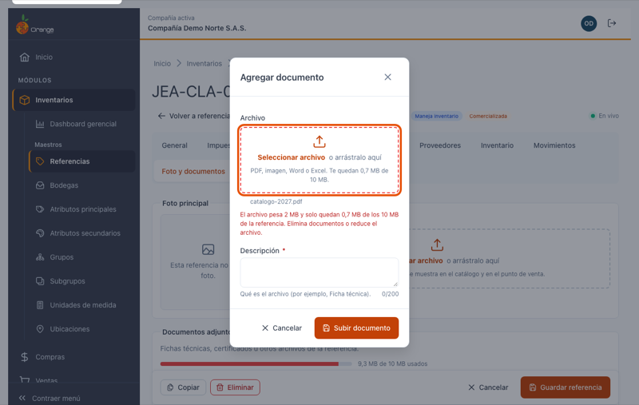

**Eliminar un documento**: haga clic en la **papelera** del documento y confirme con **Eliminar documento**. Verá **"Documento … eliminado"** y la barra del cupo se actualiza. Esta acción no se puede deshacer.

### Referencias que ya superan el cupo

Algunas referencias traen de la versión anterior documentos que en total pesan **más de 10 MB**. Esos documentos **se conservan**: se ven, se abren y se eliminan normalmente. La barra aparece llena y verá el aviso:

> *"Los documentos de esta referencia ya superan el cupo de 10 MB. Se conservan, pero para agregar otro debe eliminar alguno hasta quedar por debajo del cupo."*

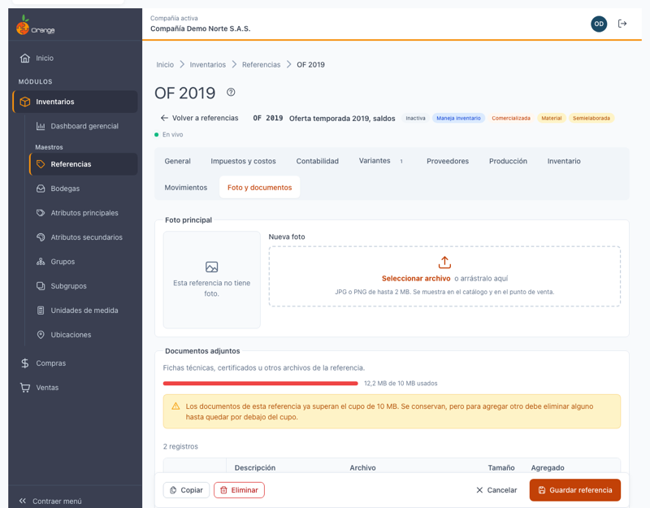

Mientras la referencia esté por encima del cupo no se puede agregar otro documento: elimine los que ya no necesite hasta que el espacio libre alcance para el archivo nuevo.

---

## 🚪 Salir sin guardar

Si cambió algo de la cabecera (General, Impuestos y costos o Contabilidad) y sin guardar intenta irse —con **Volver a referencias**, **Cancelar**, las migas, otra opción del menú, o cerrando o recargando la pestaña del navegador—, aparece **"¿Salir sin guardar?"**:

- **Seguir editando**: vuelve a la página con todo lo que escribió.
- **Salir sin guardar**: sale y descarta los cambios.

No pregunta si no hay cambios, si ya guardó, o si solo trabajó en variantes o proveedores (esos se guardan al cerrar su diálogo). Cambiar de pestaña dentro de la página nunca pierde lo escrito.

---

## 🔒 Solo consulta

Si su perfil tiene permiso de **consultar** pero no de **actualizar** la opción Referencias, la página se abre con el aviso *"Solo consulta: tu perfil no permite modificar referencias."*: todos los campos son de solo lectura, no hay **Guardar referencia** y las tablas de variantes, proveedores y producción no tienen botones para agregar, editar ni eliminar. En **Foto y documentos** puede ver y ampliar la foto y abrir los documentos, pero no aparecen **Nueva foto**, **Quitar foto**, **Agregar documento** ni la papelera. Las pestañas **Inventario** y **Movimientos** funcionan igual, porque son de consulta. **Copiar** y **Eliminar** aparecen solo si su perfil tiene esos permisos.

---

## 🔄 Cambios de otros usuarios (en vivo)

| Qué hizo el otro usuario | Qué verá | Qué puede hacer |
|--------------------------|----------|-----------------|
| Modificó la referencia que usted tiene abierta | *"Otro usuario modificó esta referencia mientras la editabas. Si guardas, reemplazarás sus cambios."* | **Ver sus cambios** para cargar lo que la otra persona guardó (si usted tenía cambios sin guardar, le avisa que se perderán), o **Guardar referencia** para dejar lo suyo. |
| Eliminó la referencia | *"Otro usuario eliminó esta referencia. Ya no se puede guardar."* | Volver al listado. Guardar y las acciones de las tablas quedan deshabilitados. |
| Cambió variantes o proveedores | *"Otro usuario cambió las variantes o los proveedores; la lista se actualizó."* | Nada: la tabla se actualiza sola y resalta las filas. Si usted tenía un diálogo abierto, se actualiza al cerrarlo. |
| Cambió consumos u operaciones (pestaña Producción) | *"Otro usuario cambió la producción de esta referencia; la lista se actualizó."* | Nada: la pestaña se actualiza sola y resalta las filas. Si usted tenía un diálogo abierto, se actualiza al cerrarlo. |
| Cambió el costo de un material de la hoja de consumos | *"Otro usuario cambió el costo de …: se recalculó el costo por unidad."* | Nada: el costo estimado por unidad se recalcula y se resalta. |
| Cambió la foto o agregó o eliminó documentos | *"Otro usuario cambió la foto o los documentos; la lista se actualizó."* | Nada: la pestaña **Foto y documentos** se actualiza sola y resalta los documentos nuevos. Si usted tenía un diálogo abierto o estaba subiendo un archivo, no se interrumpe: se actualiza al cerrarlo o al terminar la subida. |

> ℹ️ **Inventario** y **Movimientos** no se actualizan solos: sus datos cambian por documentos de otros módulos (ventas, compras, traslados, ajustes). Por eso muestran **Consultado a las HH:MM**; haga clic en **Consultar** para ver lo más reciente.

---

## 🕰️ Referencias creadas en la versión anterior

Muchas referencias vienen de la versión anterior de OrangeERP con datos que hoy no cumplirían las reglas (un código con espacios como `OF 2019`, un nombre con coma, un EAN13 con dígito de control incorrecto, una variante con cantidad 0…). Para no obligarlo a corregir todo de una vez:

- **Se muestran tal cual y se pueden guardar** mientras no cambie ese dato. Las reglas solo se aplican al campo que usted modifique.
- Si una referencia antigua está marcada como *Comercializada* y a la vez *Es material* o *Semielaborada*, verá *"Viene así de la versión anterior: se guarda sin cambios. Si marcas o desmarcas estas casillas, se aplica la regla."*
- **Siempre se exigen**, aunque no los haya tocado: el nombre, el código, el subgrupo, la unidad de medida y, si liquida IVA, **los tres impuestos**. Muchas referencias antiguas no tienen **IVA descontable** o **IVA en devoluciones**: la primera vez que las guarde, complete esos campos en **Impuestos y costos**.
- Si el subgrupo, un impuesto o una cuenta ya no existen, el campo aparece *no disponible* y hay que elegir otro.
- La **participación** de algunas variantes antiguas se ve multiplicada por 100 (por ejemplo, 15.000). No impide guardar mientras no la cambie; si la corrige, escriba un valor de 0 a 100.

---

## 🧭 Lo que por ahora sigue en la versión anterior

Esta pantalla se entrega por partes. Mientras no se publiquen en la nueva versión, estas tareas se hacen en la **versión anterior de OrangeERP**:

| Tarea | Dónde hacerla por ahora |
|-------|-------------------------|
| Enviar el producto a **facturación electrónica** | La nueva versión **no** envía la referencia al proveedor de facturación electrónica al guardar. Si crea o modifica aquí una referencia que se factura electrónicamente, guárdela también desde la versión anterior para que se sincronice. |

---

## ❓ Preguntas frecuentes

**¿Por qué no puedo agregar variantes a una referencia nueva?**
Primero hay que guardar la referencia. Al guardarla, la página pasa sola a **Variantes**.

**Guardé y la página no volvió al listado.**
Es a propósito: después de guardar se queda en el detalle para que siga con las variantes o los proveedores. Use **Volver a referencias** cuando termine.

**¿Guardar referencia guarda también las variantes?**
No hace falta: cada variante y cada proveedor se guarda al hacer clic en **Guardar variante** o **Guardar proveedor**. **Guardar referencia** guarda solo General, Impuestos y costos y Contabilidad.

**El EAN13 que escribí dice que el dígito de control no es correcto.**
El último dígito se calcula con los doce anteriores. Revise que copió bien el código; el mensaje le dice cuál debería ser el último dígito. Si no tiene un código propio, use **Generar EAN13**.

**Dice que el EAN13 ya está asignado a otra variante.**
Cada código de barras identifica una sola variante en la compañía. Búsquelo en el listado de referencias (pegue el código en la búsqueda) para ver cuál lo tiene.

**Calcular precios dejó los precios iguales al costo.**
La compañía no tiene porcentajes de precios configurados. Escriba los precios a mano o pida que se configuren esos porcentajes en la compañía.

**¿Por qué no puedo marcar "Es material" en una referencia comercializada?**
Una referencia comercializada se compra y se vende sin transformarla, así que no puede ser material ni semielaborada. Desmarque *Comercializada* si la referencia se usa en producción.

**¿Qué pasa si desactivo "Liquida IVA"?**
Al guardar se borran los tres impuestos y la marca de IVA incluido. Si la vuelve a activar, debe elegir de nuevo los tres impuestos.

**No veo la pestaña Producción (o Inventario, o Movimientos).**
**Producción** aparece solo si la referencia está guardada como *Semielaborada*; **Inventario** y **Movimientos**, solo si está guardada con *Maneja inventarios (kardex)*. Si acaba de marcar la casilla, haga clic en **Guardar referencia**. En una referencia nueva aparecen después del primer guardado.

**El inventario no muestra una bodega que sí tiene la referencia.**
Por defecto se ocultan los saldos en cero. Encienda **Mostrar saldos en cero** y haga clic en **Consultar**. Revise también la fecha de **Saldos a la fecha**.

**¿Por qué el saldo del inventario no cambia aunque alguien acaba de facturar?**
La consulta es una foto del momento indicado en **Consultado a las HH:MM**. Haga clic en **Consultar** para actualizarla.

**Necesito el kardex de más de un año.**
La pestaña **Movimientos** consulta hasta 12 meses a la vez. Para periodos más largos use el reporte **Kardex de inventarios**.

**No puedo eliminar una operación.**
Otras operaciones dependen de ella. El aviso le dice cuáles: edítelas para que dependan de otra operación (o de **Ninguna**) y vuelva a intentarlo.

**¿Qué hago con las filas marcadas "Revisar"?**
Vienen así de la versión anterior y no impiden trabajar. Cuando pueda, edítelas y corrija lo que indica el motivo (pase el cursor sobre la etiqueta).

**¿Puedo cargar muchas referencias o variantes a la vez?**
Sí, con [Importar referencias desde Excel](referencias-importar.md).

**¿Por qué un documento de Word o Excel no se abre en el navegador?**
Los PDF y las imágenes se abren en otra pestaña; los archivos de Word y Excel se **descargan** a su equipo para que los abra con su programa. Búsquelos en la carpeta de descargas.

**No me deja agregar un documento: dice que no queda espacio.**
Cada referencia tiene un cupo de 10 MB para sus documentos. Elimine los que ya no necesite o reduzca el archivo (por ejemplo, comprima el PDF o baje la resolución de la imagen).

**¿Puedo subir la foto en otro formato, como GIF o WEBP?**
No: la foto principal debe ser JPG o PNG de hasta 2 MB. Guarde la imagen en uno de esos formatos antes de subirla.

**¿Por qué el código quedó en mayúsculas?**
Los códigos siempre se guardan en mayúsculas para que no haya dos referencias "iguales" escritas distinto (`cam-01` y `CAM-01`).
