[Regresar a Referencias](referencias.md)

---

# 📥 Importar referencias desde Excel

---

## 📋 Descripción

Crea referencias nuevas, o **actualiza** las existentes, a partir de un archivo de Excel de **seis hojas**: las referencias, sus variantes, sus proveedores y su producción (consumos, consumos por variante y operaciones). Sirve, por ejemplo, para cargar una colección nueva con todas sus tallas y colores, para cambiar los precios de muchas variantes a la vez, o para descargar todo, corregirlo en Excel y volver a cargarlo.

Antes de guardar, el sistema le muestra qué va a crear, qué va a cambiar (con el valor de antes y el de después) y qué filas tienen errores. **Nada se guarda hasta que usted aplica los cambios.**

La importación **nunca borra** nada (ni referencias, ni variantes, ni proveedores, ni consumos, ni operaciones) y **nunca cambia el código** de una referencia.

> 🔐 Necesita el permiso **Exportar** sobre la opción Referencias (es el mismo permiso de Exportar a Excel).

---

## 🎯 Acceso

En [Referencias](referencias.md), haga clic en **Importar** (junto a **Exportar a Excel**).

La importación tiene tres pasos: **Cargar archivo → Revisar → Resultado**. Con **Volver a referencias** regresa al listado sin importar nada.

---

## 1️⃣ Cargar archivo

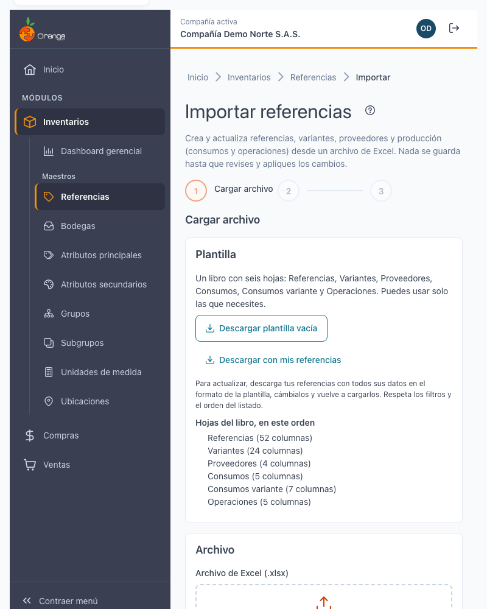

### La plantilla: un libro con seis hojas

| Hoja | Qué contiene | Cada fila es |
|------|--------------|--------------|
| **Referencias** | Datos generales, impuestos, porcentajes de costo y contabilidad | Una referencia |
| **Variantes** | Combinaciones, códigos de barras, precios y niveles de inventario | Una variante |
| **Proveedores** | Código y valor de la referencia en cada proveedor | Un proveedor de una referencia |
| **Consumos** | Materiales que consume una referencia semielaborada | Un material de una referencia |
| **Consumos variante** | Materiales que consume una variante concreta | Un material de una variante |
| **Operaciones** | Ruta de operaciones: secuencia, dependencia y tiempo | Una operación de una referencia |

Puede usar **todas las hojas o solo algunas** (al menos una): por ejemplo, para cambiar precios basta con la hoja **Variantes**. Las hojas se reconocen por su nombre exacto (con o sin tildes ni mayúsculas); las demás hojas del libro se ignoran.

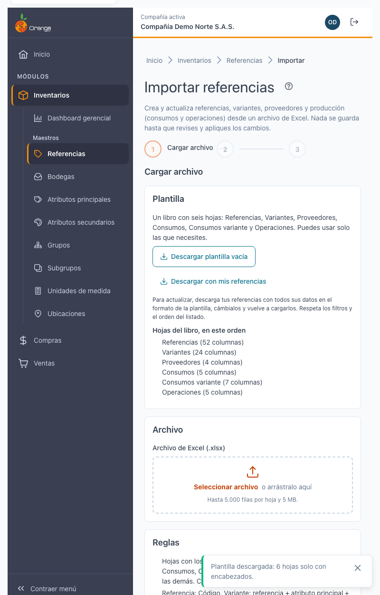

Hay dos formas de obtener el archivo:

| Botón | Qué descarga | Para qué |
|-------|--------------|----------|
| **Descargar plantilla vacía** | `referencias-plantilla.xlsx` con las seis hojas y solo los encabezados | Crear referencias o variantes nuevas |
| **Descargar con mis referencias** | Un libro con sus referencias y **todos sus datos** en las seis hojas | Corregir o actualizar lo que ya existe |

**Sobre "Descargar con mis referencias":**

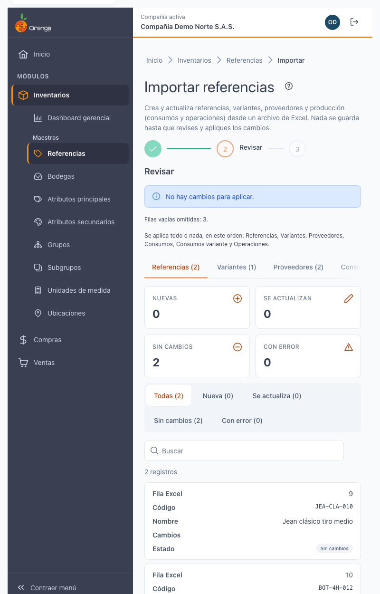

- Trae las referencias del listado **con la búsqueda, los filtros y el orden que tenía** al hacer clic en **Importar** (por defecto, solo las *Activas*), hasta **20.000 referencias**.
- Las **seis hojas vienen completas**: todas las columnas de Referencias y Variantes, más los proveedores, consumos, consumos por variante y operaciones de esas referencias. Los encabezados son los mismos de la plantilla.
- Es un viaje de ida y vuelta: si lo vuelve a cargar **sin cambiar nada**, todas las filas salen como *Sin cambios*.
- Borre las filas que no va a cambiar: así la revisión es más corta.
- Si la hoja trae más de **5.000 filas**, al descargar verá el aviso *"Para reimportar este archivo divídelo: Importar acepta hasta 5.000 filas por hoja"*. El archivo se descarga igual, pero no se divide solo: para reimportar una parte, **filtre el listado** antes de exportar.
- Si el listado supera las 20.000 referencias, la descarga se rechaza: filtre para traer menos.

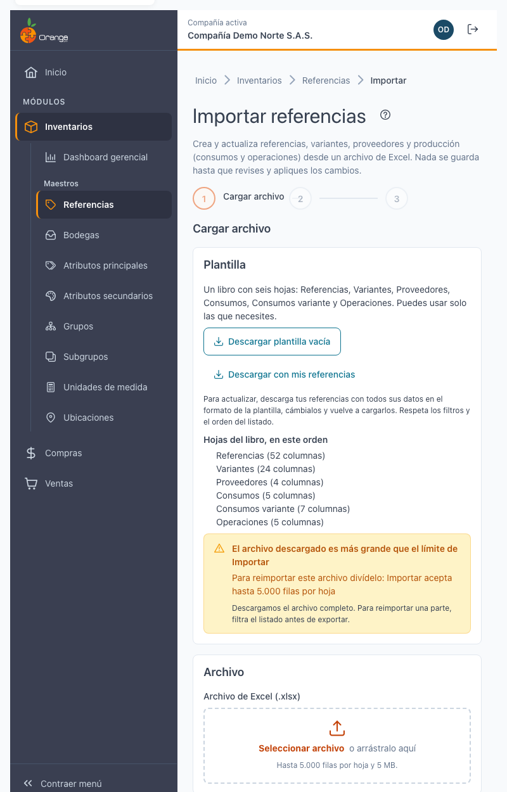

### Columnas de cada hoja

> Las hojas **Referencias** y **Variantes** tienen todas las columnas que se listan abajo. Las cuatro hojas nuevas se describen después, junto con sus reglas.

**Hoja Referencias** (la columna **Código** es obligatoria):

| Grupo | Columnas |
|-------|----------|
| Identificación | Código · Código alterno · Nombre · Nombre alterno |
| Clasificación | Código subgrupo · Documento tercero principal · Código unidad · Categoría · Código bodega por defecto · Composición · Posición arancelaria |
| Porcentajes de costo | Utilidad % · Indirectos % · Indirectos administrativos % · Indirectos de ventas % |
| Control sanitario | Tipo de riesgo · Clasificación IARC · Tipo de clasificación · Registro Invima |
| Casillas (Sí/No) | Activa · Maneja inventarios · Comercializada · Catálogo · Favorita · Comanda · Liquida IVA · IVA incluido · Es material · Fecha de vencimiento · Criterios de aceptación · Lote obligatorio · Semielaborada |
| Impuestos | IVA generado · IVA descontable · IVA devoluciones |
| Material | Tipo de material |
| Contabilidad | Cuenta y Naturaleza de: valor bruto, IVA, descuento, costos, inventario, devolución valor bruto, devolución descuento y devolución IVA |

**Hoja Variantes** (las tres primeras columnas son obligatorias):

| Grupo | Columnas |
|-------|----------|
| Identificación | Código referencia · Código atributo principal · Código atributo secundario |
| Empaque | Código unidad de empaque · Cantidad |
| Códigos | EAN8 · EAN13 · Código abierto 20 · Código abierto 40 · Código abierto 100 |
| Precios y costos | Precio 1 … Precio 5 · Costo esperado · Costo calculado · Descuento POS % |
| Inventario y producción | Mínimo · Máximo · Crítico · Peso · Tiempo estándar · Participación % |

**Hoja Proveedores** (todas obligatorias): Código referencia · Documento proveedor · Código en el proveedor · Valor.

**Hoja Consumos** (las primeras cuatro identifican la fila): Código referencia · Código material · Código atributo principal material · Código atributo secundario material · Cantidad.

**Hoja Consumos variante**: Código referencia · Código atributo principal · Código atributo secundario (la variante que consume) · Código material · Código atributo principal material · Código atributo secundario material (la variante del material) · Cantidad.

**Hoja Operaciones**: Código referencia · Código operación · Secuencia · Secuencia dependiente · Tiempo (minutos).

El orden de las columnas no importa, y puede quitar las que no use (menos las que identifican la fila). Los significados de cada campo son los mismos de la pantalla: ver [Detalle de una referencia](referencias-detalle.md).

### Reglas

| Regla | Detalle |
|-------|---------|
| **Cómo se reconoce cada fila** | La **referencia**, por su **Código**. La **variante**, por **Código referencia + Código atributo principal + Código atributo secundario**. Si ya existe, se actualiza; si no, se crea. |
| **Celda vacía** | En una fila que **actualiza**, una celda vacía **deja el valor actual**. Para cambiar un dato, escriba el valor nuevo. |
| **Al crear** | Se exigen los obligatorios: en Referencias, **Nombre**, **Código subgrupo** y **Código unidad** (y los tres impuestos si *Liquida IVA* es Sí); en Variantes, los tres códigos que la identifican. |
| **Datos de otras tablas** | Subgrupo, unidad, bodega, impuestos, cuentas y atributos se escriben **por su código** (por ejemplo, `CAM`, `UND`, `M`, `NEG`); el tercero, **por su documento** (NIT o cédula). |
| **Casillas** | Se escriben **Sí** o **No** (también se aceptan **1** y **0**). |
| **IVA** | Si *Liquida IVA* es **Sí**, los tres impuestos (**IVA generado**, **IVA descontable** e **IVA devoluciones**) son obligatorios. |
| **Naturaleza** | **C** (crédito) o **D** (débito). |
| **Formato** | El código y el nombre siguen las mismas reglas que en la pantalla (código de hasta 20 caracteres sin espacios, en MAYÚSCULAS; nombre de hasta 100, sin comas ni punto y coma). En una referencia que viene de la versión anterior, las reglas de formato solo se aplican a las celdas que cambian. |
| **Referencia y variantes en el mismo archivo** | Puede crear una referencia en la hoja Referencias y sus variantes en la hoja Variantes del mismo archivo. |
| **Nunca** | La importación nunca borra nada, ni cambia el código de una referencia. |

**Reglas de las hojas de proveedores y producción:**

| Hoja | Cómo se reconoce la fila | Reglas |
|------|--------------------------|--------|
| **Proveedores** | Código referencia + Documento proveedor (NIT o cédula de un proveedor de la compañía) | Si el par existe se actualiza el código y el valor; si no, se crea y ambos son obligatorios. Código de hasta 20 caracteres, sin comas ni punto y coma. Valor mayor que cero, con hasta 2 decimales. Un proveedor no se repite en la misma referencia. |
| **Consumos** | Código referencia + material + atributos del material | Si ya existe, se actualiza la **cantidad**; si no, se crea. Para crear, la referencia debe ser **Semielaborada** (ya lo es, o la pone la hoja Referencias del mismo archivo). El material debe ser una referencia activa de la compañía que sea *Material* o *Semielaborada*, y los atributos deben formar una variante de ese material. Una referencia no puede consumirse a sí misma. Cantidad mayor que cero, con 2 decimales. |
| **Consumos variante** | La variante (referencia + atributos) + la variante del material | Igual que Consumos, pero el consumo es de una sola variante. La variante puede venir en la hoja Variantes del mismo archivo. |
| **Operaciones** | Código referencia + Código operación | Si la operación ya está en la ruta se actualiza; si no, se crea (Secuencia y Tiempo obligatorios). La operación debe existir en el maestro de operaciones. La secuencia es un entero mayor que cero y no se repite en la ruta. **Secuencia dependiente**: debe ser de la misma referencia y menor que la secuencia de la fila; vacía no cambia nada y **0 quita** la dependencia. Tiempo mayor que cero, con 2 decimales. |

Una fila que **actualiza** un consumo u operación que ya existe solo revisa lo que cambia: si el dato guardado viene con alguna rareza de la versión anterior, igual puede corregir solo la cantidad o el tiempo.

Las hojas de proveedores y producción solo cambian filas de referencias que **existen** o que **vienen en el mismo archivo** sin errores.

### Límites

| Límite | Valor |
|--------|-------|
| Formato | Excel `.xlsx` |
| Filas | Hasta **5.000 filas por hoja**. Si tiene más, divida el archivo. (Descargar con mis referencias admite hasta 20.000 referencias, pero para reimportar cada hoja debe quedar en 5.000 filas o menos.) |
| Tamaño | Hasta **5 MB** |
| Filas vacías | Se ignoran; en **Revisar** se indica cuántas se omitieron. |

Guarde el archivo y arrástrelo al recuadro, o haga clic para seleccionarlo. Mientras se lee verá *Leyendo el archivo…* y luego *Validando las filas…*.

Si el archivo no sirve, verá **"No se puede usar este archivo"** con el motivo, y no se envía nada:

| Motivo | Qué hacer |
|--------|-----------|
| El archivo debe ser un libro de Excel (.xlsx). | Guárdelo como *Libro de Excel (.xlsx)*. |
| El archivo no tiene ninguna de las hojas esperadas (Referencias, Variantes, Proveedores, Consumos, Consumos variante, Operaciones). | Cambie el nombre de la hoja o use la plantilla. |
| A la hoja … le faltan las columnas: … | Agregue esas columnas con el encabezado exacto de la plantilla. |
| Las hojas no tienen filas con datos. | Llene al menos una fila debajo del encabezado. |
| La hoja … tiene más de 5.000 filas. Divida el archivo. | Divídalo en varios archivos. |
| El archivo pesa más de 5 MB. | Quite hojas, columnas o formatos que no use, o divida el archivo. |

---

## 2️⃣ Revisar

El sistema valida cada fila **sin guardar nada** y le muestra el resultado **por hoja**:

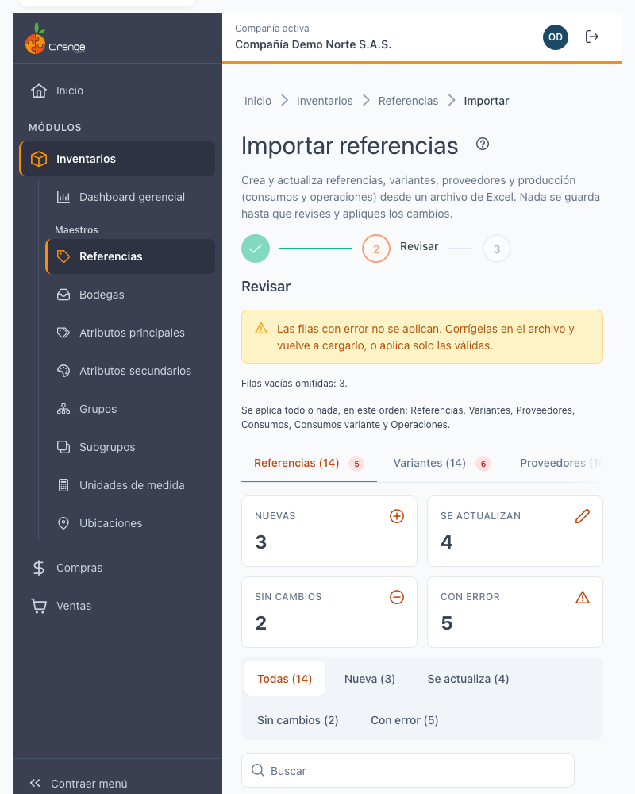

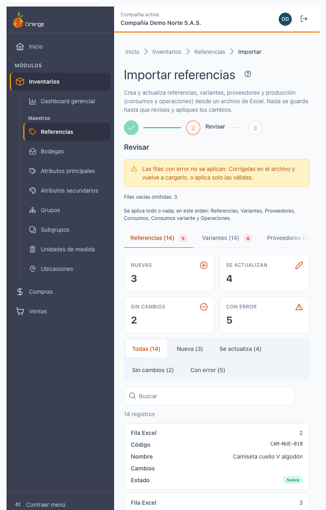

- Hay una pestaña por hoja presente en su archivo, con su número de filas y, si las hay, cuántas tienen error.
- Cada hoja tiene su resumen:

| Indicador | Significado |
|-----------|-------------|
| **Nuevas** | Filas que no existen: se crearán. |
| **Se actualizan** | Filas que ya existen y traen algún cambio. |
| **Sin cambios** | Filas que ya existen con los mismos datos: no se toca nada. |
| **Con error** | Filas que **no se aplicarán**. Debajo del estado verá el motivo. |

- Con **Filtrar por estado** ve solo las filas de un tipo.
- La tabla muestra **Fila Excel** (el número de fila en su archivo), el **Código** y el **Nombre** (o la **Referencia** y la **Variante**), los **Cambios** y el **Estado**.
- La columna **Cambios** dice qué cambia, con el valor de antes y el de después, por ejemplo *"Precio 1: 45.000 → 48.000"*.
- Una variante cuya referencia se crea en el mismo archivo dice *"Su referencia es nueva en este archivo."*

### Errores frecuentes y qué hacer

| Mensaje | Qué hacer |
|---------|-----------|
| Código: usa hasta 20 caracteres (letras, números y . _ / -), sin espacios. | Corrija el código. |
| Nombre: hasta 100 caracteres, sin comas ni punto y coma. | Quite `,` y `;` o acorte el nombre. |
| Falta el nombre / el subgrupo / la unidad (obligatorio al crear). | La referencia es nueva: complete la celda. Si quería actualizar una existente, revise que el código esté bien escrito. |
| El código de producto … supera 30 caracteres o tiene espacios (facturación electrónica). | Solo en compañías con facturación electrónica y en variantes nuevas: el código *referencia-atributo principal-atributo secundario* no cabe en SIIGO. Use atributos con códigos más cortos o acorte el código de la referencia. |
| Subgrupo …: no existe en la compañía. | Escriba el **código** del subgrupo (no el nombre). |
| Liquida IVA es Sí: faltan … | Escriba los tres impuestos, o ponga *Liquida IVA* en No. |
| Tercero …: no existe o está inactivo. | Escriba el documento de un tercero activo. |
| …: la cuenta … no es de movimiento. | Use una cuenta auxiliar (de movimiento). |
| Naturaleza: escribe C (crédito) o D (débito). | Corrija la naturaleza. |
| …: escribe Sí o No. | Corrija la casilla (Sí, No, 1 o 0). |
| …: escribe un número válido. | Quite letras o símbolos del número. |
| …: usa hasta … caracteres. | Acorte el texto. |
| Es material es Sí: falta el tipo de material. | Escriba el tipo de material. |
| Una referencia comercializada no puede ser también material ni semielaborada. | Deje en Sí solo una de las tres. |
| El código … ya existe como gasto o nota bancaria. | Ese código lo usa un concepto que no es de inventario: use otro. |
| El código se repite en el archivo (filas …). | Deje una sola fila por código. |
| La referencia … no existe ni viene en la hoja Referencias. | La variante apunta a una referencia que no existe: corrija el código o agregue la referencia en la hoja Referencias. |
| Código atributo principal / secundario …: no existe en la compañía. | Escriba el código del atributo, o créelo antes en su maestro. |
| EAN13: el dígito de control no es correcto (debería ser …). | Revise el código de barras; el mensaje dice cuál debería ser el último dígito. |
| EAN13 …: ya está asignado a otra variante de la compañía. | Cada código de barras identifica una sola variante: use otro. |
| La combinación se repite en el archivo (filas …). | Deje una sola fila por referencia + atributos. |
| La combinación está repetida en la referencia (viene así de la versión anterior)… | Corrija esa variante en el [detalle de la referencia](referencias-detalle.md) antes de importarla. |

**Errores de las hojas de proveedores y producción:**

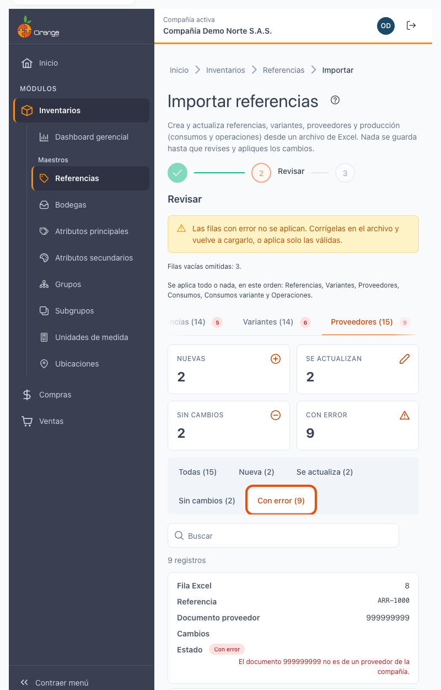

| Mensaje (resumen) | Qué hacer |
|-------------------|-----------|
| La referencia no existe ni viene en el archivo / La referencia del archivo tiene error. | Corrija o agregue la referencia en la hoja Referencias; si la referencia tiene error, corríjala primero. |
| Proveedor: el documento no es de un proveedor de la compañía. | Escriba el NIT o cédula de un proveedor activo. |
| Proveedor: falta el código o el valor. / El código tiene formato no válido. | Complete la celda; el código lleva hasta 20 caracteres, sin comas ni punto y coma. |
| El proveedor se repite en el archivo. | Deje una sola fila por referencia y proveedor. |
| Material: no existe, o no es material ni semielaborado. | Use una referencia activa marcada como *Es material* o *Semielaborada*. |
| La variante del material no existe. | Revise los códigos de atributo del material. |
| Una referencia no puede consumirse a sí misma. | Quite la fila o use otro material. |
| La referencia no es semielaborada. | Marque *Semielaborada* en la hoja Referencias (o en el detalle) para poder crear consumos. |
| La variante no existe (Consumos variante). | Corrija los atributos o agréguela en la hoja Variantes. |
| El consumo se repite en el archivo. | Deje una sola fila por llave. |
| Operación: el código no existe. | Use un código del maestro de operaciones. |
| La operación se repite en el archivo. | Deje una sola fila por referencia y operación. |
| Falta la secuencia o el tiempo. | Complételos (obligatorios al crear). |
| La secuencia está repetida. | Cada operación de la ruta lleva una secuencia distinta. |
| La secuencia dependiente no es válida. | Debe ser de la misma referencia y menor que la secuencia de la fila. |
| Falta la cantidad. | Escriba una cantidad mayor que cero. |
| La fila es ambigua. | Hay dos registros guardados con la misma llave: corríjalos en el [detalle de la referencia](referencias-detalle.md). |

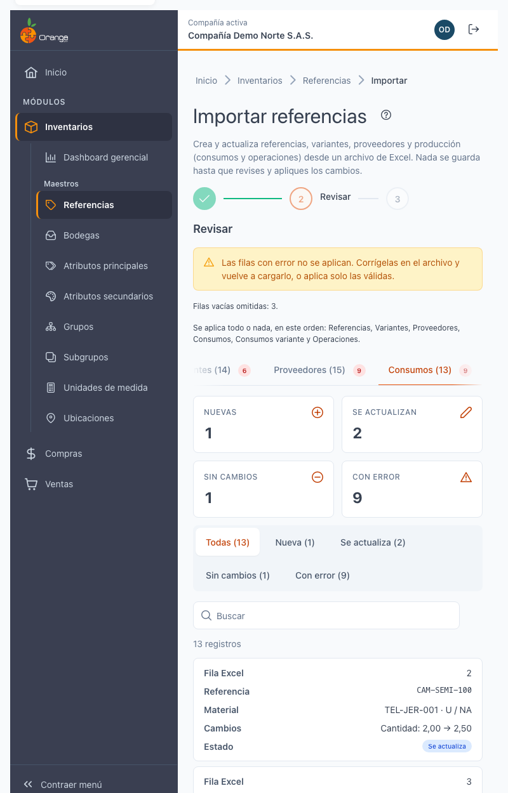

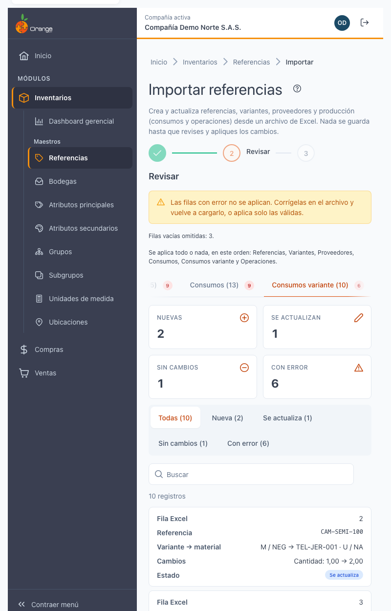

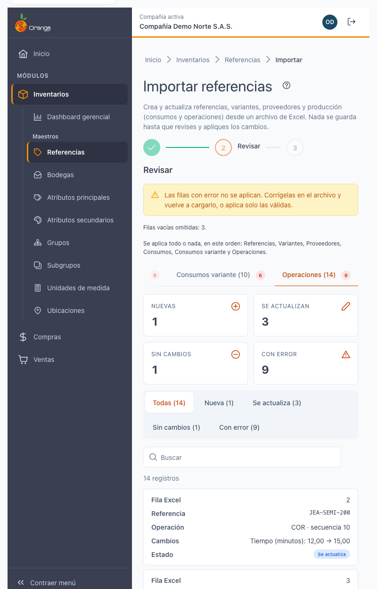

> 💡 **Descargar filas con error** genera un Excel solo con las filas con error de todas las hojas (hoja, fila, código, nombre y motivo), para corregirlas y volver a cargarlas.

Si quiere corregir el archivo antes de aplicar, haga clic en **Cargar otro archivo**.

---

## 3️⃣ Aplicar y resultado

Haga clic en **Aplicar N cambios** (N = las filas **nuevas** y las que **se actualizan** de todas las hojas). Las filas con error y las que no tienen cambios se omiten. Si no hay nada que aplicar verá *"No hay cambios para aplicar."*

- **Todo o nada**: todas las filas válidas de todas las hojas se guardan juntas, en este orden: Referencias, Variantes, Proveedores, Consumos, Consumos variante y Operaciones. Si algo falla, **no se guarda ningún cambio**: verá *"No se pudo aplicar. No se guardó ningún cambio. Inténtalo de nuevo."* y puede hacer clic en **Reintentar**.
- **Conflicto**: si alguien cambió referencias después de su revisión, verá *"Alguien cambió referencias después de la revisión. No se guardó ningún cambio: vuelve a validar el archivo."* Haga clic en **Volver a validar**: la revisión se repite con los datos actuales y puede aplicar de nuevo.
- Si mientras revisa otro usuario cambia referencias, se le avisa antes de aplicar: *"Otro usuario cambió referencias mientras revisabas. Vuelve a validar antes de aplicar."* Use **Volver a validar**.

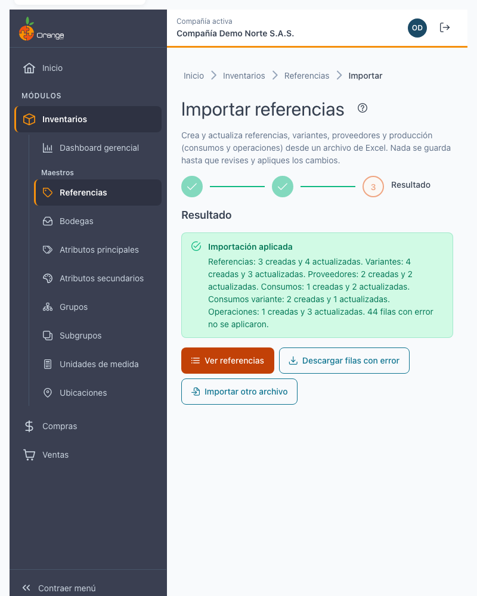

Al terminar verá **Importación aplicada** con el resumen, por ejemplo *"Referencias: 3 creadas y 8 actualizadas. Variantes: 9 creadas y 4 actualizadas. Proveedores: 2 creadas y 1 actualizada. 2 filas con error no se aplicaron."* Use **Ver referencias** para volver al listado, que ya muestra los cambios, o **Importar otro archivo**.

Los demás usuarios que tengan abierto el listado de referencias reciben un solo aviso: *"Otro usuario importó N referencias."*

---

## ❓ Preguntas frecuentes

**¿Puedo cambiar el código de una referencia con la importación?**
No. El código es lo que identifica la referencia: si pone un código distinto, se crea una referencia nueva. Para cambiar un código, ábrala en [Detalle de una referencia](referencias-detalle.md).

**¿La importación borra las referencias o variantes que no están en el archivo?**
No. Nunca elimina referencias ni variantes.

**Dejé celdas vacías: ¿se borran esos datos?**
No. En una fila que actualiza, la celda vacía deja el valor actual. Por eso es seguro dejar vacías las columnas que no quiere cambiar.

**Solo quiero cambiar precios. ¿Qué lleno?**
En la hoja **Variantes**, una fila por variante con **Código referencia**, **Código atributo principal**, **Código atributo secundario** y las columnas de precio que cambian. Puede quitar la hoja Referencias.

**¿Cómo quito un dato, por ejemplo una cuenta?**
La importación no vacía campos (una celda vacía no cambia nada). Para quitar un dato, hágalo en el [detalle de la referencia](referencias-detalle.md).

**Mis códigos con ceros a la izquierda (`007`) aparecen como `7`.**
Excel los convirtió en número. En la plantilla las columnas vienen como texto; si pega datos, péguelos como *solo valores* o dé formato de texto a la columna antes de escribir.

**¿Puedo importar los consumos y operaciones de producción?**
Sí: use las hojas **Consumos**, **Consumos variante** y **Operaciones**. Para crear consumos la referencia debe ser *Semielaborada*. También puede registrarlos en la pestaña **Producción** del [detalle de la referencia](referencias-detalle.md).

**Descargué con mis referencias y el archivo es muy grande.**
Importar acepta hasta 5.000 filas por hoja. Filtre el listado (por subgrupo, por ejemplo) antes de exportar y descargue por partes.

**¿Se borran los proveedores, consumos u operaciones que no están en el archivo?**
No. La importación nunca borra.

**No veo el botón Importar.**
Su perfil necesita el permiso **Exportar** sobre Referencias. Consulte a su administrador.
