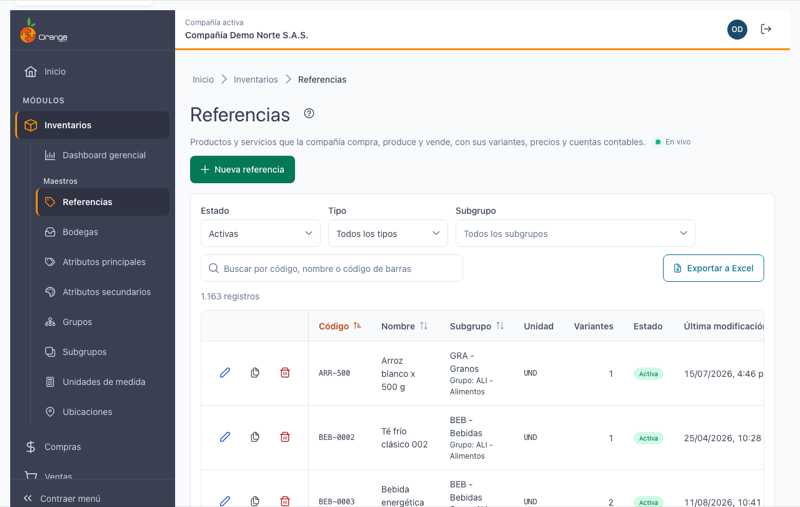
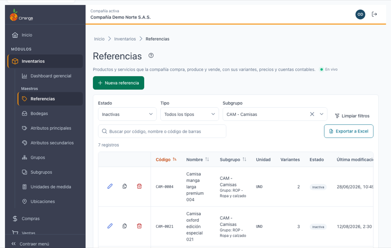
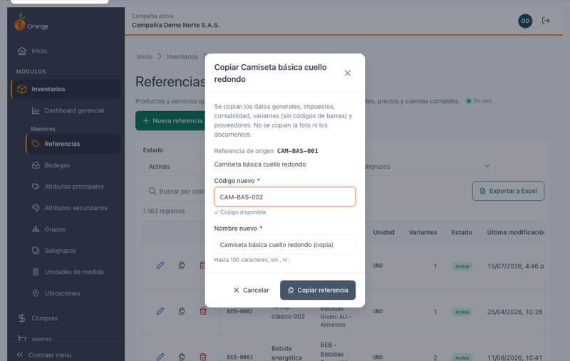
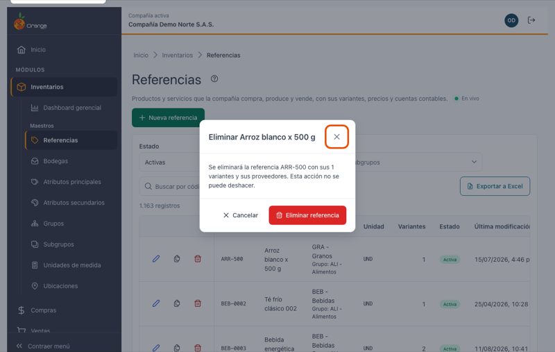

[Regresar a Inventarios](../readme.md)

---

# 🏷️ Referencias

---

## 📋 Descripción

Las **referencias** son los productos y servicios que la compañía compra, produce y vende: una camiseta, un arroz de 500 g, una tela, un insumo. Cada referencia pertenece a un [subgrupo](subgrupos.md) (y este a un [grupo](grupos.md)) y tiene sus **variantes** (por ejemplo, las tallas y colores de una prenda), cada una con su código de barras y sus precios.

Es el dato que más se usa en compras, ventas, punto de venta e inventario. Por eso en esta pantalla lo importante es **encontrar rápido** la referencia entre miles, sin tener que recorrer el listado.

En esta pantalla puede **buscar, filtrar, consultar, crear, copiar, eliminar, exportar e importar** las referencias de la compañía con la que está trabajando. Al crear o editar se abre la **página de detalle** de la referencia, que se explica en [Detalle de una referencia](referencias-detalle.md).

> 📘 El orden, la paginación, la exportación y la ayuda funcionan como en las demás tablas: ver [Manejo general de la información](../../Generales/manejo-general-informacion.md). La diferencia es que aquí la búsqueda, los filtros y el orden **los resuelve el servidor**, página por página, porque una compañía puede tener más de 11.000 referencias.

> 💡 Cada pestaña del navegador trabaja con **una compañía**. El nombre y el color de la compañía se ven en el título de la pestaña y en la barra superior.

---

## 🎯 Acceso

1. En el menú principal, haga clic en **Inventarios**.
2. En **Maestros**, haga clic en **Referencias** (es la primera opción).

> ℹ️ La misma opción aparece también en el menú de **Producción**, con los mismos permisos.

---

## 🖥️ Pantalla principal

| Elemento | Para qué sirve |
|----------|----------------|
| **?** (junto al título) | Abre esta ayuda en un panel lateral, sin salir de la pantalla. |
| **En vivo** | La pantalla está conectada: los cambios de otros usuarios aparecen solos. Ver *Cambios de otros usuarios* más abajo. |
| **Nueva referencia** | Abre la página para crear una referencia. Ver [Detalle de una referencia](referencias-detalle.md). |
| **Estado**, **Tipo**, **Subgrupo** | Filtros del listado. Ver *Filtrar el listado*. |
| **Buscar por código, nombre o código de barras** | Busca mientras escribe. Ver *Buscar una referencia*. |
| **Exportar a Excel** | Descarga las referencias que cumplen la búsqueda y los filtros. |
| **Importar** | Crea o actualiza referencias y variantes desde un archivo de Excel. Ver [Importar referencias desde Excel](referencias-importar.md). |
| **N registros** | Cuántas referencias cumplen la búsqueda y los filtros (no solo las de la página). |
| **Lápiz** / **Copiar** / **Papelera** | Editar, copiar o eliminar la referencia de esa fila. Siempre están en la **primera columna**, visibles aunque la tabla tenga que desplazarse. |
| **Código**, **Nombre**, **Subgrupo**, **Unidad**, **Variantes**, **Estado**, **Última modificación** | Columnas del listado. **Subgrupo** se muestra como `Código - Nombre` y, debajo, su grupo (`Grupo: ALI - Alimentos`). **Variantes** dice cuántas variantes tiene. **Estado** es *Activa* o *Inactiva*. |
| **Encabezados** | Puede ordenar por **Código**, **Nombre**, **Subgrupo** y **Última modificación**. Un clic ordena de forma ascendente, el segundo descendente y el tercero vuelve al orden inicial (por código). |
| **Filas por página** y paginación | Cambian cuántas referencias ve (10, 20, 50 o 100) y la página. |

> 📱 En el celular cada referencia se muestra como una tarjeta, con las acciones arriba, y los filtros se apilan uno debajo del otro.

**¿No ve algún botón?** Cada acción depende de los permisos de su perfil sobre la opción Referencias:

| Permiso | Qué habilita |
|---------|--------------|
| Consultar | Ver el listado y abrir el detalle de una referencia (y buscar subgrupos, unidades, cuentas y demás datos relacionados, aunque no tenga permisos sobre esas opciones) |
| Crear | **Nueva referencia** y **Copiar** |
| Actualizar | Modificar la referencia, sus variantes y sus proveedores. Sin este permiso el lápiz se cambia por un **ojo** (**Ver**) y el detalle se abre en solo consulta |
| Eliminar | **Papelera** (eliminar) |
| Exportar | **Exportar a Excel** e **Importar** |

---

## 🔍 Buscar una referencia

Escriba en **Buscar por código, nombre o código de barras**. La búsqueda empieza sola a partir de **2 caracteres**, sin presionar Enter, y encuentra la referencia por:

| Si escribe… | Encuentra | Ejemplo |
|-------------|-----------|---------|
| **Parte del código** o del **código alterno** | Las referencias cuyo código contiene lo escrito, en cualquier posición | `bas-00` encuentra `CAM-BAS-001` |
| **Palabras del nombre**, en cualquier orden | Las referencias que tienen **todas** esas palabras en el nombre | `camiseta cuello` encuentra *Camiseta básica cuello redondo* |
| Un **código de barras EAN13** completo | La referencia de la variante que tiene ese código | `7701234001018` |

No distingue mayúsculas ni tildes. Con un **lector de código de barras** basta con poner el cursor en la búsqueda y escanear.

Si nada coincide, la tabla muestra el mensaje de *sin resultados* con el texto buscado; borre la búsqueda con la **✕** para volver al listado completo.

---

## 🧰 Filtrar el listado

| Filtro | Opciones | Por defecto |
|--------|----------|-------------|
| **Estado** | Activas · Inactivas · Todas | **Activas** |
| **Tipo** | Todos los tipos · Comercializadas · Materiales e insumos · Semielaboradas · Manejan inventario | Todos los tipos |
| **Subgrupo** | Un subgrupo de la compañía, elegido en el buscador (escriba parte del código o del nombre) | Todos los subgrupos |

- Los filtros se combinan entre sí y con la búsqueda.
- Al cambiar un filtro, el listado vuelve a la página 1.
- Cuando algún filtro es distinto del valor por defecto aparece **Limpiar filtros**, que los deja como al abrir la pantalla.

> ⚠️ Al abrir la pantalla **solo se ven las referencias activas**. Si busca una referencia que desactivó, cambie **Estado** a *Inactivas* o *Todas*.

---

## ➕ Crear una referencia

Haga clic en **Nueva referencia**. Se abre la página de detalle, donde llena los datos generales, los impuestos y la contabilidad; al guardar, agrega sus variantes y proveedores. El paso a paso está en [Detalle de una referencia](referencias-detalle.md).

---

## ✏️ Consultar o editar una referencia

Haga clic en el **lápiz** de la referencia (o en el **ojo**, si su perfil solo permite consultar). Se abre su página de detalle. Ver [Detalle de una referencia](referencias-detalle.md).

---

## 📑 Copiar una referencia

Copiar sirve para crear una referencia parecida a otra (por ejemplo, la misma camiseta en otra línea) sin volver a escribir todo.

1. Haga clic en **Copiar** en la fila de la referencia (o en el botón **Copiar** de su página de detalle).
2. Escriba el **Código nuevo**. Mientras escribe, el sistema comprueba si está libre: verá *Verificando el código…* y luego **✓ Código disponible** o el aviso *"Ya existe una referencia con el código …"*.
3. Revise el **Nombre nuevo**: viene propuesto con el nombre de origen y *(copia)* al final.
4. Haga clic en **Copiar referencia**.

| Se copia | No se copia |
|----------|-------------|
| Datos generales, impuestos y costos, contabilidad | Los **códigos de barras** (EAN13 y EAN8) de las variantes: deben ser únicos, así que las variantes de la copia quedan sin código de barras |
| Todas las variantes (con sus precios y niveles) | La foto y los documentos adjuntos |
| Los proveedores | |

Al terminar se abre el detalle de la referencia nueva con el mensaje **"Copia creada: …"**. Revise las variantes y asígneles sus códigos de barras (puede usar **Generar EAN13**, ver [Detalle de una referencia](referencias-detalle.md)).

El código y el nombre nuevos siguen las mismas reglas que al crear: código de hasta 20 caracteres (letras, incluida la Ñ, números y `. _ / -`, sin espacios, en MAYÚSCULAS) y nombre de hasta 100 caracteres, sin comas ni punto y coma.

---

## 🗑️ Eliminar una referencia

1. Haga clic en la **papelera** de la referencia (o en **Eliminar** en su página de detalle).
2. El diálogo le recuerda cuántas variantes tiene: *"Se eliminará la referencia … con sus N variantes y sus proveedores. Esta acción no se puede deshacer."*
3. Confirme con **Eliminar referencia**.

Al eliminarla verá **"Referencia … eliminada"**. Desde el detalle, la pantalla vuelve al listado.

Al eliminar la referencia también se borran **su foto y sus documentos adjuntos** (ver [Foto y documentos](referencias-detalle.md)). Si los necesita, ábralos y guárdelos antes de eliminarla.

**Una referencia no se puede eliminar si ya se usó**: si alguna de sus variantes tiene movimientos de inventario, inventario físico, cortes de costo o de saldos, producción, clientes asociados, o si es material de otra referencia. En ese caso el diálogo cambia a:

> *"No se puede eliminar … : tiene información relacionada en otros módulos. Si ya no la usas, márcala como inactiva."*

y no se borra nada. Para dejar de usarla, ábrala, desmarque **Activa** y guarde: deja de verse en el listado por defecto, pero su historia se conserva.

---

## 📤 Exportar a Excel

Haga clic en **Exportar a Excel**. Mientras se prepara, el botón dice *Exportando…*. Se descarga `referencias_AAAA-MM-DD.xlsx` con **todas** las referencias que cumplen la búsqueda y los filtros (no solo la página visible), en el orden que tenga en pantalla, con el encabezado fijo y filtros de Excel.

| Columnas del archivo |
|----------------------|
| Código · Cód. alterno · Nombre · Nombre alterno |
| Cód. subgrupo · Subgrupo · Cód. grupo · Grupo |
| Documento tercero principal · Tercero principal · Posición arancelaria |
| Liquida IVA · Activa · Maneja inventarios · Composición · Cód. unidad · Unidad · Es material |
| Variantes (número) · Última modificación (fecha de Excel) |

Las casillas salen como **Sí** / **No**.

> ⚠️ Se exportan hasta **20.000 referencias**. Si el filtro da más, verá *"Hay más de 20.000 referencias con estos filtros. Acota la búsqueda o los filtros para exportar."* y no se descarga nada.

---

## 🔄 Cambios de otros usuarios (en vivo)

Si otra persona crea, modifica o elimina referencias mientras usted tiene abierta esta pantalla, **no tiene que recargar**: el listado vuelve a pedir la página que está viendo, sin perder la búsqueda, los filtros, el orden ni la página.

- Las filas nuevas o modificadas que estén en su página se **resaltan** unos segundos.
- Abajo a la derecha aparece un aviso, por ejemplo *"Otro usuario creó la referencia Camiseta polo piqué."* o *"Otro usuario eliminó la referencia …"*. Si fueron varias, *"Otros usuarios modificaron N referencias."*
- Agregar, cambiar o quitar variantes y proveedores también cuenta como una modificación de la referencia.
- Si otro usuario aplica una **importación desde Excel**, verá un solo aviso: *"Otro usuario importó N referencias."*
- Junto a la descripción verá **En vivo** mientras la conexión esté activa. Si se interrumpe, dice **Reconectando…**; al volver, la pantalla se actualiza sola.
- Si estaba por confirmar la eliminación de una referencia que otro ya eliminó, el diálogo se cierra con el aviso *"Otro usuario ya eliminó la referencia …"*.

> ℹ️ Los cambios que usted hace en esta misma pestaña no generan avisos. Los cambios hechos desde la versión anterior de OrangeERP no se avisan al instante: se reflejan al volver a esta pestaña después de un rato o al recargar.

Lo que pasa si otra persona cambia la referencia que usted tiene abierta en el detalle se explica en [Detalle de una referencia](referencias-detalle.md).

---

## ❓ Preguntas frecuentes

**No encuentro una referencia que sí existe.**
Revise, en este orden: que esté en la compañía correcta (título de la pestaña); que el filtro **Estado** no la esté ocultando (por defecto solo se ven las *Activas*); que **Tipo** y **Subgrupo** estén en *Todos*; y que haya escrito al menos 2 caracteres. Por código, la búsqueda encuentra lo que **empieza** por lo que escribe; por nombre, las referencias que tienen **todas** las palabras.

**¿Por qué el código de barras no encuentra nada?**
La búsqueda por EAN13 necesita el código **completo** (13 dígitos). Si el código es de otra variante que ya no existe, o no está asignado a ninguna variante de esta compañía, no aparece.

**¿Por qué ya no veo gastos ni notas bancarias en el listado?**
Este maestro muestra solo las referencias de inventario. Los conceptos de gasto y de notas bancarias se manejan en sus propias opciones.

**Una referencia tiene la columna Subgrupo con "—".**
Tiene asignado un subgrupo que ya no existe en la compañía (suele pasar con referencias antiguas). Ábrala, elija el subgrupo correcto y guarde.

**Hay referencias con códigos con espacios o símbolos, como `OF 2019`.**
Vienen de la versión anterior. Se listan y se editan normalmente; solo si cambia el código se exige el formato actual.

**¿Cómo cargo muchas referencias o cambio muchos precios a la vez?**
Con **Importar**: descargue la plantilla (o sus referencias en el formato de la plantilla), llénela y cárguela. Ver [Importar referencias desde Excel](referencias-importar.md).

**No veo "En vivo".**
La conexión en vivo no está disponible en este momento (por ejemplo, por la red de su empresa). La pantalla funciona igual; para ver cambios de otros usuarios, recargue la página.

**La "Última modificación" de algunas referencias muestra una hora distinta.**
Las fechas se guardan en hora universal y se muestran en la hora de su equipo; algunas referencias modificadas en la versión anterior pueden verse desplazadas hasta que se vuelvan a guardar.
