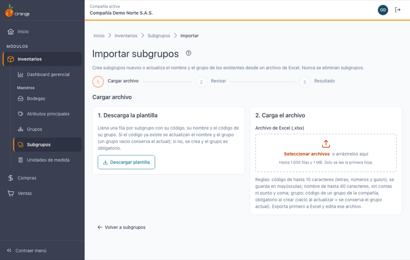
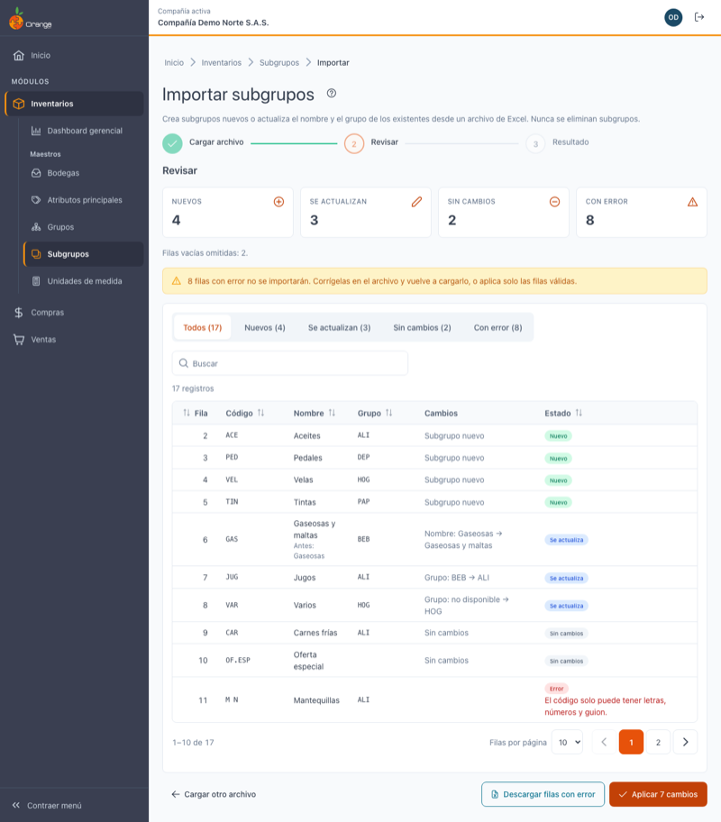
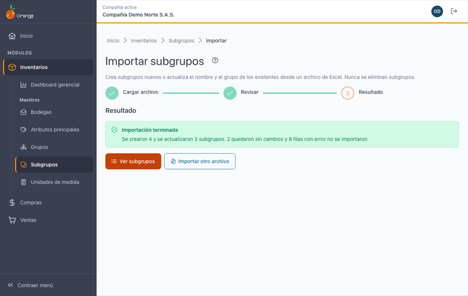

[Regresar a Subgrupos](subgrupos.md)

---

# 📥 Importar subgrupos desde Excel

---

## 📋 Descripción

Crea subgrupos nuevos o **actualiza el nombre y el grupo** de los existentes a partir de un archivo de Excel. Es la forma más rápida de cargar los subgrupos de una compañía nueva o de **mover muchos subgrupos a otro grupo** de una vez. Antes de guardar, el sistema le muestra qué va a crear, qué va a actualizar y qué filas tienen errores. **Nunca elimina subgrupos ni cambia códigos.**

> 🔐 Necesita el permiso **Exportar** sobre la opción Subgrupos (es el mismo permiso de Exportar a Excel).

---

## 🎯 Acceso

En [Subgrupos](subgrupos.md), haga clic en **Importar** (junto a **Exportar a Excel**).

La importación tiene tres pasos: **Cargar archivo → Revisar → Resultado**.

---

## 1️⃣ Cargar archivo

1. Haga clic en **Descargar plantilla**. Se descarga `subgrupos-plantilla.xlsx` con 3 columnas: **Código**, **Nombre** y **Grupo**.
2. Llene **una fila por subgrupo**, con su código, su nombre y el **código de su grupo** (por ejemplo `ALI`, no *Alimentos*):
   - Si el **código ya existe**, se actualizan su **nombre** y su **grupo**. Si deja la celda **Grupo vacía**, el subgrupo **conserva** el grupo que tiene.
   - Si el **código no existe**, se **crea** el subgrupo. En ese caso el **Grupo es obligatorio**.
3. Guarde el archivo y arrástrelo al recuadro, o haga clic en **Seleccionar archivos**.

Debajo del recuadro de carga la pantalla le recuerda las reglas (código, nombre y grupo) con el consejo *"Exporta primero a Excel y edita ese archivo."*

> 💡 También puede partir de **Exportar a Excel** en el listado: el archivo exportado trae las columnas de la plantilla y además *Nombre del grupo* y *Última modificación*, que la importación **ignora**. Puede corregir en ese archivo y cargarlo tal cual.

| Regla | Detalle |
|-------|---------|
| Formato | Excel `.xlsx`. Solo se lee la **primera hoja**. |
| Encabezado | La primera fila debe tener **Código**, **Nombre** y **Grupo** (con o sin tilde, en mayúsculas o minúsculas). El orden de las columnas no importa. Si falta alguna (por ejemplo, Grupo), verá *"Faltan las columnas: Grupo. Usa la plantilla."* |
| Tamaño | Hasta **1.000 filas** y **1 MB**. Si tiene más, divida el archivo. |
| Filas vacías | Se ignoran; en **Revisar** se indica cuántas se omitieron ("Filas vacías omitidas"). |
| Código | De 1 a 10 caracteres: letras, números y guion. Se guarda en mayúsculas. Los códigos de la versión anterior con símbolos (como `OF.ESP`) se aceptan porque ya existen. |
| Nombre | Hasta 40 caracteres, sin comas ni punto y coma. |
| Grupo | **Código** de un grupo de la compañía. **Al crear** es obligatorio; **al actualizar**, vacío = conserva el grupo actual. |

Si el archivo no sirve (no es Excel, le falta alguna columna, está vacío o es muy grande), verá el motivo y no se envía nada.

---

## 2️⃣ Revisar

El sistema valida cada fila **sin guardar nada** y le muestra un resumen:

| Indicador | Significado |
|-----------|-------------|
| **Nuevos** | Códigos que no existen: se crearán con su grupo. En **Cambios** verá *Subgrupo nuevo*. |
| **Se actualizan** | Códigos que ya existen con otro nombre u otro grupo. Si cambia el nombre, debajo verá **Antes: …**; la columna **Cambios** dice qué cambia, por ejemplo *Nombre: Gaseosas → Gaseosas y maltas* o *Grupo: BEB → ALI*. Si el grupo anterior ya no existía, verá *Grupo: no disponible → HOG*. |
| **Sin cambios** | Códigos que ya existen con el mismo nombre y el mismo grupo: no se toca nada. |
| **Con error** | Filas que **no se importarán**. Debajo del estado verá el motivo. |

Use las pestañas **Todos / Nuevos / Se actualizan / Sin cambios / Con error** para filtrar la tabla, y el buscador para ubicar una fila.

### Errores por fila

| Mensaje | Cómo corregirlo |
|---------|-----------------|
| Falta el código. / Falta el nombre. | Complete la celda. |
| El código tiene más de 10 caracteres. | Acorte el código. |
| El código solo puede tener letras, números y guion. | Quite espacios, puntos, tildes u otros símbolos. |
| El código / El nombre no puede tener comas ni punto y coma. | Quite `,` y `;`. |
| El nombre tiene más de 40 caracteres. | Acorte el nombre. |
| Falta el grupo: es obligatorio para crear un subgrupo. | Un subgrupo nuevo necesita su grupo: escriba el **código del grupo** en la columna Grupo. |
| No existe un grupo con el código … en la compañía. | Revise el código del grupo (no el nombre) y que exista en [Grupos](grupos.md) de esta compañía. |
| El código se repite en el archivo (filas …). | Deje una sola fila por código. Todas las filas repetidas quedan con error. |

> 💡 **Descargar filas con error** genera un Excel solo con esas filas y su motivo, para corregirlas y volver a cargarlas.

> 🔄 Si mientras revisa otro usuario cambia subgrupos, verá *"Otro usuario cambió subgrupos mientras revisabas. Vuelve a validar antes de aplicar."* Haga clic en **Volver a validar** para que la revisión tenga en cuenta esos cambios.

---

## 3️⃣ Aplicar y resultado

Haga clic en **Aplicar N cambios** (N = nuevos + se actualizan). Las filas con error se omiten.

- Todo se guarda **junto**: si algo falla, **no se guarda ningún cambio** y puede reintentar.
- Si otro usuario cambió subgrupos mientras usted revisaba, verá el aviso de cambios: haga clic en **Volver a validar** y revise de nuevo.
- Si alguien eliminó un grupo del archivo después de la revisión, esa fila no se aplica (se cuenta entre las filas con error) y el resto sí.

Al terminar verá el resumen (creados, actualizados, sin cambios y con error). Use **Ver subgrupos** para volver al listado, que ya muestra los cambios, o **Importar otro archivo**.

---

## ❓ Preguntas frecuentes

**¿Cómo paso varios subgrupos a otro grupo de una vez?**
Use **Exportar a Excel** en el listado, cambie la columna **Grupo** (el código del grupo) en las filas que quiera mover e importe el archivo. Solo cambiarán los subgrupos cuyo grupo sea distinto.

**¿Escribo el código o el nombre del grupo?**
El **código** (por ejemplo `ALI`). La columna *Nombre del grupo* del archivo exportado es solo informativa y la importación la ignora.

**¿Qué pasa si dejo la celda Grupo vacía?**
Si el subgrupo ya existe, conserva su grupo actual (solo se actualiza el nombre, si cambió). Si el subgrupo es nuevo, la fila queda con el error *"Falta el grupo"*.

**¿Puedo cambiar el código de un subgrupo con la importación?**
No. El código es lo que identifica el subgrupo: si pone un código distinto, se crea uno nuevo. Para cambiar un código use **Editar** en [Subgrupos](subgrupos.md).

**¿La importación carga la imagen del subgrupo?**
No. La imagen del subgrupo no se edita en esta versión; la importación conserva la que tenga cada subgrupo.

**¿La importación borra los subgrupos que no están en el archivo?**
No. Nunca elimina subgrupos.

**¿Dónde quedó "Importar desde Orange VFP"?**
Ya no existe: esta importación desde Excel lo reemplaza.

**No veo el botón Importar.**
Su perfil necesita el permiso **Exportar** sobre Subgrupos. Consulte a su administrador.
