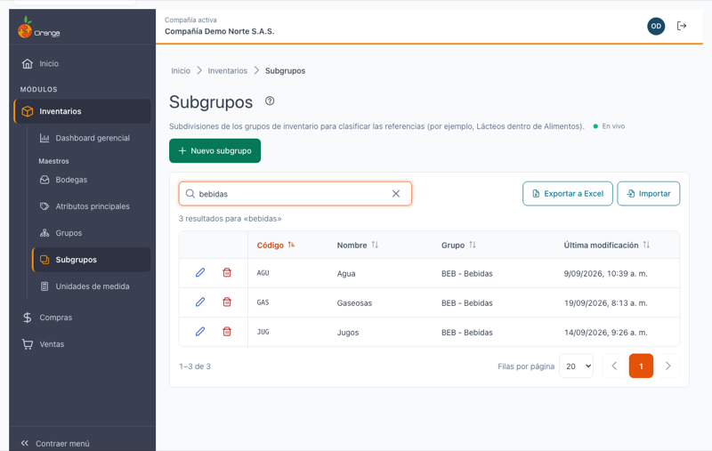
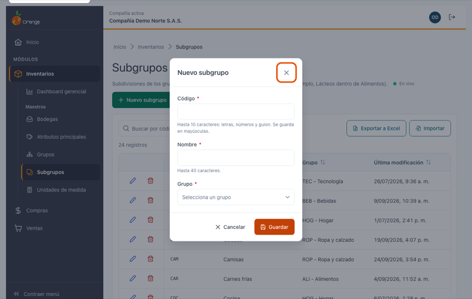
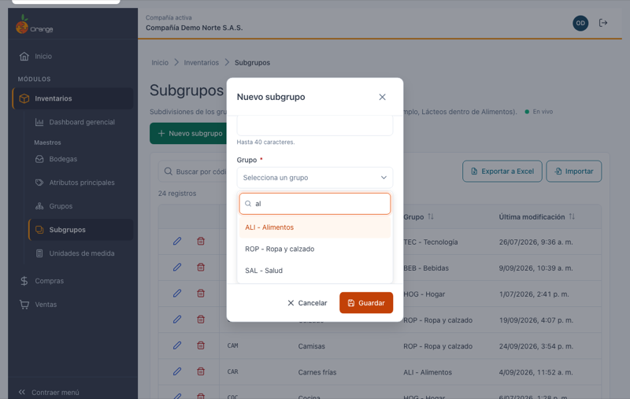
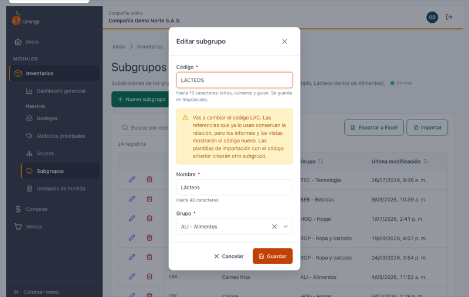
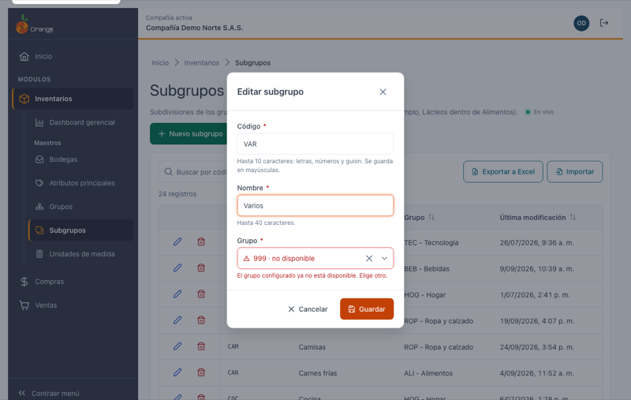
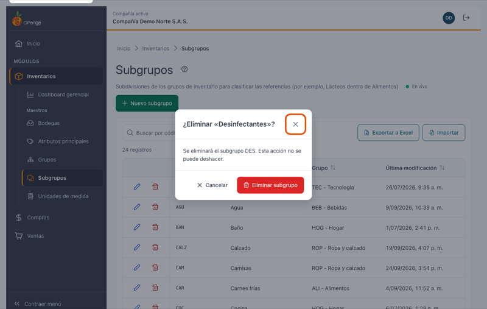
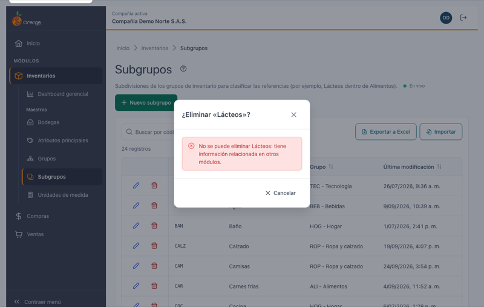

[Regresar a Inventarios](../readme.md)

---

# 🗃️ Subgrupos

---

## 📋 Descripción

Los **subgrupos** dividen cada [grupo](grupos.md) de inventario en clasificaciones más finas, por ejemplo `LAC` Lácteos y `CAR` Carnes dentro del grupo `ALI` Alimentos, o `GAS` Gaseosas y `JUG` Jugos dentro de `BEB` Bebidas. La clasificación de las referencias tiene tres niveles: **Grupo → Subgrupo → Referencia**. Cada referencia pertenece a un subgrupo, y cada subgrupo a un grupo.

Por eso un subgrupo **no se puede guardar sin su grupo**.

En esta pantalla puede **consultar, crear, editar, eliminar, exportar e importar** los subgrupos de la compañía con la que está trabajando.

> 📘 La búsqueda, el orden, la paginación, la exportación y la ayuda funcionan igual en todas las tablas: ver [Manejo general de la información](../../Generales/manejo-general-informacion.md).

> 💡 Cada pestaña del navegador trabaja con **una compañía**. El nombre y el color de la compañía se ven en el título de la pestaña y en la barra superior.

---

## 🎯 Acceso

1. En el menú principal, haga clic en **Inventarios**.
2. En **Maestros**, haga clic en **Subgrupos** (está debajo de **Grupos**).

---

## 🖥️ Pantalla principal

| Elemento | Para qué sirve |
|----------|----------------|
| **?** (junto al título) | Abre esta ayuda en un panel lateral, sin salir de la pantalla. |
| **En vivo** | La pantalla está conectada: los cambios de otros usuarios aparecen solos. Ver *Cambios de otros usuarios* más abajo. |
| **Nuevo subgrupo** | Crea un subgrupo. |
| **Buscar por código, nombre o grupo** | Filtra el listado mientras escribe. Busca en el código y el nombre del subgrupo **y también en el código y el nombre de su grupo**: si escribe `bebidas` (o `BEB`) verá todos los subgrupos del grupo Bebidas. No distingue mayúsculas ni tildes. |
| **Exportar a Excel** | Descarga los subgrupos (con el filtro y el orden que tenga en pantalla) **con su grupo**. |
| **Importar** | Crea o actualiza subgrupos desde un archivo de Excel. Ver [Importar subgrupos desde Excel](subgrupos-importar.md). |
| **Lápiz** / **Papelera** | Editar o eliminar el subgrupo de esa fila. Siempre están en la **primera columna**, visibles aunque la tabla tenga que desplazarse. |
| **Código**, **Nombre**, **Grupo**, **Última modificación** | Columnas del listado. **Grupo** muestra el grupo como `Código - Nombre` (por ejemplo `ALI - Alimentos`). Al abrir la pantalla, la tabla viene ordenada por **código**. |
| **Encabezados** | Un clic ordena de forma ascendente, el segundo descendente y el tercero vuelve al orden inicial. |
| **Filas por página** y paginación | Cambian cuántos subgrupos ve y la página. |

> 📱 En el celular cada subgrupo se muestra como una tarjeta, con las acciones arriba y el grupo visible.

**¿No ve algún botón?** Cada acción depende de los permisos de su perfil sobre la opción Subgrupos:

| Permiso | Qué habilita |
|---------|--------------|
| Consultar | Ver la pantalla (y buscar el grupo al crear o editar, aunque no tenga permisos sobre la opción Grupos) |
| Crear | **Nuevo subgrupo** |
| Actualizar | **Lápiz** (editar) |
| Eliminar | **Papelera** (eliminar) |
| Exportar | **Exportar a Excel** e **Importar** |

---

## ➕ Crear un subgrupo

1. Haga clic en **Nuevo subgrupo**.
2. Escriba el código y el nombre.
3. En **Grupo**, busque y elija el grupo al que pertenece.
4. Haga clic en **Guardar** (o presione **Enter**).

| Campo | Obligatorio | Reglas | Ejemplo |
|-------|:-----------:|--------|---------|
| **Código** | ✅ | De 1 a 10 caracteres: letras, números y guion. Se guarda **siempre en MAYÚSCULAS** (lo convierte mientras escribe). No se puede repetir en la compañía. | `LAC`, `SG-01`, `LACTEOS-10` |
| **Nombre** | ✅ | Hasta 40 caracteres, sin comas ni punto y coma. | `Lácteos` |
| **Grupo** | ✅ | Un grupo de la compañía, elegido en el buscador. | `ALI - Alimentos` |

### Elegir el grupo

1. Haga clic en el campo **Grupo**. Se abre una lista con los primeros grupos de la compañía, ordenados por código, como `Código - Nombre`.
2. Para encontrar un grupo, **escriba parte del código o del nombre** en *Buscar por código o nombre del grupo*: `al`, `ali` o `aliment` encuentran `ALI - Alimentos`. Busca los grupos cuyo **código empieza** por lo que escribe o cuyo **nombre lo contiene**, sin distinguir mayúsculas.
3. Si la compañía tiene muchos grupos, **desplácese hacia abajo** en la lista: al llegar al final se cargan más resultados (verá *"Cargando más…"*).
4. Elija el grupo con el mouse, o con las **flechas** y **Enter**. **Escape** cierra la lista sin cerrar el diálogo.

- Si ningún grupo coincide, verá *"Ningún grupo coincide con «…»."*
- Para quitar el grupo elegido, use la **✕** del campo.
- Si la búsqueda falla (por ejemplo, por la red), la lista muestra el error con **Reintentar**; el resto del diálogo sigue funcionando.

> 💡 El grupo se muestra como **Código - Nombre** (`ALI - Alimentos`). En la versión anterior se mostraba al revés, como *"Alimentos - Cód.:ALI"*.

Al guardar verá el mensaje **"Subgrupo … creado."** y el subgrupo aparece en el listado con su grupo.

### ¿Qué puede salir mal?

Si algo falta, el sistema marca los campos con error y pone el cursor en el primero (en el orden Código, Nombre, Grupo).

| Mensaje | Qué hacer |
|---------|-----------|
| Escribe el código del subgrupo. / Escribe el nombre del subgrupo. | Complete el campo. |
| Usa solo letras, números y guion (máximo 10). | Quite espacios, puntos, tildes u otros símbolos del código, o acórtelo. |
| El nombre no puede tener comas ni punto y coma (máximo 40). | Corrija o acorte el nombre. |
| Elige el grupo del subgrupo. | Elija el grupo en el buscador. |
| Ya existe un subgrupo con el código … | Use otro código. Lo que escribió (también el grupo) se conserva. |
| El grupo ya no existe en la compañía. Elige otro. | Otro usuario eliminó el grupo mientras usted creaba o editaba el subgrupo: elija otro grupo. |
| No se pudo guardar el subgrupo. Inténtalo de nuevo. | Falló la conexión o el servidor. El diálogo conserva lo escrito: vuelva a guardar. |

---

## ✏️ Editar un subgrupo

1. Haga clic en el **lápiz** del subgrupo. El diálogo muestra el código, el nombre y el **grupo actual**.
2. Cambie el código, el nombre o el grupo y haga clic en **Guardar**.

> ⚠️ **Cambiar el código** está permitido y no afecta las referencias que ya usan el subgrupo: conservan la relación. Verá un aviso porque los **informes y las vistas** mostrarán el código nuevo, y una plantilla de importación con el código anterior crearía otro subgrupo. Si vuelve a escribir el código original, el aviso desaparece.

> 💡 **Cambiar el grupo** mueve el subgrupo (y sus referencias) al nuevo grupo en la clasificación.

> 💡 Algunos subgrupos creados en la versión anterior tienen códigos con símbolos, como `OF.ESP`. Puede seguir editando su nombre o su grupo sin tocar el código; solo si cambia el código se exige el formato actual (letras, números y guion). Si un subgrupo antiguo **no tiene código** (la celda Código se ve vacía en el listado), al editarlo debe escribirle uno.

### El grupo aparece "no disponible"

Algunos subgrupos de la versión anterior tienen asignado un grupo que **ya no existe en la compañía**. En el listado su columna Grupo muestra **—**, y al editarlo el campo Grupo aparece en rojo como **"… · no disponible"** con el mensaje *"El grupo configurado ya no está disponible. Elige otro."*

**No puede guardar hasta elegir un grupo válido**: abra el buscador, elija el grupo correcto y guarde.

Si otro usuario eliminó el subgrupo mientras lo editaba, al guardar el diálogo se cierra, el subgrupo desaparece del listado y un aviso le indica **"Este subgrupo ya no existe"**.

---

## 🗑️ Eliminar un subgrupo

1. Haga clic en la **papelera** del subgrupo.
2. Confirme con **Eliminar subgrupo**.

Un subgrupo **no se puede eliminar** si tiene información relacionada, es decir, si alguna **referencia** de inventario lo usa. En ese caso el diálogo cambia a:

> No se puede eliminar … : tiene información relacionada en otros módulos.

Si ya no lo necesita, cambie primero el subgrupo de esas referencias.

---

## 📤 Exportar a Excel

Haga clic en **Exportar a Excel**. Se descarga `subgrupos_AAAA-MM-DD.xlsx` con **todos** los subgrupos del filtro actual (no solo la página visible), en el orden que tenga en pantalla, con el encabezado fijo y filtros de Excel. Columnas:

| Columna | Contenido |
|---------|-----------|
| **Código** | Código del subgrupo. |
| **Nombre** | Nombre del subgrupo. |
| **Grupo** | **Código** del grupo (por ejemplo `ALI`). |
| **Nombre del grupo** | Nombre del grupo, como información (la importación la ignora). |
| **Última modificación** | Fecha de Excel. |

Si el grupo de un subgrupo no está disponible, **Grupo** y **Nombre del grupo** quedan vacías.

El archivo exportado **se puede volver a importar**: puede exportar, corregir nombres o grupos en Excel e importarlo.

---

## 📥 Importar desde Excel

Para crear muchos subgrupos o cambiar sus nombres o grupos de una vez, use **Importar**. Vea el paso a paso en [Importar subgrupos desde Excel](subgrupos-importar.md).

---

## 🔄 Cambios de otros usuarios (en vivo)

Si otra persona crea, modifica, elimina o importa subgrupos mientras usted tiene abierta esta pantalla, **no tiene que recargar**: el listado se pone al día solo, sin perder lo que buscó, el orden ni la página.

- Las filas nuevas o modificadas se **resaltan** unos segundos.
- Abajo a la derecha aparece un aviso, por ejemplo *"Otro usuario creó el subgrupo Embutidos."* o *"Otro usuario importó 5 subgrupos. El listado ya está al día."*
- Junto a la descripción verá **En vivo** mientras la conexión esté activa. Si se interrumpe, dice **Reconectando…**; al volver, la pantalla se actualiza sola.

**Si estaba editando ese mismo subgrupo:**

| Qué hizo el otro usuario | Qué verá | Qué puede hacer |
|--------------------------|----------|-----------------|
| Lo modificó | *"Otro usuario modificó este subgrupo mientras lo editabas. Si guardas, reemplazarás sus cambios."* | **Ver sus cambios** para cargar lo que la otra persona guardó, o **Guardar** para dejar lo suyo. |
| Lo eliminó | *"Otro usuario eliminó este subgrupo. Ya no se puede guardar."* | **Cancelar**. El botón Guardar queda deshabilitado. |

Si estaba por confirmar la eliminación de un subgrupo que otro ya eliminó, el diálogo se cierra con el aviso *"Otro usuario ya eliminó el subgrupo…"*.

> ℹ️ Los cambios que usted hace en esta misma pestaña no generan avisos. Los cambios en la pantalla de **Grupos** (por ejemplo, el nombre de un grupo) no se avisan aquí: la columna Grupo se actualiza al recargar la página o cuando llega un cambio de subgrupos. Los cambios hechos desde la versión anterior de OrangeERP no se avisan al instante: se reflejan al volver a esta pestaña después de un rato o al recargar.

---

## ❓ Preguntas frecuentes

**¿Por qué no puedo guardar un subgrupo sin grupo?**
Todo subgrupo pertenece a un grupo: es el segundo nivel de la clasificación (Grupo → Subgrupo → Referencia). Es la misma regla de la versión anterior.

**¿Por qué no aparece el grupo que busco?**
Solo aparecen los grupos de la compañía actual. Escriba el **inicio del código** o **parte del nombre**; si hay muchos, desplácese hacia abajo en la lista para cargar más. Si aun así no aparece, revise en [Grupos](grupos.md) que exista en esta compañía.

**Al editar, el grupo sale "no disponible". ¿Qué hago?**
El grupo que tenía asignado ya no existe en esta compañía (suele pasar con subgrupos antiguos). Elija el grupo correcto en el buscador y guarde.

**¿Dónde está la imagen del subgrupo?**
En esta versión la imagen del subgrupo **no se edita**: la pantalla nueva no muestra ni cambia la imagen, y al editar un subgrupo **se conserva** la que ya tenía (la usa el Punto de venta). Los subgrupos creados en la nueva versión quedan sin imagen. La carga de imágenes llegará cuando se defina el almacenamiento de archivos de la nueva versión; mientras tanto, si necesita cambiarla, use la versión anterior de OrangeERP.

**¿Dónde quedó "Importar desde Orange VFP"?**
Ya no existe. Para cargar o actualizar subgrupos de forma masiva use [Importar desde Excel](subgrupos-importar.md).

**¿Por qué el código quedó en mayúsculas?**
Los códigos siempre se guardan en mayúsculas para que no haya dos subgrupos "iguales" escritos distinto (`lac` y `LAC`).

**¿Por qué no encuentro un subgrupo que sí existe?**
Revise que esté en la compañía correcta (título de la pestaña) y borre el texto del buscador con la **✕**.

**No veo "En vivo".**
La conexión en vivo no está disponible en este momento (por ejemplo, por la red de su empresa). La pantalla funciona igual; para ver cambios de otros usuarios, recargue la página.

**La "Última modificación" de algunos subgrupos muestra una hora distinta.**
Las fechas se guardan en hora universal y se muestran en la hora de su equipo; algunos subgrupos modificados en la versión anterior pueden verse desplazados hasta que se ajusten sus fechas.
