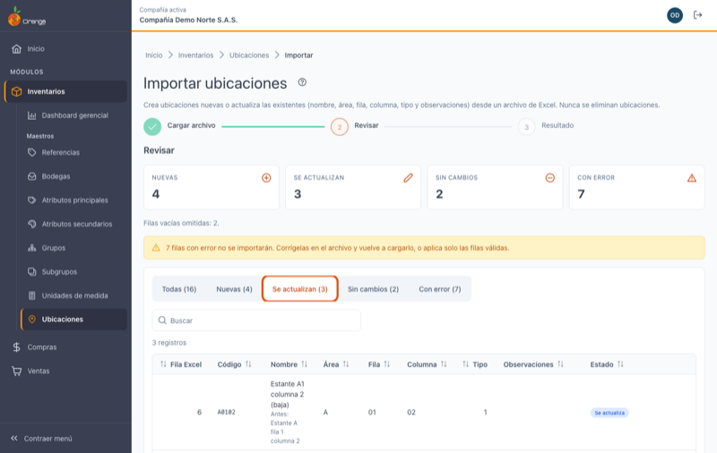
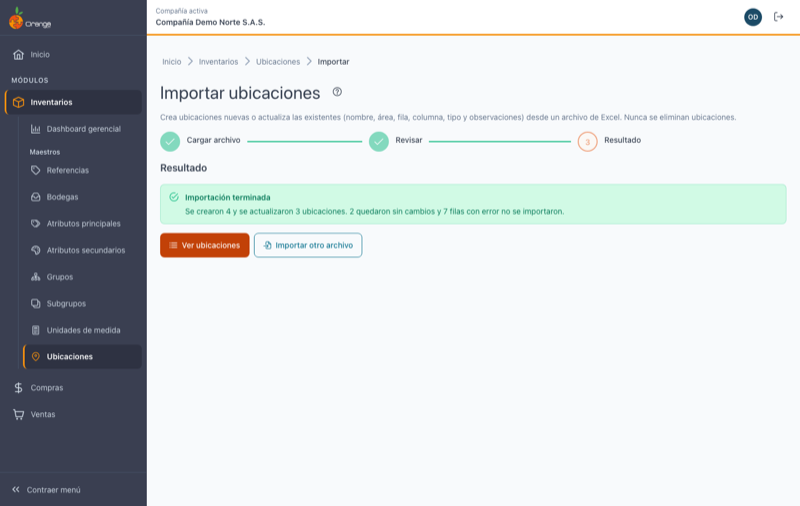

[Regresar a Ubicaciones](ubicaciones.md)

---

# 📥 Importar ubicaciones desde Excel

---

## 📋 Descripción

Crea ubicaciones nuevas o **actualiza el nombre, el área, la fila, la columna, el tipo y las observaciones** de las existentes a partir de un archivo de Excel. Es la forma más rápida de cargar las ubicaciones de una bodega nueva. Antes de guardar, el sistema le muestra qué va a crear, qué va a actualizar y qué filas tienen errores. **Nunca elimina ubicaciones ni cambia códigos.**

> 🔐 Necesita el permiso **Exportar** sobre la opción Ubicaciones (es el mismo permiso de Exportar a Excel).

---

## 🎯 Acceso

En [Ubicaciones](ubicaciones.md), haga clic en **Importar** (junto a **Exportar a Excel**).

La importación tiene tres pasos: **Cargar archivo → Revisar → Resultado**.

---

## 1️⃣ Cargar archivo

1. Haga clic en **Descargar plantilla**. Se descarga `ubicaciones-plantilla.xlsx` con 7 columnas: **Código**, **Nombre**, **Área**, **Fila**, **Columna**, **Tipo** y **Observaciones**.
2. Llene **una fila por ubicación**. Código, nombre, área, fila y columna son obligatorios; tipo y observaciones son opcionales.
   - Si el **código ya existe**, se actualizan sus demás datos.
   - Si el **código no existe**, se **crea** la ubicación.
3. Guarde el archivo y arrástrelo al recuadro, o haga clic en **Seleccionar archivo**. Para salir sin importar, use **Volver a ubicaciones**.

Debajo del recuadro de carga la pantalla le recuerda las reglas de cada columna.

> 💡 También puede partir de **Exportar a Excel** en el listado: el archivo exportado trae las mismas columnas y además *Última modificación*, que la importación **ignora**. Puede corregir en ese archivo y cargarlo tal cual.

| Regla | Detalle |
|-------|---------|
| Formato | Excel `.xlsx`. Solo se lee la **primera hoja**. |
| Encabezado | La primera fila debe tener **las siete columnas** (con o sin tilde, en mayúsculas o minúsculas). El orden de las columnas no importa. Si falta alguna, verá *"Faltan las columnas: … Usa la plantilla."* |
| Tamaño | Hasta **1.000 filas** y **1 MB**. Si tiene más, divida el archivo. |
| Filas vacías | Se ignoran; en **Revisar** se indica cuántas se omitieron ("Filas vacías omitidas"). |
| Código | De 1 a 5 caracteres: letras, números y guion. Se guarda en mayúsculas. Los códigos de la versión anterior con símbolos (como `R.01`) se aceptan porque ya existen. |
| Nombre | Hasta 30 caracteres. |
| Área, Fila, Columna | Obligatorias, hasta 5 caracteres cada una. Se guardan en mayúsculas. |
| Tipo | Número entero de 0 a 255. **Vacío = 0.** |
| Observaciones | Hasta 200 caracteres. **Vacía = sin observaciones.** |
| Todas | Ninguna celda puede tener comas ni punto y coma. |

> ⚠️ Una celda **vacía** de Tipo u Observaciones **no** significa "dejar como está": si la ubicación ya tiene un tipo o unas observaciones y usted deja la celda vacía, se actualizan a 0 o a sin observaciones. En la revisión lo verá como *Antes: …*.

Si el archivo no sirve (no es Excel, le falta alguna columna, está vacío o es muy grande), verá el motivo y no se envía nada.

---

## 2️⃣ Revisar

El sistema valida cada fila **sin guardar nada** y le muestra un resumen:

| Indicador | Significado |
|-----------|-------------|
| **Nuevas** | Códigos que no existen: se crearán. |
| **Se actualizan** | Códigos que ya existen con algún dato distinto. Debajo de cada celda que cambia verá **Antes: …** con el valor actual. |
| **Sin cambios** | Códigos que ya existen con los mismos datos: no se toca nada. Un área, fila o columna escrita en minúsculas cuenta como igual a la guardada en mayúsculas. |
| **Con error** | Filas que **no se importarán**. Debajo del estado verá el motivo. |

Use las pestañas **Todas / Nuevas / Se actualizan / Sin cambios / Con error** para filtrar la tabla, y el buscador para ubicar una fila.

> 💡 La primera columna de la tabla se llama **Fila Excel**: es el número de fila en su archivo. No la confunda con la columna **Fila** de la ubicación.

### Errores por fila

Una fila puede tener varios errores a la vez.

| Mensaje | Cómo corregirlo |
|---------|-----------------|
| Falta el código. / Falta el nombre. / Falta el área. / Falta la fila de la ubicación. / Falta la columna. | Complete la celda. |
| El código tiene más de 5 caracteres. | Acorte el código. |
| El código solo puede tener letras, números y guion. | Quite espacios, puntos, tildes u otros símbolos. |
| El nombre tiene más de 30 caracteres. | Acorte el nombre. |
| El área / La fila de la ubicación / La columna tiene más de 5 caracteres. | Acorte el valor. |
| El tipo debe ser un número entero de 0 a 255. | Escriba un número sin decimales entre 0 y 255, o deje la celda vacía. |
| Las observaciones tienen más de 200 caracteres. | Acorte las observaciones. |
| … no puede tener comas ni punto y coma. | Quite `,` y `;` de esa celda. |
| El código se repite en el archivo (filas …). | Deje una sola fila por código. Todas las filas repetidas quedan con error. |
| La fila está vacía. | Borre la fila o complétela. |

> 💡 **Descargar filas con error** genera un Excel solo con esas filas y su motivo, para corregirlas y volver a cargarlas. Con **Cargar otro archivo** vuelve al paso 1.

> 🔄 Si mientras revisa otro usuario cambia ubicaciones, verá *"Otro usuario cambió ubicaciones mientras revisabas. Vuelve a validar antes de aplicar."* Haga clic en **Volver a validar** para que la revisión tenga en cuenta esos cambios.

---

## 3️⃣ Aplicar y resultado

Haga clic en **Aplicar N cambios** (N = nuevas + se actualizan). Las filas con error se omiten. Si no hay nada que aplicar, el botón queda deshabilitado y verá *"No hay cambios para aplicar: todas las filas están sin cambios o con error."*

- Todo se guarda **junto**: si algo falla, **no se guarda ningún cambio** y puede reintentar.
- Si otro usuario cambió ubicaciones mientras usted revisaba, verá *"Otro usuario cambió ubicaciones mientras revisabas. Vuelve a validar el archivo; no se guardó ningún cambio."* Haga clic en **Volver a validar** y revise de nuevo; no tiene que volver a cargar el archivo.

Al terminar verá el resumen (creadas, actualizadas, sin cambios y con error). Use **Ver ubicaciones** para volver al listado, que ya muestra los cambios, o **Importar otro archivo**.

---

## ❓ Preguntas frecuentes

**¿Puedo cambiar el código de una ubicación con la importación?**
No. El código es lo que identifica la ubicación: si pone un código distinto, se crea una nueva. Para cambiar un código use **Editar** en [Ubicaciones](ubicaciones.md).

**¿Qué pasa si dejo vacías las celdas Tipo u Observaciones?**
El tipo queda en 0 y las observaciones quedan vacías, también en ubicaciones que ya existen. Si quiere conservarlos, parta del archivo de **Exportar a Excel**, que ya los trae.

**¿La importación borra las ubicaciones que no están en el archivo?**
No. Nunca elimina ubicaciones.

**¿Por qué una fila con el área en minúsculas sale "Sin cambios"?**
Porque el área, la fila y la columna se guardan en mayúsculas: `a` y `A` son el mismo valor.

**¿Existe la importación desde la versión anterior?**
No. La versión anterior no tenía importación de ubicaciones; esta importación desde Excel es nueva.

**No veo el botón Importar.**
Su perfil necesita el permiso **Exportar** sobre Ubicaciones. Consulte a su administrador.
