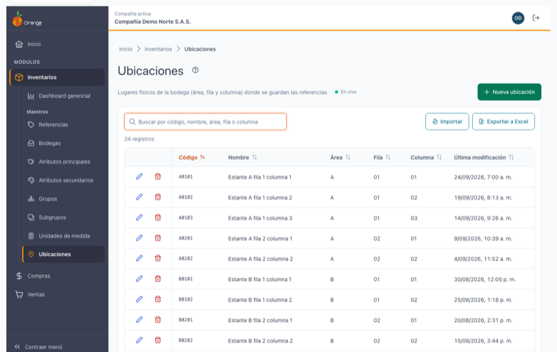
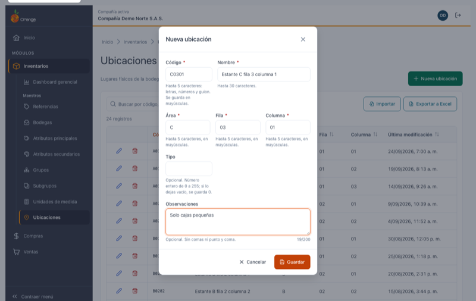
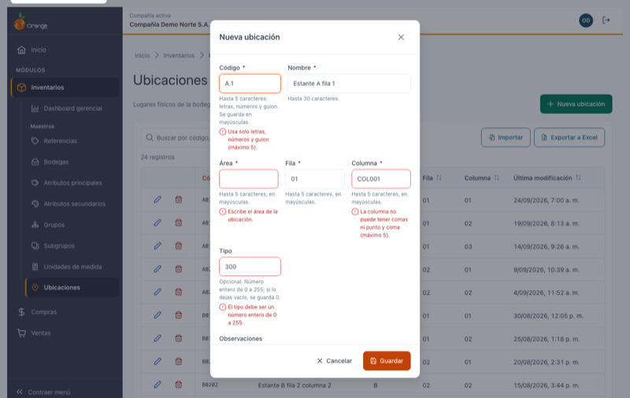
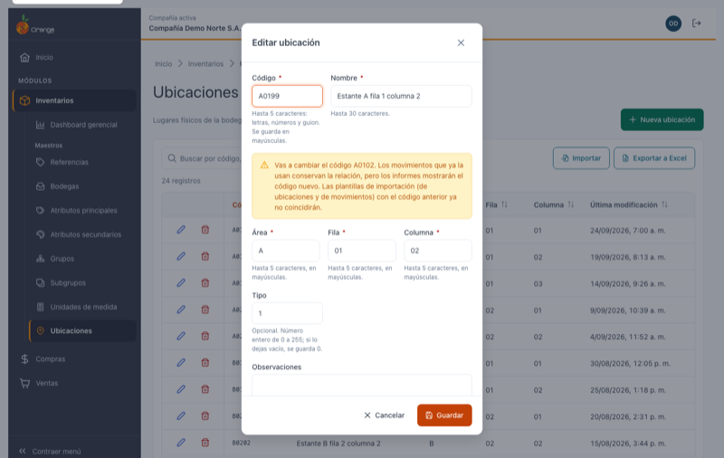
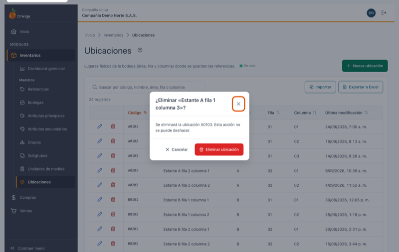
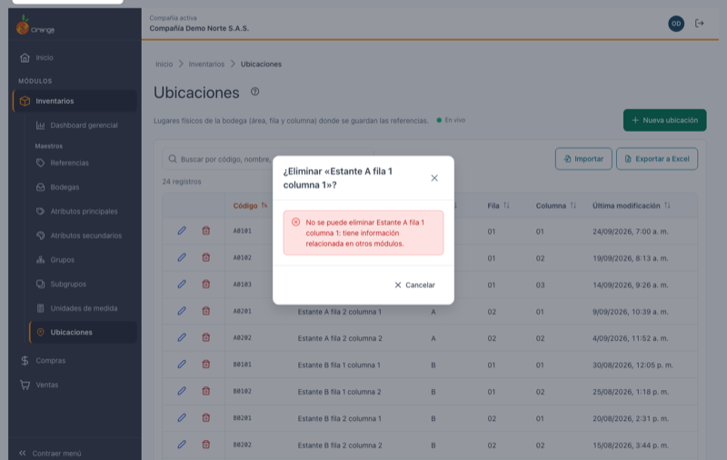
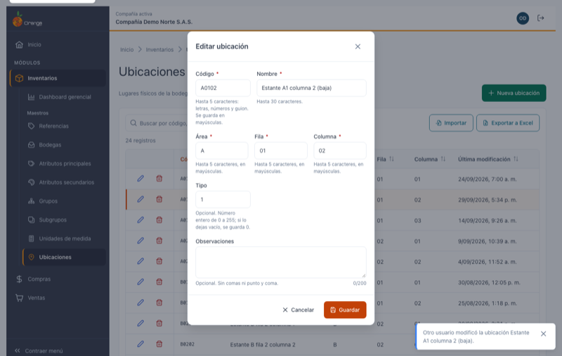

[Regresar a Inventarios](../readme.md)

---

# 📍 Ubicaciones

---

## 📋 Descripción

Las **ubicaciones** son los lugares físicos dentro de la bodega donde se guardan las referencias, por ejemplo `A0101` Estante A fila 1 columna 1 o `REC` Zona de recepción. Cada ubicación se describe con su **Área**, su **Fila** y su **Columna**. Los movimientos de inventario usan la ubicación en cada línea.

En esta pantalla puede **consultar, crear, editar, eliminar, exportar e importar** las ubicaciones de la compañía con la que está trabajando.

> 📘 La búsqueda, el orden, la paginación, la exportación y la ayuda funcionan igual en todas las tablas: ver [Manejo general de la información](../../Generales/manejo-general-informacion.md).

> 💡 Cada pestaña del navegador trabaja con **una compañía**. El nombre y el color de la compañía se ven en el título de la pestaña y en la barra superior.

---

## 🎯 Acceso

1. En el menú principal, haga clic en **Inventarios**.
2. En **Maestros**, haga clic en **Ubicaciones** (es la última opción del grupo).

---

## 🖥️ Pantalla principal

| Elemento | Para qué sirve |
|----------|----------------|
| **?** (junto al título) | Abre esta ayuda en un panel lateral, sin salir de la pantalla. |
| **En vivo** | La pantalla está conectada: los cambios de otros usuarios aparecen solos. Ver *Cambios de otros usuarios* más abajo. |
| **Nueva ubicación** | Crea una ubicación. |
| **Buscar por código, nombre, área, fila o columna** | Filtra el listado mientras escribe. Busca en el código, el nombre, el área, la fila y la columna. No distingue mayúsculas ni tildes: `recepcion` encuentra *Zona de recepción*. |
| **Exportar a Excel** | Descarga las ubicaciones (con el filtro y el orden que tenga en pantalla) con **todos** sus datos. |
| **Importar** | Crea o actualiza ubicaciones desde un archivo de Excel. Ver [Importar ubicaciones desde Excel](ubicaciones-importar.md). |
| **Lápiz** / **Papelera** | Editar o eliminar la ubicación de esa fila. Siempre están en la **primera columna**, visibles aunque la tabla tenga que desplazarse. |
| **Código**, **Nombre**, **Área**, **Fila**, **Columna**, **Última modificación** | Columnas del listado. Al abrir la pantalla, la tabla viene ordenada por **código**. El **Tipo** y las **Observaciones** no se ven en la tabla: los encuentra al editar la ubicación y en el archivo de Excel. |
| **Encabezados** | Un clic ordena de forma ascendente, el segundo descendente y el tercero vuelve al orden inicial. |
| **Filas por página** y paginación | Cambian cuántas ubicaciones ve (10, 20, 50 o 100) y la página. |

Si la compañía todavía no tiene ubicaciones, verá **"Aún no hay ubicaciones"** con el botón para crear la primera. Si la búsqueda no encuentra nada, use **Limpiar búsqueda**.

> 📱 En el celular cada ubicación se muestra como una tarjeta, con las acciones arriba y su área, fila y columna.

**¿No ve algún botón?** Cada acción depende de los permisos de su perfil sobre la opción Ubicaciones:

| Permiso | Qué habilita |
|---------|--------------|
| Consultar | Ver la pantalla |
| Crear | **Nueva ubicación** |
| Actualizar | **Lápiz** (editar) |
| Eliminar | **Papelera** (eliminar) |
| Exportar | **Exportar a Excel** e **Importar** |

Los botones que su perfil no permite no aparecen. Si su perfil cambia mientras tiene la pantalla abierta, al guardar o eliminar verá *"Tu perfil ya no permite esta acción. Recarga la página para ver tus permisos actualizados."*; lo que escribió se conserva.

---

## ➕ Crear una ubicación

1. Haga clic en **Nueva ubicación**.
2. Escriba el código, el nombre, el área, la fila y la columna.
3. Si lo necesita, escriba el tipo y las observaciones.
4. Haga clic en **Guardar**.

| Campo | Obligatorio | Reglas | Ejemplo |
|-------|:-----------:|--------|---------|
| **Código** | ✅ | De 1 a 5 caracteres: letras, números y guion. Se guarda **siempre en MAYÚSCULAS** (lo convierte mientras escribe). No se puede repetir en la compañía. | `A0101`, `REC`, `A-01` |
| **Nombre** | ✅ | Hasta 30 caracteres, sin comas ni punto y coma. | `Estante A fila 1 columna 1` |
| **Área** | ✅ | Hasta 5 caracteres, sin comas ni punto y coma. Se guarda en MAYÚSCULAS. | `A`, `REC` |
| **Fila** | ✅ | Hasta 5 caracteres, sin comas ni punto y coma. Se guarda en MAYÚSCULAS. | `01` |
| **Columna** | ✅ | Hasta 5 caracteres, sin comas ni punto y coma. Se guarda en MAYÚSCULAS. | `01`, `B-2` |
| **Tipo** | — | Número entero de 0 a 255. Si lo deja vacío, se guarda **0**. | `0`, `2` |
| **Observaciones** | — | Hasta 200 caracteres, sin comas ni punto y coma. Debajo del campo verá cuántos caracteres lleva (por ejemplo *19/200*). | `Solo cajas pequeñas` |

> 💡 El **Tipo** es un número libre: el sistema no le da un significado. Úselo si su empresa tiene una clasificación propia de ubicaciones; si no, déjelo vacío.

Al guardar verá el mensaje **"Ubicación … creada."** y la ubicación aparece en el listado, sin recargar la página.

### ¿Qué puede salir mal?

Si algo falta o no cumple las reglas, el sistema marca los campos con error, pone el cursor en el primero y no guarda nada.

| Mensaje | Qué hacer |
|---------|-----------|
| Escribe el código / el nombre / el área / la fila / la columna de la ubicación. | Complete el campo. |
| Usa solo letras, números y guion (máximo 5). | Quite espacios, puntos, tildes u otros símbolos del código, o acórtelo. |
| El nombre no puede tener comas ni punto y coma (máximo 30). | Corrija o acorte el nombre. |
| El área / La fila / La columna no puede tener comas ni punto y coma (máximo 5). | Quite `,` y `;` o acorte el valor. |
| El tipo debe ser un número entero de 0 a 255. | Escriba un número sin decimales entre 0 y 255, o deje el campo vacío. |
| Las observaciones no pueden tener comas ni punto y coma (máximo 200). | Corrija o acorte las observaciones. |
| Ya existe una ubicación con el código … | Use otro código. Lo que escribió se conserva. |
| No se pudo guardar la ubicación. Inténtalo de nuevo. | Falló la conexión o el servidor. El diálogo conserva lo escrito: vuelva a guardar. |

---

## ✏️ Editar una ubicación

1. Haga clic en el **lápiz** de la ubicación. El diálogo muestra todos sus datos, también el tipo y las observaciones.
2. Cambie lo que necesite y haga clic en **Guardar**.

Al guardar verá **"Ubicación … actualizada."**. La fila se actualiza sin perder la búsqueda ni el orden que tenía.

> ⚠️ **Cambiar el código** está permitido y no afecta los movimientos que ya usan la ubicación: conservan la relación. Verá un aviso porque los **informes** mostrarán el código nuevo y las **plantillas de importación** (de ubicaciones y de movimientos) que tengan el código anterior ya no coincidirán. Si vuelve a escribir el código original, el aviso desaparece.

> 💡 Algunas ubicaciones creadas en la versión anterior tienen códigos con símbolos, como `R.01`. Puede seguir editando sus demás datos sin tocar el código; solo si cambia el código se exige el formato actual (letras, números y guion).

> 💡 Si una ubicación antigua tiene el área, la fila o la columna en minúsculas, al guardarla quedarán en mayúsculas.

Si otro usuario eliminó la ubicación mientras la editaba, al guardar el diálogo se cierra, la ubicación desaparece del listado y un aviso le indica **"Esta ubicación ya no existe; otro usuario pudo eliminarla."**

---

## 🗑️ Eliminar una ubicación

1. Haga clic en la **papelera** de la ubicación.
2. Revise el nombre y el código en el diálogo **¿Eliminar «…»?**. La acción no se puede deshacer.
3. Haga clic en **Eliminar ubicación**.

Al terminar verá **"Ubicación … eliminada."** y la fila desaparece.

### No se puede eliminar

Si la ubicación ya se usó en **movimientos de inventario**, el sistema no la elimina y el diálogo muestra: *"No se puede eliminar …: tiene información relacionada en otros módulos."* Solo puede cerrar el diálogo; no se borró nada.

Si ya no usa esa ubicación, cámbiele el nombre (por ejemplo, *"No usar - Estante A"*) para que nadie la elija por error.

---

## 📤 Exportar a Excel

Haga clic en **Exportar a Excel**. Se descarga `ubicaciones_AAAA-MM-DD.xlsx` con **todas** las ubicaciones del filtro actual (no solo la página visible), en el orden que tenga en pantalla, con el encabezado fijo y filtros de Excel. Columnas:

| Columna | Contenido |
|---------|-----------|
| **Código** | Código de la ubicación. |
| **Nombre** | Nombre de la ubicación. |
| **Área**, **Fila**, **Columna** | Como texto (se conservan los ceros a la izquierda, como `01`). |
| **Tipo** | Número. |
| **Observaciones** | Texto (vacío si no tiene). |
| **Última modificación** | Fecha de Excel. |

El archivo exportado **se puede volver a importar**: puede exportar, corregir en Excel e importarlo.

---

## 📥 Importar desde Excel

Para crear muchas ubicaciones o cambiar sus datos de una vez, use **Importar**. Vea el paso a paso en [Importar ubicaciones desde Excel](ubicaciones-importar.md).

---

## 🔄 Cambios de otros usuarios (en vivo)

Si otra persona crea, modifica, elimina o importa ubicaciones mientras usted tiene abierta esta pantalla, **no tiene que recargar**: el listado se pone al día solo, sin perder lo que buscó, el orden ni la página.

- Las filas nuevas o modificadas se **resaltan** unos segundos.
- Abajo a la derecha aparece un aviso, por ejemplo *"Otro usuario creó la ubicación Muelle 2."* o *"Otro usuario importó 5 ubicaciones. El listado ya está al día."*
- Junto a la descripción verá **En vivo** mientras la conexión esté activa. Si se interrumpe, dice **Reconectando…**; al volver, la pantalla se actualiza sola.

**Si estaba editando esa misma ubicación:**

| Qué hizo el otro usuario | Qué verá | Qué puede hacer |
|--------------------------|----------|-----------------|
| La modificó | *"Otro usuario modificó esta ubicación mientras la editabas. Si guardas, reemplazarás sus cambios."* | **Ver sus cambios** para cargar lo que la otra persona guardó, o **Guardar** para dejar lo suyo. |
| La eliminó | *"Otro usuario eliminó esta ubicación. Ya no se puede guardar."* | **Cancelar**. El botón Guardar queda deshabilitado. |

Si estaba por confirmar la eliminación de una ubicación que otro ya eliminó, el diálogo se cierra con el aviso *"Otro usuario ya eliminó la ubicación …"*.

> ℹ️ Los cambios que usted hace en esta misma pestaña no generan avisos. Los cambios hechos desde la versión anterior de OrangeERP no se avisan al instante: se reflejan al volver a esta pestaña después de un rato o al recargar.

---

## ❓ Preguntas frecuentes

**¿Por qué el código, el área, la fila y la columna quedaron en mayúsculas?**
Se guardan siempre en mayúsculas para que no haya dos valores "iguales" escritos distinto (`a` y `A`).

**¿Dónde veo el tipo y las observaciones?**
Al editar la ubicación (lápiz) y en el archivo de **Exportar a Excel**. No se muestran en la tabla para que el listado sea fácil de leer.

**¿Qué significa el tipo?**
Es un número libre que el sistema no usa para ningún cálculo ni informe. Si su empresa no lo necesita, déjelo vacío (se guarda 0).

**¿Por qué no puedo eliminar una ubicación?**
Porque ya se usó en movimientos de inventario. Eliminarla dejaría esos movimientos sin ubicación. En la versión anterior sí se podía; la nueva versión lo impide para proteger la información.

**¿Por qué no encuentro una ubicación que sí existe?**
Revise que esté en la compañía correcta (título de la pestaña) y borre el texto del buscador con la **✕**.

**No veo "En vivo".**
La conexión en vivo no está disponible en este momento (por ejemplo, por la red de su empresa). La pantalla funciona igual; para ver cambios de otros usuarios, recargue la página.

**La "Última modificación" de algunas ubicaciones muestra una hora distinta.**
Las fechas se guardan en hora universal y se muestran en la hora de su equipo; algunas ubicaciones modificadas en la versión anterior pueden verse desplazadas hasta que se vuelvan a guardar.
