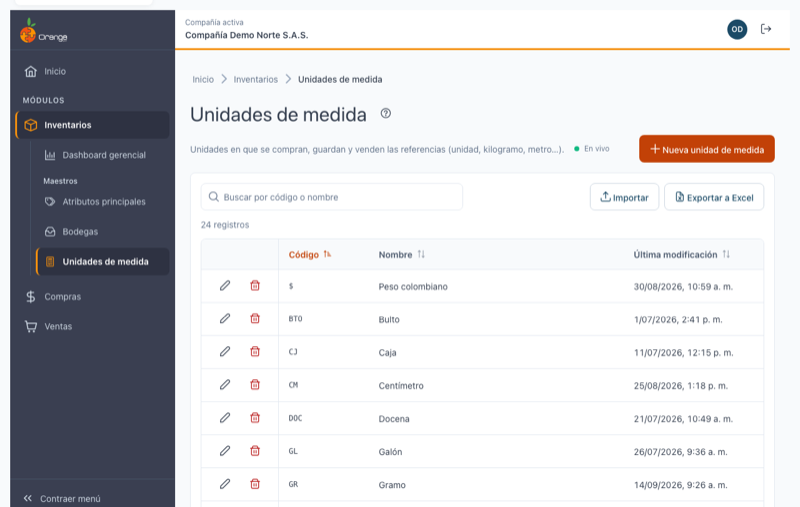
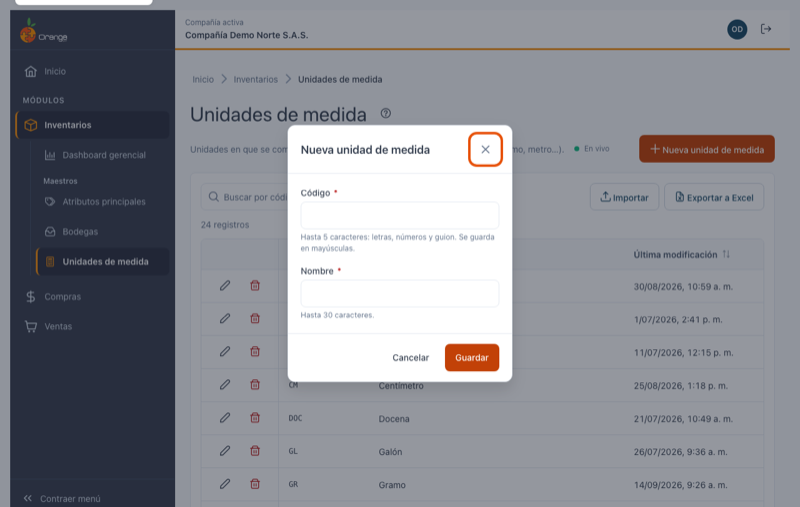
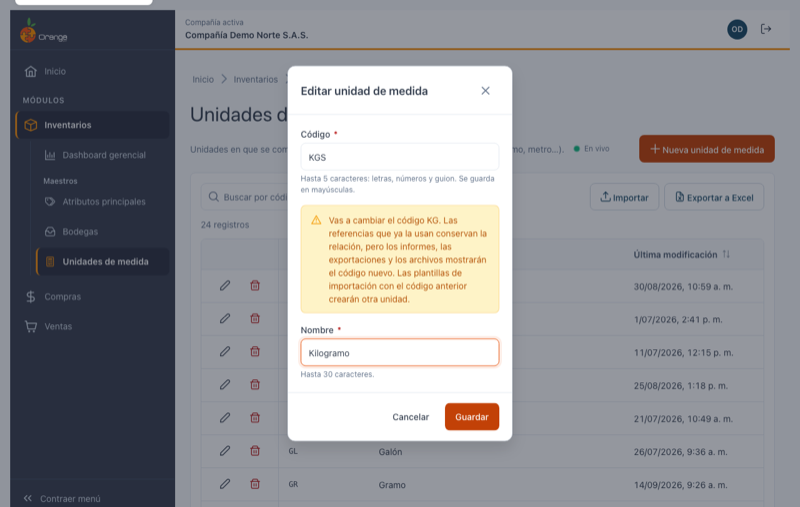
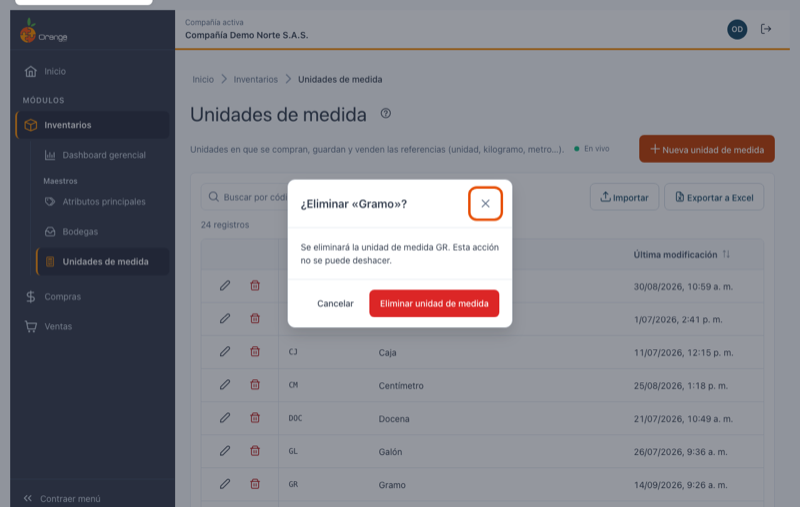

[Regresar a Inventarios](../readme.md)

---

# 📐 Unidades de medida

---

## 📋 Descripción

Las **unidades de medida** indican en qué se cuentan las referencias al comprarlas, guardarlas y venderlas: `UND` (unidad), `KG` (kilogramo), `MT` (metro), `LT` (litro), `DOC` (docena)… Cada referencia tiene una unidad de medida, y los movimientos de inventario la muestran junto a las cantidades.

En esta pantalla puede **consultar, crear, editar, eliminar, exportar e importar** las unidades de medida de la compañía con la que está trabajando.

> 📘 La búsqueda, el orden, la paginación, la exportación y la ayuda funcionan igual en todas las tablas: ver [Manejo general de la información](../../Generales/manejo-general-informacion.md).

> 💡 Cada pestaña del navegador trabaja con **una compañía**. El nombre y el color de la compañía se ven en el título de la pestaña y en la barra superior.

---

## 🎯 Acceso

1. En el menú principal, haga clic en **Inventarios**.
2. En **Maestros**, haga clic en **Unidades de medida**.

---

## 🖥️ Pantalla principal

| Elemento | Para qué sirve |
|----------|----------------|
| **?** (junto al título) | Abre esta ayuda en un panel lateral, sin salir de la pantalla. |
| **En vivo** | La pantalla está conectada: los cambios de otros usuarios aparecen solos. Ver *Cambios de otros usuarios* más abajo. |
| **Nueva unidad de medida** | Crea una unidad de medida. |
| **Buscar por código o nombre** | Filtra el listado mientras escribe. No distingue mayúsculas ni tildes. |
| **Importar** | Crea o actualiza unidades desde un archivo de Excel. Ver [Importar unidades de medida desde Excel](unidades-medida-importar.md). |
| **Exportar a Excel** | Descarga el listado (con el filtro y el orden que tenga en pantalla). |
| **Lápiz** / **Papelera** | Editar o eliminar la unidad de esa fila. Siempre están en la **primera columna**, visibles aunque la tabla tenga que desplazarse. |
| **Encabezados** | Al abrir la pantalla, la tabla viene ordenada por **Código**. Un clic en un encabezado ordena de forma ascendente, el segundo descendente y el tercero vuelve al orden inicial. |
| **Filas por página** y paginación | Cambian cuántas unidades ve y la página. |

> 📱 En el celular cada unidad se muestra como una tarjeta, con las acciones arriba.

**¿No ve algún botón?** Cada acción depende de los permisos de su perfil sobre la opción Unidades de medida:

| Permiso | Qué habilita |
|---------|--------------|
| Consultar | Ver la pantalla |
| Crear | **Nueva unidad de medida** |
| Actualizar | **Lápiz** (editar) |
| Eliminar | **Papelera** (eliminar) |
| Exportar | **Exportar a Excel** e **Importar** |

---

## ➕ Crear una unidad de medida

1. Haga clic en **Nueva unidad de medida**.
2. Complete los campos y haga clic en **Guardar** (o presione **Enter**).

| Campo | Obligatorio | Reglas | Ejemplo |
|-------|:-----------:|--------|---------|
| **Código** | ✅ | Hasta 5 caracteres: letras, números y guion. Se guarda **siempre en MAYÚSCULAS** (lo convierte mientras escribe). No se puede repetir en la compañía. | `KG`, `M2` |
| **Nombre** | ✅ | Hasta 30 caracteres, sin comas ni punto y coma. | `Kilogramo` |

Al guardar verá el mensaje **"Unidad de medida … creada."** y la unidad aparece en el listado.

### ¿Qué puede salir mal?

| Mensaje | Qué hacer |
|---------|-----------|
| Escribe el código… / Escribe el nombre… | Complete el campo. |
| Usa solo letras, números y guion (máximo 5). | Quite espacios, tildes, barras u otros símbolos del código, o acórtelo. |
| El nombre no puede tener comas ni punto y coma (máximo 30). | Corrija o acorte el nombre. |
| Ya existe una unidad de medida con el código … | Use otro código. |

---

## ✏️ Editar una unidad de medida

1. Haga clic en el **lápiz** de la unidad.
2. Cambie el código o el nombre y haga clic en **Guardar**.

> ⚠️ **Cambiar el código** está permitido y no afecta las referencias ni los movimientos que ya usan la unidad. Verá un aviso porque los **informes, las exportaciones y los archivos externos** mostrarán el código nuevo, y una plantilla de importación con el código anterior crearía otra unidad.

> 💡 Algunas unidades creadas en la versión anterior tienen códigos con símbolos, como `$`. Puede seguir editando su nombre sin tocar el código; solo si cambia el código se exige el formato actual (letras, números y guion).

Si otro usuario eliminó la unidad mientras la editaba, al guardar el diálogo se cierra, la unidad desaparece del listado y un aviso le indica **"Esta unidad de medida ya no existe"**.

---

## 🗑️ Eliminar una unidad de medida

1. Haga clic en la **papelera** de la unidad.
2. Confirme con **Eliminar unidad de medida**.

Una unidad **no se puede eliminar** si tiene información relacionada: si alguna **referencia** la usa, o si aparece en las **variantes** (tallas y colores) de alguna referencia. En ese caso verá:

> No se puede eliminar … : tiene información relacionada en otros módulos.

Si ya no la necesita, cambie primero la unidad de esas referencias.

---

## 📤 Exportar a Excel

Haga clic en **Exportar a Excel**. Se descarga `unidades-medida_AAAA-MM-DD.xlsx` con **todas** las unidades del filtro actual (no solo la página visible), con las columnas **Código, Nombre y Última modificación**, el encabezado fijo y filtros de Excel. Las fechas quedan como fechas de Excel.

---

## 📥 Importar desde Excel

Para crear muchas unidades o cambiar sus nombres de una vez, use **Importar**. Vea el paso a paso en [Importar unidades de medida desde Excel](unidades-medida-importar.md).

---

## 🔄 Cambios de otros usuarios (en vivo)

Si otra persona crea, modifica, elimina o importa unidades de medida mientras usted tiene abierta esta pantalla, **no tiene que recargar**: el listado se pone al día solo, sin perder lo que buscó, el orden ni la página.

- Las filas nuevas o modificadas se **resaltan** unos segundos.
- Abajo a la derecha aparece un aviso, por ejemplo *"Otro usuario creó la unidad de medida Centímetro cúbico."*
- Junto a la descripción verá **En vivo** mientras la conexión esté activa. Si se interrumpe, dice **Reconectando…**; al volver, la pantalla se actualiza sola.

**Si estaba editando esa misma unidad:**

| Qué hizo el otro usuario | Qué verá | Qué puede hacer |
|--------------------------|----------|-----------------|
| La modificó | *"Otro usuario modificó esta unidad de medida mientras la editabas. Si guardas, reemplazarás sus cambios."* | **Ver sus cambios** para cargar lo que la otra persona guardó, o **Guardar** para dejar lo suyo. |
| La eliminó | *"Otro usuario eliminó esta unidad de medida. Ya no se puede guardar."* | **Cancelar**. El botón Guardar queda deshabilitado. |

Si estaba por confirmar la eliminación de una unidad que otro ya eliminó, el diálogo se cierra con el aviso *"Otro usuario ya eliminó la unidad de medida…"*.

> ℹ️ Los cambios que usted hace en esta misma pestaña no generan avisos. Los cambios hechos desde la versión anterior de OrangeERP no se avisan al instante: se reflejan al volver a esta pestaña después de un rato o al recargar.

---

## ❓ Preguntas frecuentes

**¿Por qué el código quedó en mayúsculas?**
Los códigos siempre se guardan en mayúsculas para que no haya dos unidades "iguales" escritas distinto (`kg` y `KG`).

**¿Puedo crear una unidad con el código `$` o `M/S`?**
No. Los códigos nuevos solo admiten letras, números y guion. Las unidades de la versión anterior que ya tienen símbolos se conservan y se pueden editar.

**¿Por qué no encuentro una unidad que sí existe?**
Revise que esté en la compañía correcta (título de la pestaña) y borre el texto del buscador con la **✕**.

**No veo "En vivo".**
La conexión en vivo no está disponible en este momento (por ejemplo, por la red de su empresa). La pantalla funciona igual; para ver cambios de otros usuarios, recargue la página.

**La "Última modificación" de algunas unidades muestra una hora distinta.**
Las fechas se guardan en hora universal y se muestran en la hora de su equipo; algunas unidades modificadas en la versión anterior pueden verse desplazadas hasta que se ajusten sus fechas.
