[Regresar a Inventarios](../readme.md)

---

# 🔁 Entradas y salidas

---

## 📋 Descripción

Los **movimientos de inventario** son los documentos con los que entra o sale mercancía de las bodegas sin pasar por compras ni ventas: ajustes por conteo, consumos internos, traslados, devoluciones, dotación, etc. Cada documento tiene un **tipo** (por ejemplo *EI - Entrada por ajuste* o *SI - Salida por consumo*), un **encabezado** (fecha, tercero, observaciones) y sus **líneas** (qué referencia, en qué bodega, cuántas unidades y a qué valor).

Lo más importante de esta pantalla: **cada línea se guarda en el momento en que la confirma** y actualiza de inmediato las existencias y la contabilidad. No hay un botón "Guardar documento": lo que ve como *Guardada* ya quedó registrado.

En esta pantalla puede **buscar, filtrar, consultar, crear, duplicar, cerrar, anular, eliminar, imprimir, exportar e importar** los movimientos de la compañía con la que está trabajando.

> 📘 El orden, la paginación y la ayuda funcionan como en las demás tablas: ver [Manejo general de la información](../../Generales/manejo-general-informacion.md).

> 💡 Cada pestaña del navegador trabaja con **una compañía**. El nombre de la compañía se ve en la barra superior.

---

## 🎯 Acceso

1. En el menú principal, haga clic en **Inventarios**.
2. En **Movimientos**, haga clic en **Entradas y salidas**.

---

## 🖥️ Pantalla principal

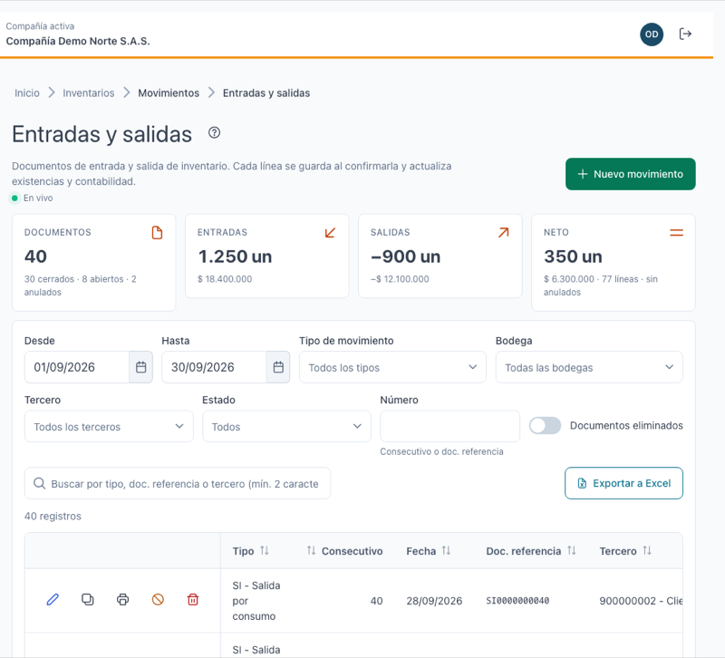

| Elemento | Para qué sirve |
|----------|----------------|
| **?** (junto al título) | Abre esta ayuda en un panel lateral, sin salir de la pantalla. |
| **En vivo** | La pantalla está conectada: los documentos que crean o cambian otros usuarios aparecen solos. Ver *Cambios de otros usuarios*. |
| **Nuevo movimiento** | Abre un documento nuevo. Ver *Crear un movimiento*. |
| **Documentos**, **Entradas**, **Salidas**, **Neto** | Resumen de **todo lo que cumple los filtros** (no solo de la página). Ver *Filtrar el listado y leer el resumen*. |
| **Desde**, **Hasta**, **Tipo de movimiento**, **Bodega**, **Tercero**, **Estado**, **Número** | Filtros del listado. |
| **Documentos eliminados** | Solo para administradores de la compañía (próxima entrega). Ver *Bitácora*. |
| **Buscar por tipo, doc. referencia o tercero** | Busca mientras escribe, a partir de 2 caracteres. |
| **Exportar a Excel** | Descarga los documentos que cumplen la búsqueda y los filtros. |
| **N registros** | Cuántos documentos cumplen la búsqueda y los filtros. |
| **Iconos de la primera columna** | **Lápiz** (editar) u **ojo** (ver), **Duplicar**, **Imprimir**, **Anular** y **Papelera** (eliminar). Solo aparecen las acciones que usted puede hacer sobre **ese** documento. |
| **Columnas** | Tipo, Consecutivo, Fecha, Doc. referencia, Tercero, Cantidad, Valor, Estado y Última modificación. Puede ordenar por cualquiera haciendo clic en el encabezado. Las salidas se muestran con signo **−**. |

Cada documento está en uno de estos **estados**:

| Estado | Qué significa |
|--------|---------------|
| **Abierto** | Se le pueden agregar, cambiar y quitar líneas. |
| **Cerrado** | Ya no se modifica (salvo con el permiso especial *editar documentos cerrados*). |
| **Anulado** | Se conserva como rastro, pero **no afecta** existencias ni costos. |
| **Periodo cerrado** (marca adicional) | La fecha del documento cae en un periodo contable cerrado: solo se puede consultar. |

> 📱 En el celular cada documento se muestra como una tarjeta y los filtros se apilan.

**¿No ve algún botón?** Cada acción depende de los permisos de su perfil sobre la opción *Entradas y salidas* y del estado del documento:

| Permiso | Qué habilita |
|---------|--------------|
| Consultar | Ver el listado, el resumen y abrir los documentos en solo lectura |
| Crear | **Nuevo movimiento** y **Duplicar** |
| Actualizar | Agregar, cambiar y quitar líneas, cambiar el encabezado y **Cerrar transacción** en documentos abiertos |
| Anular | **Anular** |
| Eliminar | **Eliminar** |
| Imprimir | **Imprimir** |
| Exportar | **Exportar a Excel** (listado y líneas del documento) |
| Editar documentos cerrados (permiso especial del usuario) | **Editar cerrado** |
| Administrador de la compañía | Pestaña **Bitácora** y **Documentos eliminados** |

Además, los **tipos de movimiento** que ve y puede usar son los que su usuario tiene autorizados.

---

## 🧰 Filtrar el listado y leer el resumen

| Filtro | Qué hace | Por defecto |
|--------|----------|-------------|
| **Desde** / **Hasta** | Rango de fechas de los documentos. Máximo **92 días**. | El mes en curso |
| **Tipo de movimiento** | Un tipo, elegido en el buscador | Todos los tipos |
| **Bodega** | Documentos con movimiento en esa bodega | Todas las bodegas |
| **Tercero** | Documentos de ese tercero (busque por documento o nombre) | Todos los terceros |
| **Estado** | Abierto, Cerrado y/o Anulado (puede elegir varios) | Todos |
| **Número** | Consecutivo o doc. referencia | — |

- Los filtros se combinan entre sí y con la búsqueda. Al cambiar uno, el listado vuelve a la página 1.
- **Limpiar filtros** los deja como al abrir la pantalla.
- Si **Desde** es posterior a **Hasta**, verá *"La fecha inicial no puede ser posterior a la final"* y no se consulta nada hasta corregirlo.
- Los filtros quedan en la dirección de la página: si la copia y la comparte, la otra persona ve el mismo listado.

El **resumen** (las cuatro tarjetas de arriba) se calcula con **todos** los documentos que cumplen los filtros:

| Tarjeta | Qué muestra |
|---------|-------------|
| **Documentos** | Cuántos hay y, debajo, cuántos están cerrados, abiertos y anulados |
| **Entradas** | Unidades que entraron y, debajo, su valor |
| **Salidas** | Unidades que salieron (con signo −) y su valor |
| **Neto** | Entradas menos salidas, su valor y el número de líneas |

> ℹ️ Los documentos **anulados** se cuentan en *Documentos*, pero **no suman** unidades ni valores.

Si el resumen no se puede calcular, verá *"No se pudo calcular el resumen"* con **Reintentar**; el listado sigue funcionando.

---

## 📤 Exportar a Excel

Haga clic en **Exportar a Excel**. Se descarga `movimientos-inventario_DESDE_HASTA.xlsx` con **todos** los documentos que cumplen la búsqueda y los filtros (no solo la página visible), con las mismas columnas del listado, y verá *"Se descargó … con N documentos."*

> ⚠️ Se exportan hasta **50.000 documentos**. Si el filtro da más, verá *"El filtro tiene más de 50.000 documentos. Acote las fechas u otros filtros para exportar."* y no se descarga nada.

Dentro de un documento cerrado o anulado, la tabla de líneas tiene su propio botón para exportar las líneas de ese documento.

---

## 📥 Importar entradas y salidas desde Excel

Crea **varios documentos nuevos de una sola vez** a partir de una hoja de Excel: cada fila es una línea y las filas con la misma **Clave de documento** forman un documento. Antes de guardar, el sistema le muestra qué documentos va a crear y qué filas tienen errores. **Nada se guarda hasta que usted aplica.**

> 🔐 Necesita los permisos **Crear** y **Exportar** sobre Entradas y salidas, y estar autorizado para los tipos de movimiento que importe. Con ambos permisos verá el botón **Importar**, junto a **Exportar a Excel**; si falta alguno, el botón no aparece. Los **traslados** no se importan aquí.

La importación **solo crea documentos nuevos**: nunca modifica ni borra los existentes.

### Los tres pasos: Cargar archivo → Revisar → Resultado

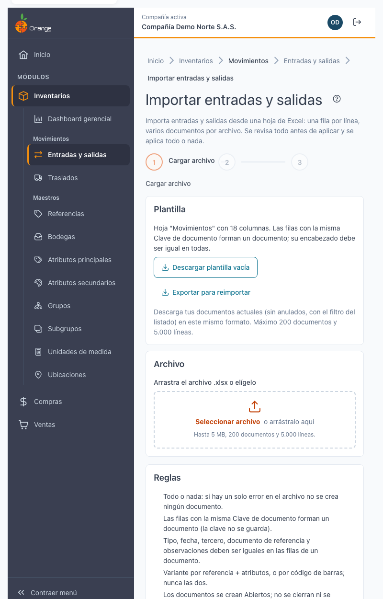

**1. Cargar archivo.** Descargue la **plantilla vacía** (hoja **Movimientos** con 18 columnas) o **Exportar para reimportar** (sus documentos actuales, sin anulados y con el filtro del listado, en el mismo formato; hasta 200 documentos y 5.000 líneas). Arrastre el archivo `.xlsx` al recuadro o elíjalo. Con **Cancelar** (o **Volver al listado**) regresa sin importar nada.

> 💡 Un archivo exportado para reimportar **crea documentos nuevos** con otro consecutivo; no actualiza los que ya existen.

### La hoja Movimientos: 18 columnas

El orden de las columnas no importa (se leen por su nombre) y las columnas desconocidas se ignoran. Las marcadas con * son obligatorias.

| Parte | Columna | Qué escribir |
|-------|---------|--------------|
| Encabezado (igual en todas las filas del documento) | **Clave de documento*** | Texto de hasta 20 caracteres, sin comas ni punto y coma. Solo agrupa las filas: no se guarda. |
| | **Código tipo de movimiento*** | Por ejemplo `EI` o `SI`. |
| | **Fecha*** | Fecha de Excel o `aaaa-mm-dd`. |
| | **Documento tercero*** | NIT o cédula de un tercero activo. |
| | **Documento referencia** | Hasta 20 caracteres. |
| | **Observaciones** | Hasta 200 caracteres (se quitan comas y punto y coma). |
| Línea | **Código referencia**, **Código atributo principal**, **Código atributo secundario** | La variante por sus códigos (atributos vacíos si la referencia no los usa). |
| | **Código de barras** | La variante por su código de barras (EAN13, EAN8 o código alterno). |
| | **Código bodega*** | Código de la bodega. |
| | **Código ubicación** | Opcional. |
| | **Código centro de costos** | Obligatorio si el tipo lo exige. |
| | **Número OP** | Obligatorio si el tipo exige orden de producción. |
| | **Lote** | Hasta 20 caracteres; obligatorio si la referencia exige lote. |
| | **Detalle** | Hasta 200 caracteres. |
| | **Cantidad*** | Mayor que 0, hasta 4 decimales. |
| | **Valor unitario*** | Mayor que 0. |

**Reglas importantes**

| Regla | Detalle |
|-------|---------|
| **Un archivo, varios documentos** | Cada **Clave de documento** distinta es un documento nuevo. El consecutivo lo asigna el sistema (no hay columna). |
| **Encabezado igual** | Tipo, fecha, tercero, documento de referencia y observaciones deben ser iguales en todas las filas del documento; si una difiere, el documento completo queda con error. |
| **La variante, de una sola forma** | Por referencia + atributos **o** por código de barras; nunca las dos, y al menos una. Solo variantes activas, de referencias con inventario. |
| **Líneas iguales** | Las líneas iguales (variante, bodega, ubicación y lote) se suman en una sola, como en la captura; en la revisión verá *"Se suma a la fila N"*. |
| **Abiertos** | Los documentos se crean **Abiertos**: no se cierran ni se contabilizan solos. Ciérrelos desde el listado cuando corresponda. |
| **No se importan** | Fecha de vencimiento, criterios de aceptación, estado, cierre ni anulación. |

**Límites**

| Límite | Valor |
|--------|-------|
| Archivo | `.xlsx`, hasta **5 MB**, hoja **Movimientos** |
| Para **revisar** (vista previa) | Hasta **200 documentos y 5.000 líneas** |
| Para **aplicar** | Hasta **200 documentos y 5.000 líneas** por archivo, igual que la revisión. La aplicación corre en segundo plano; el tiempo que toma con archivos grandes aún está por medir en el ambiente de pruebas |

Si el archivo no sirve verá **"El archivo no se puede importar"** con el motivo y no se envía nada: no es un `.xlsx`, no tiene la hoja *Movimientos*, falta una columna obligatoria, no tiene filas, pesa más de 5 MB, o trae demasiados documentos o líneas (divídalo).

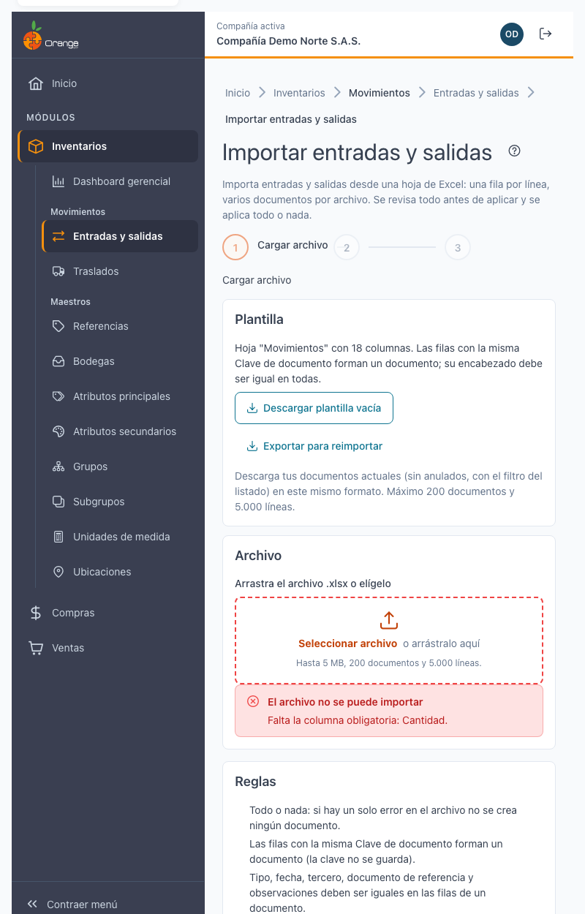

### 2. Revisar

El sistema valida cada fila **sin guardar nada**.

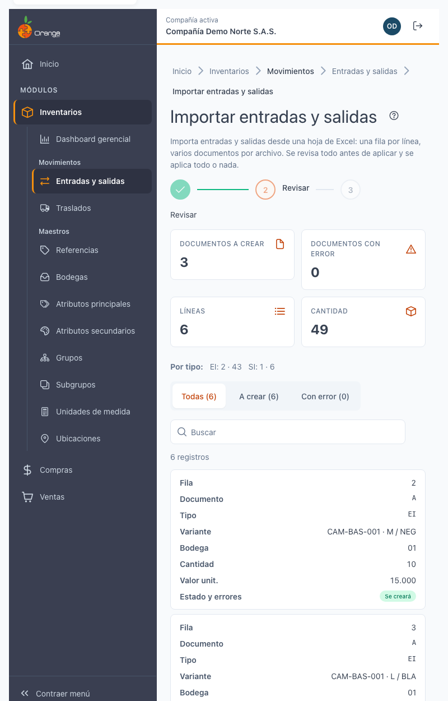

- El resumen muestra **Documentos a crear**, **Documentos con error**, **Líneas**, **Cantidad** y **Valor**, y el detalle **Por tipo**.
- La tabla muestra, por fila: **Fila** (la de su Excel), **Documento**, **Tipo**, **Variante**, **Bodega**, **Cantidad**, **Valor unit.** y **Estado y errores** (*Se creará* o *Con error*). Con **Todas / A crear / Con error** filtra por estado del documento.
- Un error en una fila marca **todo el documento** como *Con error*.
- **Descargar errores** genera un Excel con las filas con error y su motivo. **Cambiar archivo** vuelve al paso 1.

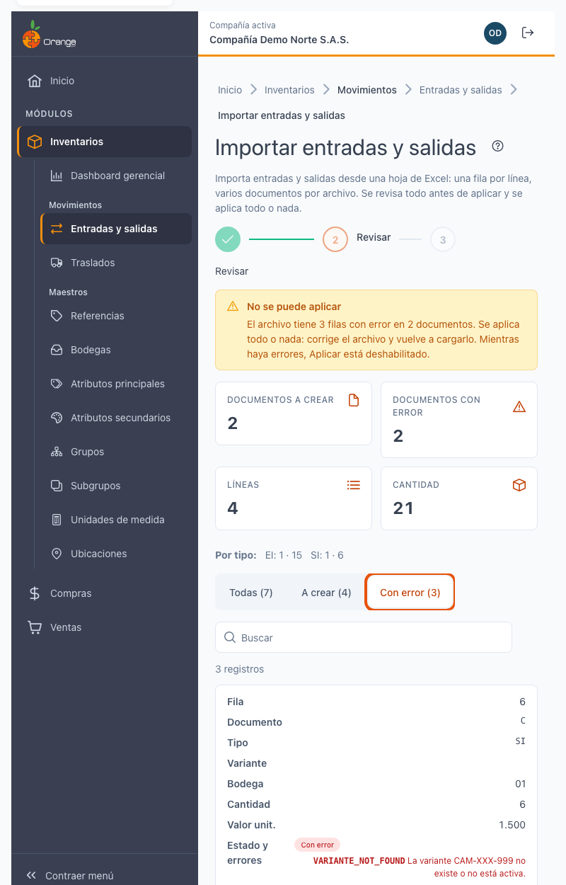

**Sin errores para aplicar:** mientras haya **una sola fila con error**, **Aplicar** está deshabilitado y no se crea ningún documento (nunca se omiten solo los documentos con error). Corrija el archivo y vuelva a cargarlo.

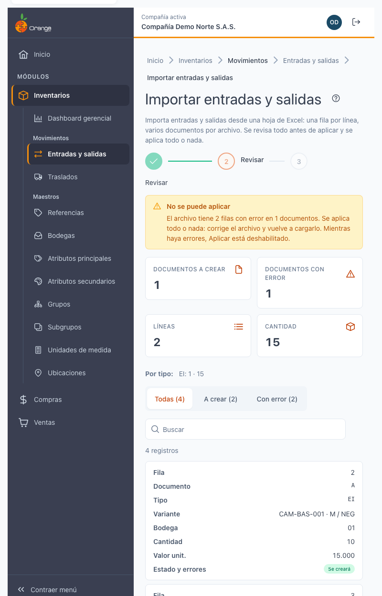

**Errores frecuentes y qué hacer**

| Mensaje | Qué hacer |
|---------|-----------|
| Falta la clave de documento. / La clave supera 20 caracteres o tiene "," o ";". | Escriba una clave corta, sin comas ni punto y coma. |
| La columna … difiere de la primera fila del documento (filas …). | Deje el encabezado idéntico en todas las filas del documento. |
| El tipo de movimiento … no existe. / No está autorizado para el tipo …. | Use un código de tipo existente y que usted pueda usar. |
| La fecha … no es válida. / El periodo de … está cerrado. | Corrija la fecha o use una de un periodo abierto. |
| El tercero … no existe. / Está inactivo. | Escriba el documento de un tercero activo. |
| Falta la variante. / Informa la variante por referencia o por código de barras, no por ambas. | Use una sola forma, completa. |
| La variante … no existe o no está activa. | Revise los códigos de referencia y atributos. |
| El código de barras … coincide con más de una variante. | Use referencia y atributos. |
| La bodega … no existe. / … no existe (ubicación, centro de costos, orden de producción). | Escriba un código existente. |
| El tipo exige centro de costos / número de orden de producción. / La referencia exige lote. | Complete la celda. |
| La cantidad … no es válida (mayor que 0, hasta 4 decimales). / El valor unitario … no es válido. | Corrija el número. |
| El saldo quedaría en …; el tipo no permite negativos. | Reduzca la salida, o registre antes la entrada que la cubre (se simula en el orden del archivo). |
| El documento supera el máximo de … líneas / el tope de …. | Divida el documento en dos claves. |

**Archivo demasiado grande para aplicar.** Si el archivo pasa de **200 documentos** o de **5.000 líneas**, el sistema no lo acepta (ni para revisar ni para aplicar): divídalo en archivos más pequeños.

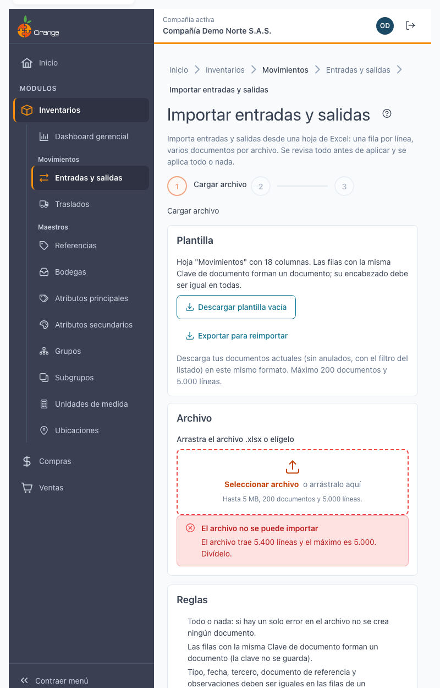

### 3. Aplicar y resultado

Haga clic en **Aplicar N documentos**. La aplicación **no ocurre al instante**: el sistema la pone en cola como un **proceso en segundo plano** y se aplica **documento por documento**.

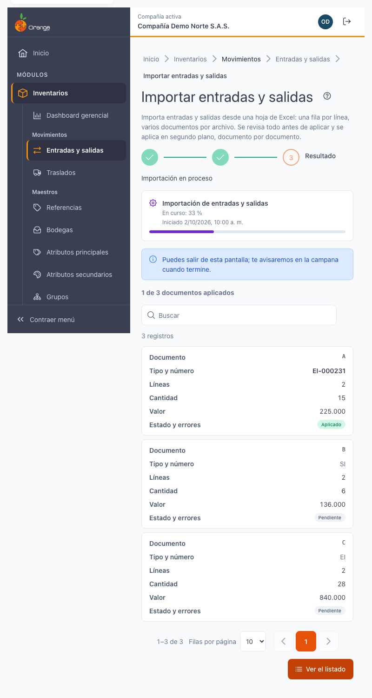

- Mientras corre verá **Importación en proceso**, con el porcentaje (*"En curso: 33 %"*) y cuántos documentos van aplicados (*"1 de 3 documentos aplicados"*). Cada documento se marca como **Aplicado**, **Falló** o **Pendiente**.
- Puede salir de la pantalla: *"te avisaremos en la campana cuando termine"*. El resultado llega también a la **campana de notificaciones**.

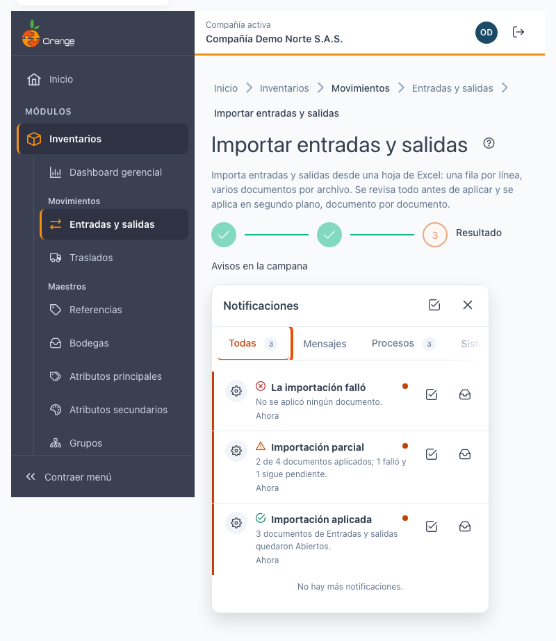

- Si cierra y vuelve a abrir la importación mientras el proceso sigue vivo (o desde el aviso de la campana), la pantalla retoma el estado del proceso.
- **No envíe dos veces el mismo archivo en 10 minutos.** Si lo hace, el sistema reutiliza el proceso que ya está en curso y no crea otro: no se duplican documentos.

**Una transacción por documento.** Cada documento se guarda completo o no se guarda. Si uno falla, **no se deshacen los documentos que ya se aplicaron**; el resto queda pendiente o con su error.

**Resultado.** Al terminar, cada documento aparece con su estado y, si se aplicó, con un **enlace** a su número (por ejemplo *EI-000231*). Los documentos quedan **Abiertos**.

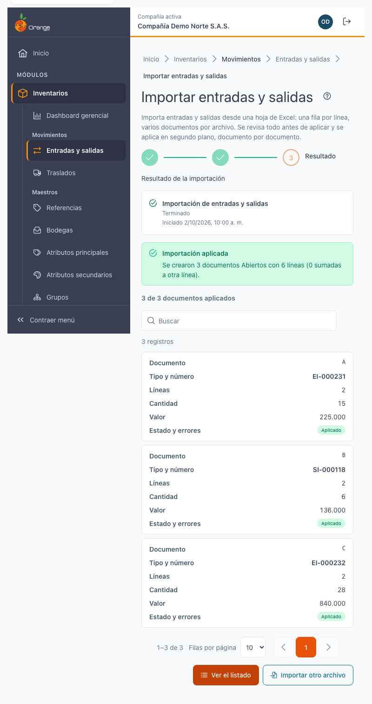

Use **Ver el listado** o **Importar otro archivo**.

**Resultado parcial.** Si algunos documentos se aplicaron y otros no, verá el aviso *"Importación parcial"* y el conteo (*"2 de 4 documentos aplicados"*). Los aplicados ya están registrados; los que fallaron muestran el motivo.

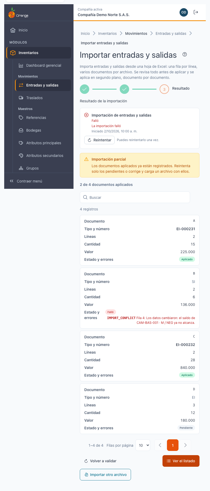

- **Reintentar pendientes** reanuda el proceso solo con los documentos que faltan, sin duplicar los ya aplicados. Se puede reintentar una vez.
- **Volver a validar** vuelve a revisar el archivo, por si los datos cambiaron.
- Si vuelve a enviar el mismo archivo cuando ya hubo un resultado parcial, el sistema responde **409 IMPORT_PARCIAL**: no crea otro proceso. Use **Reintentar pendientes**, o corrija el archivo y cárguelo solo con los documentos que faltan.

| Aviso | Qué hacer |
|-------|-----------|
| *Importación parcial: los documentos aplicados ya están registrados.* | Reintente los pendientes, o cargue un archivo solo con ellos. |
| *Otro proceso está usando esa bodega.* | El sistema reintenta solo los pendientes; si persiste, haga clic en **Reintentar**. |
| *Los datos cambiaron: el saldo ya no alcanza* (IMPORT_CONFLICT) | Use **Volver a validar** y ajuste el archivo. |
| *Otro usuario importó movimientos mientras revisabas.* | Use **Volver a validar** antes de aplicar. |
| *La importación falló. No se aplicó ningún documento.* | Corrija la causa que se muestra por documento y reintente. |

Cada documento y línea importados aparece en la [bitácora](#-bitácora-solo-administradores) igual que si los hubiera capturado, y los demás usuarios con el listado abierto reciben el aviso de cambios nuevos.

---

## ➕ Crear un movimiento

Haga clic en **Nuevo movimiento**.

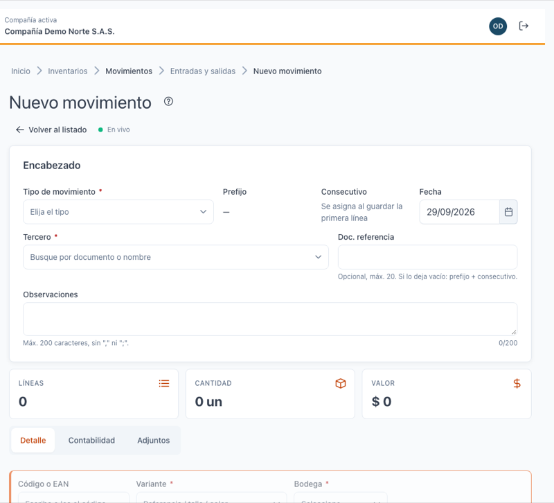

1. Llene el **encabezado**:
   - **Tipo de movimiento** (obligatorio): define si es entrada o salida, el prefijo y qué datos pide cada línea (por ejemplo, centro de costos u orden de producción). Algunos tipos traen **bodega, centro de costos o tercero por defecto**, que se llenan solos si están vacíos.
   - **Fecha**: viene con la fecha de hoy. Si cae en un **periodo cerrado**, lo verá de inmediato y no podrá capturar líneas.
   - **Tercero** (obligatorio). Si el tercero tiene una observación importante (por ejemplo, pagos pendientes), aparece un aviso amarillo *"Observación del tercero"*; es informativo, no le impide seguir.
   - **Doc. referencia** (opcional, máx. 20 caracteres): si lo deja vacío se usa el prefijo más el consecutivo.
   - **Observaciones** (opcional, máx. 200 caracteres, sin comas ni punto y coma).
   - **Consecutivo**: dice *"Se asigna al guardar la primera línea"*.
2. Mientras falte tipo, fecha o tercero, la captura de líneas dice *"Complete tipo, fecha y tercero para capturar líneas."*
3. Capture la **primera línea** (ver *Captura por teclado*). Al guardarse, el documento **se crea**: verá *"Movimiento SI 41 creado"*, aparece el consecutivo y el **tipo queda bloqueado** (*"El tipo no se puede cambiar después de guardar la primera línea."*).
4. Siga agregando líneas. Cuando termine, **cierre la transacción** si su proceso lo exige (ver *Cerrar la transacción*).

> ⚠️ **No hay borrador.** Lo que no se ha guardado (la línea que está escribiendo o las que están *En cola* o con error) se pierde si sale de la pantalla. Si intenta salir con líneas sin guardar verá *"Hay N líneas sin guardar; si sale se perderán. Las líneas ya guardadas no se ven afectadas."* con **Quedarme** y **Salir y perderlas**.

---

## ⌨️ Captura por teclado

La fila de captura está pensada para trabajar **sin ratón**. Los campos se recorren en este orden:

**Código o EAN → Variante → Bodega → Ubicación → C. costos → Lote → Cantidad → Valor unit.**

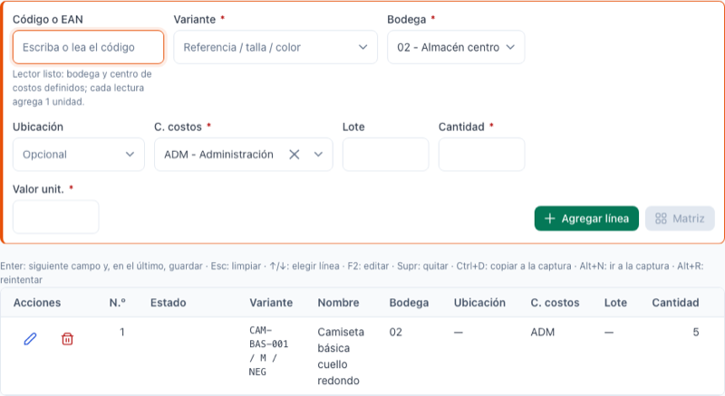

1. Escriba el **código** de la referencia o su **código de barras** y presione **Enter**:
   - Si corresponde a **una** variante, la toma y salta a **Cantidad** (o a **Bodega** si aún no la ha elegido).
   - Si corresponde a **varias** variantes (por ejemplo, tallas o colores), se abre *"El código … corresponde a N variantes"*: elija con **↑/↓** y **Enter**.
   - Si no existe, verá *"No se encontró el código …"* y el cursor se queda en el campo.
   - Si prefiere buscar por nombre, use el campo **Variante** (*Referencia / talla / color*).

   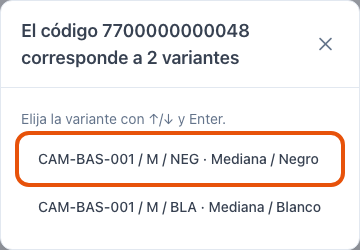

2. Al tener variante y bodega, debajo de la captura verá la **existencia** en esa bodega (*"Existencia en 02 - Almacén centro: 40"*) y el **valor sugerido** (*"Valor sugerido $ 15.000 (costo promedio)"*).
3. Escriba la **Cantidad** (mayor que cero, hasta 4 decimales) y presione **Enter**.
4. En **Valor unit.**, presione **Enter** para aceptar el sugerido o escriba otro.
5. El Enter del último campo (o el botón **Agregar línea**) **envía** la línea: aparece enseguida en la tabla, la captura se limpia **conservando bodega, ubicación y centro de costos**, y el cursor vuelve a **Código o EAN** para la siguiente. No tiene que esperar a que el servidor responda.

**Campos que dependen del tipo o de la referencia:**

| Campo | Cuándo es obligatorio |
|-------|-----------------------|
| **Bodega** | Siempre |
| **Ubicación** | Nunca (opcional) |
| **C. costos** | Si el tipo de movimiento lo exige |
| **Lote** (máx. 20) | Si la referencia maneja lote |
| **Vence** | Aparece si la referencia maneja fecha de vencimiento |
| **Orden de producción** | Si el tipo de movimiento lo exige |

**Atajos de teclado** (también aparecen debajo de la captura):

| Tecla | Qué hace |
|-------|----------|
| **Enter** | Pasa al siguiente campo; en el último, envía la línea |
| **Esc** | Limpia la captura (o cancela la edición de una línea) |
| **↑ / ↓** | Seleccionan una línea de la tabla |
| **F2** | Edita la línea seleccionada: la carga en la captura (*"Editando la línea 3: Enter guarda el cambio, Esc lo cancela."*) |
| **Supr** | Quita la línea seleccionada (pide confirmación) |
| **Ctrl+D** | Copia la línea seleccionada a la captura, para crear una parecida |
| **Alt+N** | Vuelve a la captura |
| **Alt+R** | Reintenta las líneas que no se guardaron |

**Matriz:** para referencias con tallas y colores, el botón **Matriz** abre una tabla talla × color con la existencia de cada variante en la bodega elegida. Escriba la cantidad en cada celda y haga clic en **Agregar N líneas**: cada celda con cantidad se envía como una línea, con su valor sugerido.

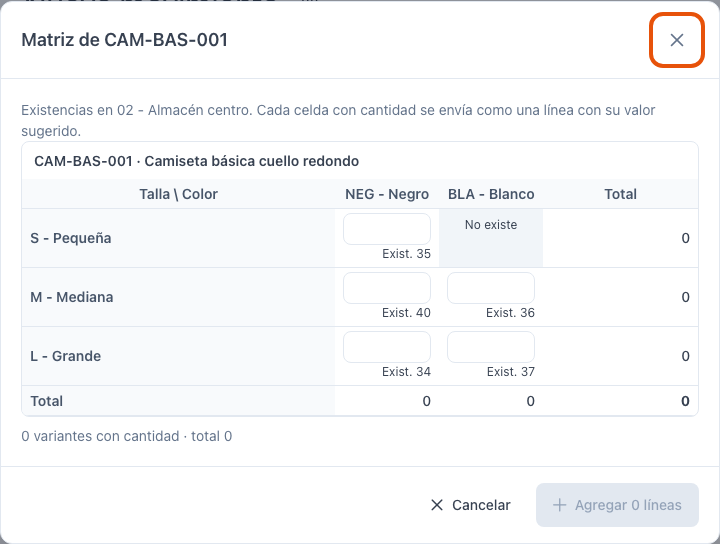

**Cambiar o quitar una línea ya guardada:** use el **lápiz** (o **F2**) y confirme con **Enter**, o la **papelera** (o **Supr**). Al quitarla verá *"Se quitará … del documento y se actualizarán existencias y contabilidad."* Si quita la última línea, se le pregunta si quiere eliminar también el documento vacío o **Conservarlo**.

---

## 📷 Lector de código de barras

Con un lector de código de barras la captura es todavía más rápida:

1. Deje listos la **bodega** y, si el tipo lo exige, el **centro de costos**. El campo **Código o EAN** lo confirma: *"Lector listo: bodega y centro de costos definidos; cada lectura agrega 1 unidad."*
2. Con el cursor en **Código o EAN**, lea el código: la línea se envía sola con **cantidad 1**, sin tocar más teclas.
3. Si vuelve a leer el mismo producto, **no se crea otra línea**: se suma a la que ya existe (ver *Línea sumada*).

- Puede leer tan rápido como quiera: las lecturas se ponen en cola y no se pierde ninguna.
- Si el código corresponde a varias variantes, se abre la ventana para elegir.
- Para una cantidad distinta de 1, corrija la línea con el lápiz o escriba la cantidad a mano en la captura.

> ℹ️ La pantalla reconoce el lector porque los caracteres llegan muy rápido. Si usted escribe el código a mano, se comporta como la captura normal.

---

## 🚦 Estado de cada línea

Cada línea muestra en la columna **Estado** qué pasó con ella. Las líneas guardadas no muestran nada especial: su **N.º** indica que ya están registradas.

| Estado | Qué significa | Qué hacer |
|--------|---------------|-----------|
| **Por guardar** | Línea copiada (al duplicar) que aún no se envía | **Guardar todas** |
| **En cola** | Espera su turno: las líneas se envían **una a la vez, en orden** | Nada, siga capturando |
| **Guardando…** | Se está registrando | Nada |
| **Guardada** | Quedó registrada (el aviso dura unos segundos) | — |
| **Sumada a la línea N** | Era igual a otra línea y se sumó a ella | — |
| **Error** + motivo | El sistema la rechazó por una regla (por ejemplo, *"La existencia quedaría en −1"*) | **Corregir** (la devuelve a la captura) o **Descartar** |
| **No se guardó** | No hubo respuesta del servidor o estaba ocupado | **Reintentar** o **Alt+R**. Reintentar **no la duplica**: antes se comprueba si ya había quedado guardada |
| **En conflicto** | Otro usuario cambió esa misma línea | Ver *Cambios de otros usuarios* |

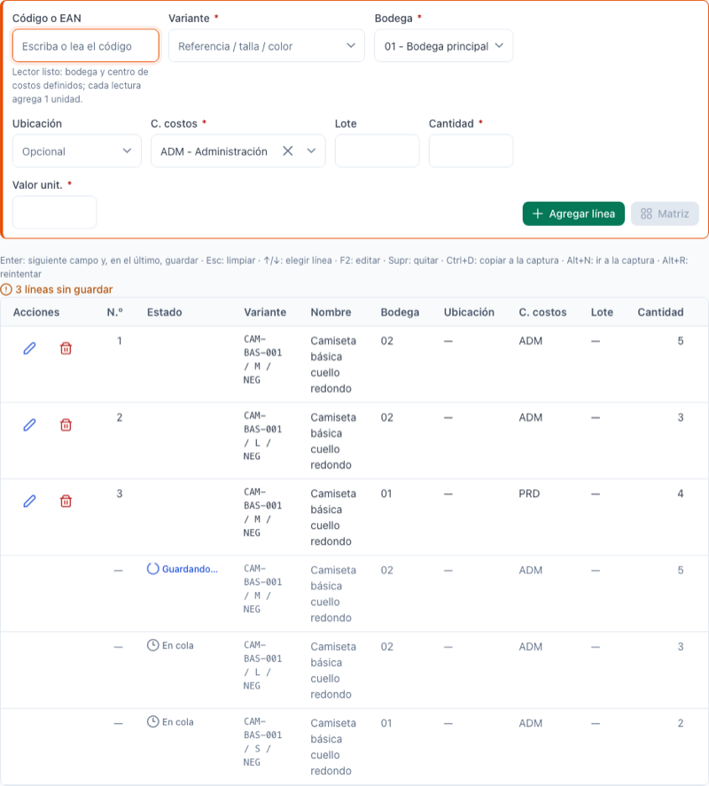

Mientras haya líneas sin guardar:

- Arriba de la tabla verá *"N líneas sin guardar"* y el botón **Reintentar todas** si alguna falló.
- El valor del resumen del documento dice *"Totales sin incluir N líneas sin guardar"*: los totales son siempre los que ya quedaron registrados.
- **Cerrar transacción** está deshabilitado (*"Hay N líneas sin guardar"*).

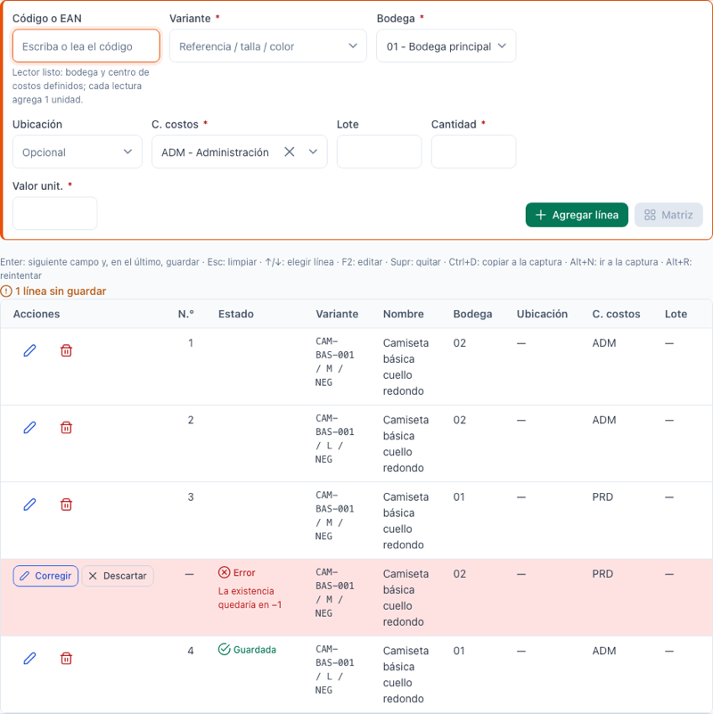

### Línea sumada

Si agrega una línea **igual** a otra que ya existe (misma variante, bodega, centro de costos y valor, sin lote), no se crea una línea nueva: la cantidad **se suma**. Antes de enviarla, la captura lo avisa: *"Se sumará a la línea 1: 5 + 2 = 7"*. Después, la línea destino se resalta con *"Sumada a la línea 1"*.

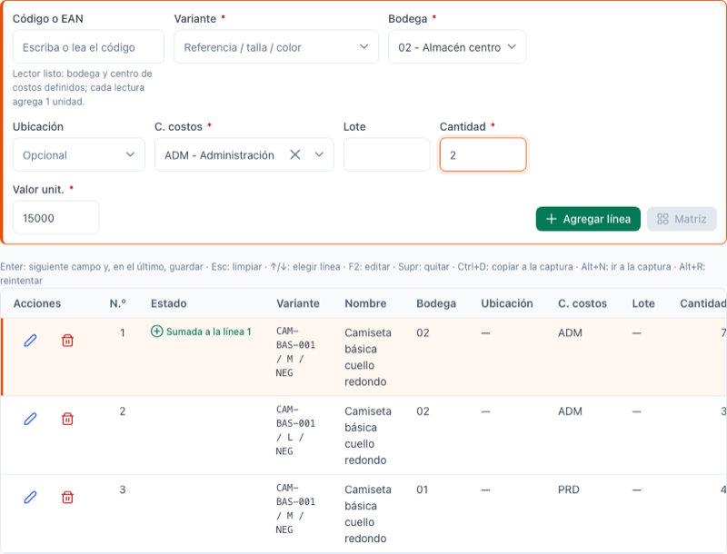

### Validaciones antes de guardar

| Aviso | Por qué |
|-------|---------|
| *"La existencia quedaría en −N"* | La salida dejaría la bodega en negativo y el tipo no lo permite. Se avisa en la captura y el sistema la rechaza. |
| *"La fecha está en un periodo cerrado: no se pueden guardar líneas."* | El periodo contable de la fecha del documento está cerrado. |
| *"Superaría el tope de …"* | La cantidad supera el tope configurado. |
| *"Alcanzó el máximo de N líneas para este tipo"* | El tipo de movimiento limita el número de líneas. |
| *"La cantidad debe ser mayor que cero (máx. 4 decimales)"*, *"El valor unitario debe ser mayor que cero"* | Datos de la línea inválidos. |
| *"Este tipo exige centro de costos"*, *"Esta referencia exige lote (máx. 20)"*, *"Elija la bodega"*, *"Elija la variante"* | Falta un dato obligatorio. |

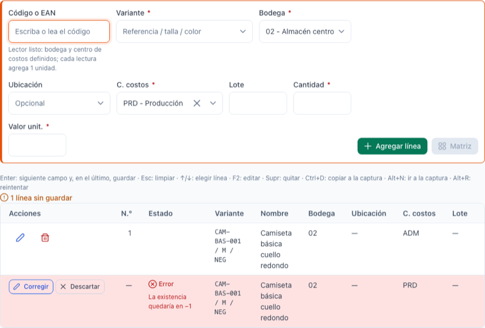

---

## 📄 El documento

Al abrir un documento (lápiz u ojo en el listado) ve:

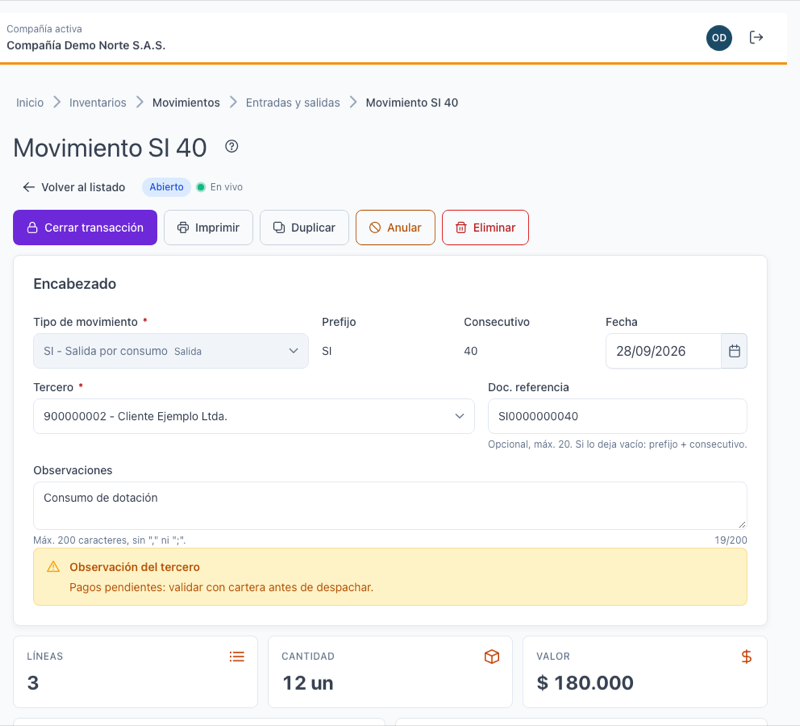

- **Barra superior**: *Volver al listado*, el estado, *En vivo* y las acciones: **Cerrar transacción** (la principal), **Imprimir**, **Duplicar**, **Anular** y **Eliminar**. Si una acción no se puede usar, aparece deshabilitada con el motivo debajo.
- **Encabezado**: editable si el documento está abierto; en un documento cerrado o anulado muestra además quién lo **creó**, quién lo **cerró** y cuántas veces se ha **impreso**.
- **Resumen**: Líneas, Cantidad y Valor; **Por bodega** y **Por referencia** (las 20 de mayor valor).
- **Pestañas**:
  - **Detalle**: la captura y las líneas. En un documento de solo lectura, las líneas se ven en una tabla paginada con búsqueda por referencia, orden y exportación.
  - **Contabilidad**: los registros contables del documento con sus sumas. Si débitos y créditos no cuadran verá *"Documento descuadrado — diferencia …"*: revise la configuración contable del tipo o de las referencias.
  - **Adjuntos**: soportes del movimiento (actas, remisiones, fotos), máximo 10 MB por documento. *Por ahora muestra "Disponible en la próxima entrega".*
  - **Bitácora**: solo administradores. Ver *Bitácora*. *Por ahora muestra "Disponible en la próxima entrega".*

### Cambiar el encabezado

En un documento ya creado, cada cambio del encabezado **se guarda solo**: al elegir la fecha o el tercero, o al salir del campo de texto. Verá *"Guardando encabezado…"* y luego *"Encabezado guardado"*. El tipo no se puede cambiar.

> ⚠️ Cambiar la **fecha** de un documento con líneas **no recalcula** el valor de las líneas ya guardadas ni vuelve a revisar sus existencias; solo valida que la nueva fecha esté en un periodo abierto.

---

## 🔒 Cerrar la transacción

Cuando termine de capturar, haga clic en **Cerrar transacción** y confirme: *"¿Cerrar el movimiento SI 40? Después no podrá modificarse."*

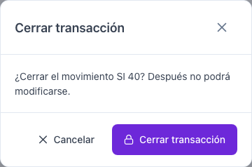

Verá *"Movimiento SI 40 cerrado"* y el documento pasa a solo lectura.

El botón está deshabilitado, con el motivo debajo, si:

- hay líneas sin guardar (*"Hay N líneas sin guardar"*), o
- el documento no tiene líneas (*"Agregue al menos una línea"*).

### Editar un documento cerrado

Si su usuario tiene el permiso especial para editar documentos cerrados, en un documento cerrado verá **Editar cerrado**. Al usarlo aparece el aviso *"Editando un documento cerrado — Sigue cerrado: cada línea se guarda y la contabilidad se vuelve a registrar."* y la captura funciona como en un documento abierto.

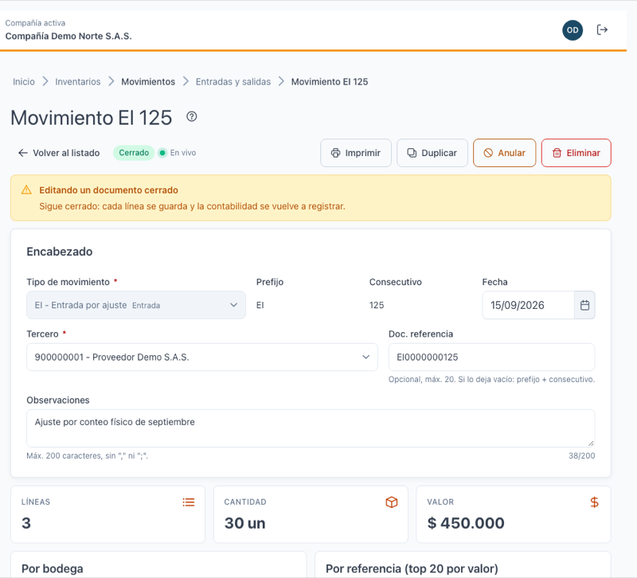

---

## 🚫 Anular o eliminar

| | **Anular** | **Eliminar** |
|---|---|---|
| ¿Qué pasa con el documento? | **Se conserva** como rastro, con el motivo, quién y cuándo | **Desaparece** con sus líneas, su contabilidad y sus adjuntos |
| Existencias y costos | Deja de afectarlos | Deja de afectarlos |
| ¿Se puede deshacer? | No | No |
| Cuándo usarlo | Documentos cerrados, o cuando necesita dejar evidencia | Documentos hechos por error que no tienen nada relacionado |

Ambas acciones exigen que el **periodo** del documento esté **abierto**.

### Anular

Haga clic en **Anular**, escriba el **Motivo de anulación** (obligatorio, máx. 200 caracteres, sin comas ni punto y coma) y confirme. Si el documento estaba abierto, queda también cerrado.

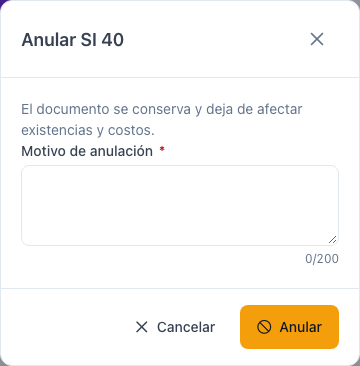

El documento muestra *"Documento anulado: <motivo>"* con quién y cuándo lo anuló. Un documento anulado **no se puede eliminar** (*"Los documentos anulados se conservan"*) ni imprimir.

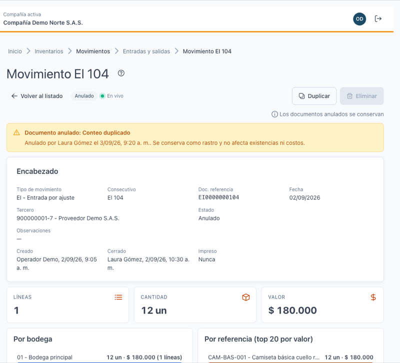

### Eliminar

Eliminar pide una confirmación reforzada:

1. Haga clic en **Eliminar**. El diálogo dice exactamente qué se borrará: *"Se eliminarán el documento EI-125, sus 3 líneas, sus 2 registros contables y sus 2 adjuntos. No se puede deshacer."*
2. Si el documento está **cerrado**, le recomienda *"Mejor anúlelo: se conserva y deja de afectar existencias."* con el botón **Anular** en el mismo diálogo.
3. Para habilitar **Eliminar**, escriba el **número del documento** tal como se indica (*"Escriba EI-125 para confirmar"*).

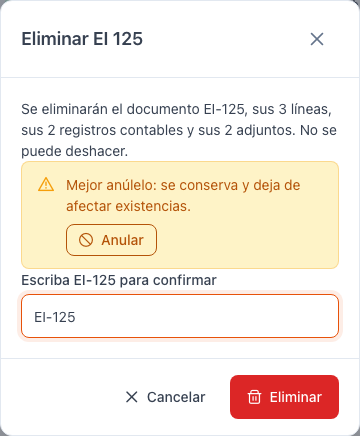

**Eliminar** no aparece, o aparece deshabilitado con el motivo, cuando:

| Motivo que verá | Qué significa |
|-----------------|---------------|
| *"Tiene documentos relacionados; anúlelo en su lugar"* | Otro documento depende de este |
| *"Los documentos anulados se conservan"* | Ya está anulado |
| *"El periodo está cerrado"* | La fecha cae en un periodo cerrado |

> ⚠️ Para evitar borrados masivos por error, hay un límite de eliminaciones seguidas por usuario. Si lo alcanza verá *"Demasiadas eliminaciones seguidas; intente de nuevo en N s"*.

---

## 🖨️ Imprimir

Haga clic en **Imprimir** (en el listado o en el documento). Se abre la vista del formato en tamaño carta; la barra superior indica qué formato se aplicó, por ejemplo *"Formato FRT-INV-001 (tipo EI)"*. Haga clic en **Imprimir** para enviarlo a la impresora o guardarlo en PDF desde el navegador, y en **Volver al documento** para regresar.

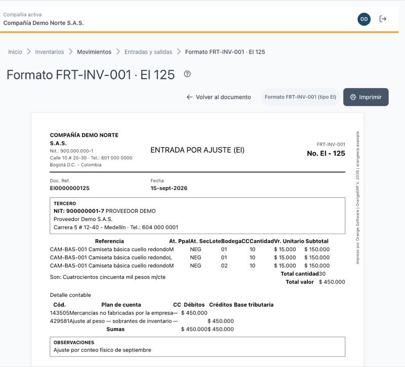

El formato por defecto **FRT-INV-001** incluye, en este orden: datos de la compañía; tipo, número, doc. referencia y fecha; datos del tercero; líneas (referencia, atributos, lote, bodega, centro de costos, cantidad, valor unitario y subtotal); total de cantidad, total de valor y el valor en letras; el detalle contable con sus sumas; observaciones; firma de recibido; y el pie con quién lo elaboró, **Original** o **Copia**, y la fecha y hora de impresión.

- La **primera** impresión dice **Original**; las siguientes, **Copia**. Cada impresión queda registrada (*"Impresión n.º N registrada"*) y el encabezado del documento muestra cuántas veces se ha impreso.
- **Papel y color:** en la barra superior elija **Carta** o **A4** y, en la hoja, **Color** o **Blanco y negro**.
- **Descargar PDF:** el botón **Descargar PDF** genera el formato en el servidor con el papel y el modo elegidos y lo guarda con el nombre del documento, por ejemplo `EI-125.pdf`. Mientras se descarga, el botón muestra un indicador y no se puede pulsar de nuevo. Descargar no suma una impresión: el contador cuenta las veces que se abre la vista. Si el documento es demasiado grande (más de 4000 líneas) aparece *"El documento es demasiado grande para el PDF; usa Imprimir"*; en ese caso use **Imprimir**.
- **Formato por tipo:** cada tipo de movimiento puede tener su propio formato, configurado en el tipo de movimiento. Un formato puede cambiar el título, los textos fijos, las columnas opcionales, las firmas (por ejemplo *Entregó* y *Recibió*) y ocultar valores, valor en letras o contabilidad. Si el tipo no tiene formato o el configurado no existe, se usa **FRT-INV-001**.

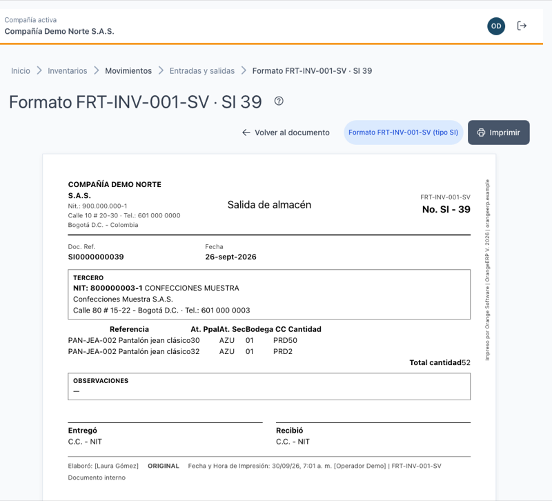

---

## 📑 Duplicar

**Duplicar** (en el listado o en el documento) abre un documento **nuevo** con el mismo tipo, tercero, observaciones y líneas del original, con la fecha de hoy y el valor unitario **sugerido de nuevo** para esa fecha. No copia el consecutivo, el doc. referencia ni los adjuntos.

Las líneas copiadas aparecen como **Por guardar** y el aviso dice *"Copia de EI 125: revise y pulse Guardar todas"*. Revise, corrija o quite lo que necesite y haga clic en **Guardar todas**: se envían una a una (la primera crea el documento) y cada una muestra su estado. Es útil para devoluciones o movimientos que se repiten.

---

## 🔄 Cambios de otros usuarios (en vivo)

Si otra persona crea, modifica o elimina movimientos mientras usted trabaja, **no tiene que recargar**:

**En el listado**

- El listado y el resumen se actualizan solos, sin perder filtros, orden ni página; las filas nuevas o modificadas se **resaltan** unos segundos.
- Aparece un aviso como *"Otro usuario creó un movimiento"*, *"… modificó un movimiento"* o *"… eliminó un movimiento"*.

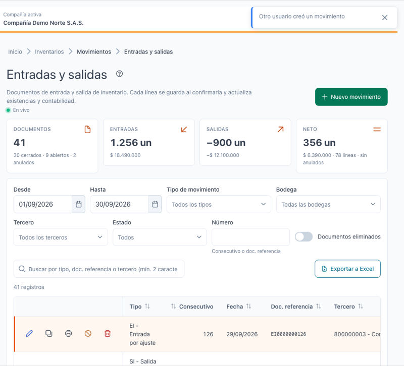

**En un documento abierto**

- Si otro usuario lo modifica, verá *"Otro usuario modificó este documento"* con **Ver sus cambios**. Al usarlo, la pantalla se actualiza **sin tocar** lo que usted está capturando ni sus líneas en cola.
- Si otro usuario lo elimina, verá *"Este documento fue eliminado por otro usuario"*: ya no se puede guardar. Sus líneas sin guardar se pueden llevar a un documento nuevo con **Duplicar**.
- Si otro usuario lo cierra o anula mientras usted captura, las líneas pendientes muestran *"El documento ya no se puede modificar (lo cerró, anuló o eliminó otro usuario)."*

**Conflictos.** Si usted cambia una línea que otro usuario acaba de cambiar, la línea queda **En conflicto** con el valor actual (*"Otro usuario cambió esta línea (ahora 8 un)"*) y dos opciones: **Usar la actual** (descarta su cambio) o **Aplicar mi cambio sobre la actual**. Si la línea fue quitada, verá *"Otro usuario quitó esta línea"*.

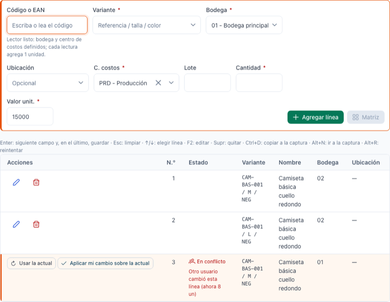

Si el conflicto es en el **encabezado**, verá *"Otro usuario cambió el encabezado"* con quién y a qué hora, y las opciones **Recargar encabezado** o **Aplicar mis cambios** (lo que usted escribió se conserva para volver a aplicarlo).

> ℹ️ Junto al estado verá **En vivo** mientras la conexión esté activa y **Reconectando…** si se interrumpe. Sin conexión en vivo la pantalla funciona igual; los cambios de otros se ven al recargar. Los cambios que usted hace en esta misma pestaña no generan avisos.

---

## 🕵️ Bitácora (solo administradores)

> 🚧 La pestaña **Bitácora** se habilita en una próxima entrega y mientras tanto muestra *"Disponible en la próxima entrega"*. El interruptor **Documentos eliminados** del listado todavía no aparece. Esta sección describe cómo van a funcionar.

Los **administradores de la compañía** ven la pestaña **Bitácora** en cada documento: quién creó, cambió, cerró, anuló, imprimió o eliminó el movimiento y sus líneas, y cuándo.

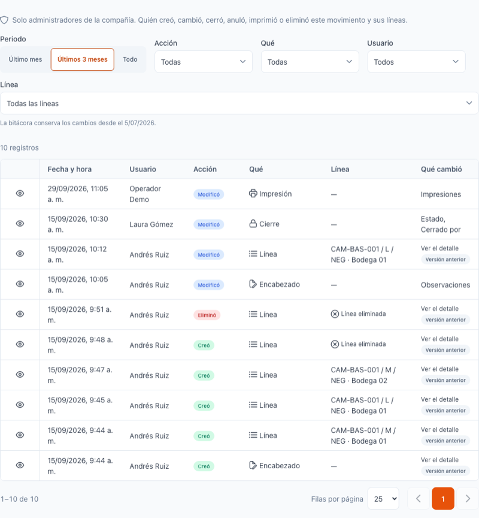

- **Filtros**: **Periodo** (Último mes, Últimos 3 meses, Todo), **Acción** (Creó, Modificó, Eliminó), **Qué** (Encabezado, Línea, Cierre, Impresión, Anulación, Eliminación del documento), **Usuario** y **Línea**.
- **Ver el detalle** (ojo) muestra cada campo **Antes** y **Después**; **Mostrar todos los campos** incluye los que no cambiaron.
- Los registros marcados **Versión anterior** los guardó la versión anterior de OrangeERP: se muestra lo que guardó, sin comparar campos.
- Si alguien cambia el documento mientras usted mira la bitácora, verá *"Hay cambios nuevos en este movimiento."* con **Actualizar**.
- Debajo de los filtros se indica desde qué fecha conserva cambios la bitácora.

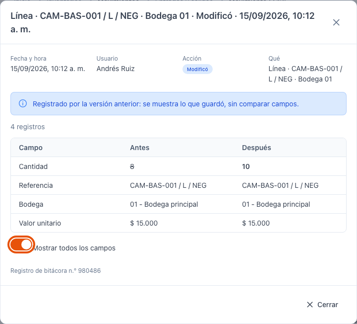

**Documentos eliminados.** En el listado, el interruptor **Documentos eliminados** muestra los documentos eliminados en el rango de fechas, con quién y cuándo los eliminó. **Ver bitácora** abre la bitácora de ese documento en solo lectura.

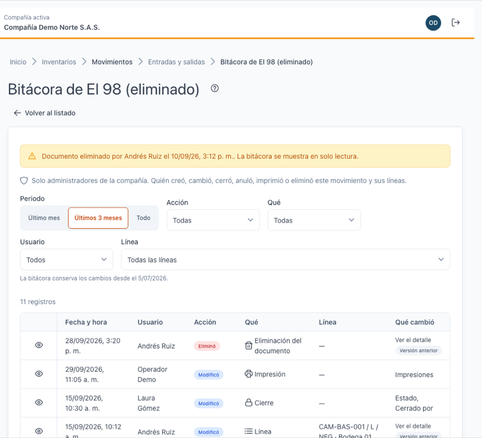

Si su usuario no es administrador, no verá la pestaña ni el interruptor.

---

## ❓ Preguntas frecuentes

**No veo el botón Importar.**
Necesita los permisos **Crear** y **Exportar** sobre Entradas y salidas. Consulte a su administrador.

**Mi archivo tiene un error en una fila: ¿se crean los demás documentos?**
No. Con una fila con error no se puede aplicar: corrija el archivo y vuelva a cargarlo. Ver [Importar](#-importar-entradas-y-salidas-desde-excel).

**Apliqué y la pantalla dice "En proceso". ¿Tengo que esperar?**
No. Puede salir: el resultado llega a la campana y puede volver a abrir la importación.

**Fallaron algunos documentos, ¿se pierden los que sí se aplicaron?**
No. Cada documento es una transacción propia. Use **Reintentar pendientes**: solo se procesan los que faltan, sin duplicar.

**Envié el archivo otra vez y no se creó otro proceso.**
Es lo esperado: dentro de 10 minutos el mismo archivo reutiliza el proceso en curso. Si ya hubo un resultado parcial verá el aviso 409 IMPORT_PARCIAL.

**¿Cuántos documentos puedo aplicar por archivo?**
Hasta 200 documentos y 5.000 líneas. Los archivos grandes pueden tardar; por eso la aplicación es en segundo plano.

**¿Los documentos importados quedan cerrados?**
No. Quedan **Abiertos**; ciérrelos desde el listado.

**¿Tengo que guardar el documento al final?**
No. Cada línea se guarda al confirmarla. Lo único que puede hacer al final es **Cerrar transacción**, para que nadie lo modifique.

**Cerré la pestaña con líneas "En cola" o con error. ¿Se guardaron?**
No. Solo quedan registradas las líneas con número (**N.º**). Abra el documento desde el listado, revise qué líneas tiene y vuelva a capturar las que falten.

**Leí dos veces el mismo producto y solo veo una línea.**
Es lo esperado: las lecturas iguales se **suman** a la misma línea (*"Sumada a la línea N"*). Revise la cantidad de esa línea.

**Una línea dice "No se guardó". ¿Si reintento se duplica?**
No. Antes de reenviarla, el sistema comprueba si ya había quedado guardada (*"La línea ya estaba guardada; no se reenvió."*).

**Me dice "La existencia quedaría en −1", pero en la versión anterior sí me dejaba.**
En esta versión las existencias negativas y el periodo cerrado se validan **siempre en el servidor**, línea por línea, salvo que el tipo de movimiento permita negativos. Revise la existencia de la bodega (se ve en la captura) o registre primero la entrada.

**Las cantidades con decimales se redondeaban antes.**
Ahora se aceptan hasta **4 decimales** y se respetan en la existencia, en la contabilidad y en el formato impreso.

**No puedo cambiar el tipo de movimiento.**
El tipo se bloquea al guardar la primera línea. Si se equivocó de tipo, elimine el documento (o anúlelo si ya está cerrado) y créelo de nuevo; **Duplicar** le ahorra volver a capturar las líneas.

**Cambié la fecha del documento y el valor de las líneas no cambió.**
Es lo esperado: cambiar la fecha no recalcula el valor de las líneas ya guardadas. Si necesita el costo de la nueva fecha, cambie el valor de cada línea o duplique el documento.

**¿Anulo o elimino?**
Anule si el documento está cerrado o si necesita dejar evidencia; elimine solo documentos hechos por error que no tengan nada relacionado. Ver la tabla de *Anular o eliminar*.

**El formato impreso no es el que espero.**
Revise qué formato tiene configurado el tipo de movimiento (la barra de impresión lo indica). Si el tipo no tiene uno válido, se usa FRT-INV-001.

**Veo "Disponible en la próxima entrega" en Adjuntos o en Bitácora.**
Esas dos pestañas se habilitan en una próxima entrega. Todo lo demás (capturar y guardar líneas, cambiar el encabezado, cerrar, anular, eliminar, duplicar e imprimir) ya funciona. Mientras tanto, para adjuntar soportes o revisar quién cambió un documento, use la versión anterior de OrangeERP.

**No veo "En vivo".**
La conexión en vivo no está disponible en este momento (por ejemplo, por la red de su empresa). La pantalla funciona igual; para ver cambios de otros usuarios, recargue la página.
