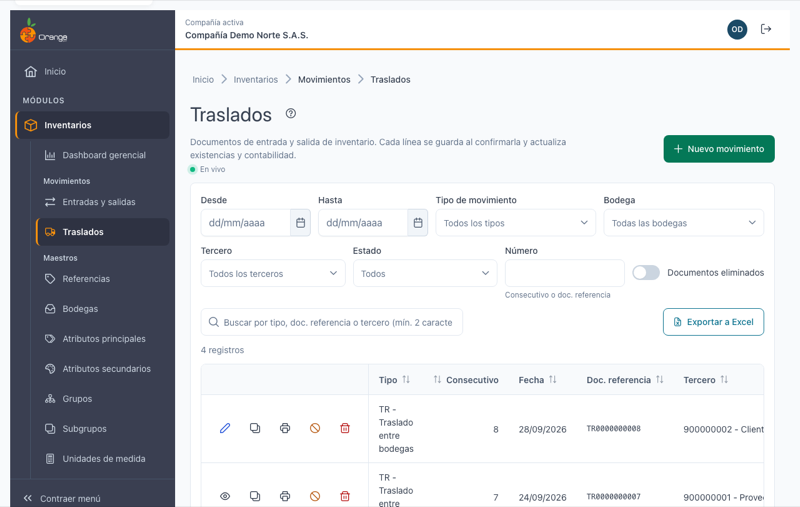
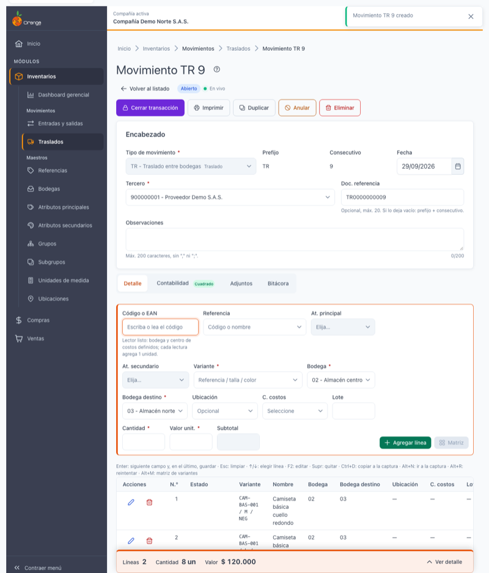
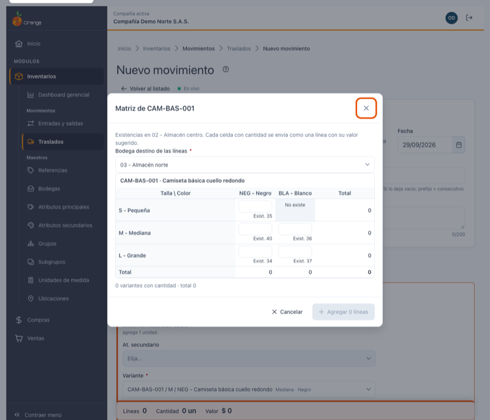
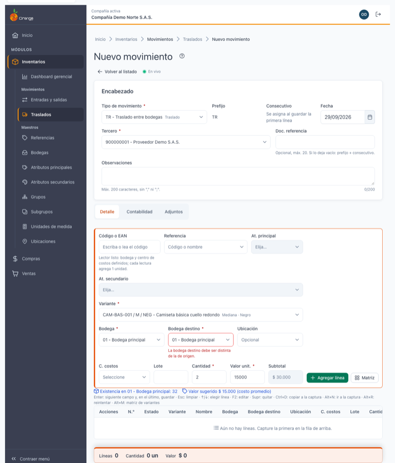
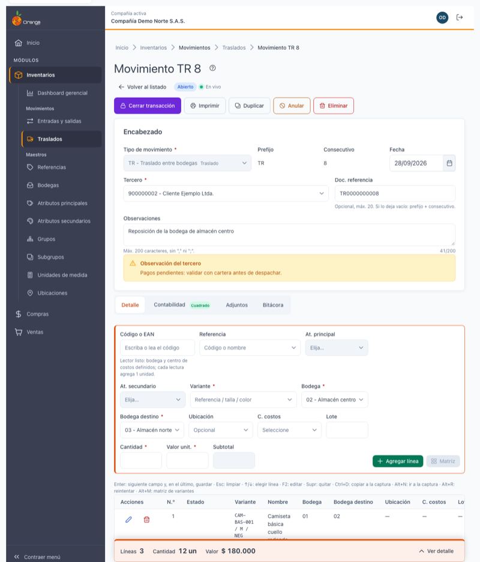
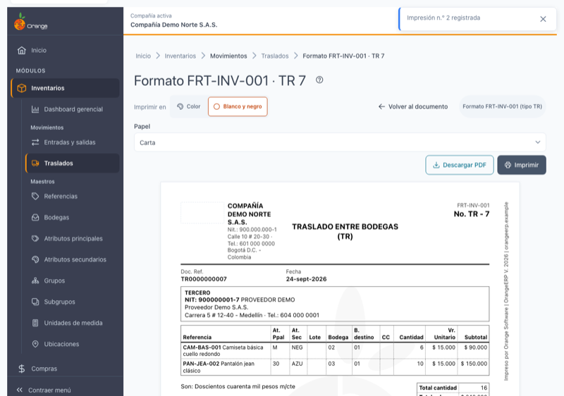

[Regresar a Inventarios](../readme.md)

---

# 🚚 Traslados

---

## 📋 Descripción

Un **traslado** es el documento con el que mercancía **sale de una bodega y entra a otra** de la misma compañía. Cada línea indica qué referencia se mueve, desde qué **bodega (origen)**, hacia qué **bodega destino**, cuántas unidades y a qué valor. Al guardar la línea, las existencias **bajan en el origen y suben en el destino** al mismo tiempo.

Esta pantalla funciona **igual que [Entradas y salidas](entradas-salidas.md)**: cada línea se guarda en el momento en que la confirma, no hay botón "Guardar documento", y se puede cerrar, anular, eliminar, duplicar, imprimir y exportar. Aquí solo se explica lo que es **distinto en los traslados**; para el resto (captura por teclado, lector de código de barras, estados de línea, encabezado) consulte ese manual.

> 📘 El orden, la paginación y la ayuda funcionan como en las demás tablas: ver [Manejo general de la información](../../Generales/manejo-general-informacion.md).

> 💡 Cada pestaña del navegador trabaja con **una compañía**. El nombre de la compañía se ve en la barra superior.

---

## 🎯 Acceso

1. En el menú principal, haga clic en **Inventarios**.
2. En **Movimientos**, haga clic en **Traslados**.

---

## 🖥️ Pantalla principal

El listado, los filtros (**Desde**, **Hasta**, **Tipo de movimiento**, **Bodega**, **Tercero**, **Estado**, **Número**), el resumen, la búsqueda y la exportación a Excel son los mismos de [Entradas y salidas](entradas-salidas.md#-filtrar-el-listado-y-leer-el-resumen). Lo que cambia:

- Solo ve los **tipos de movimiento de traslado** que su usuario tiene autorizados (por ejemplo *TR - Traslado entre bodegas*).
- El listado **no tiene columna de bodega destino**: un mismo documento puede llevar líneas con destinos distintos. El destino se ve en el detalle del documento.
- Los estados son los mismos: **Abierto**, **Cerrado** y **Anulado**.

**¿No ve algún botón?** Cada acción depende de los permisos de su perfil sobre la opción *Traslados*:

| Permiso | Qué habilita |
|---------|--------------|
| Consultar | Ver el listado y abrir los documentos en solo lectura |
| Crear | **Nuevo movimiento** y **Duplicar** |
| Actualizar | Agregar, cambiar y quitar líneas, cambiar el encabezado y **Cerrar transacción** |
| Anular | **Anular** |
| Eliminar | **Eliminar** |
| Imprimir | **Imprimir** y **Descargar PDF** |
| Exportar | **Exportar a Excel** |
| Editar documentos cerrados (permiso especial del usuario) | **Editar cerrado** |

Si su usuario no tiene permiso para consultar traslados, la pantalla le muestra el aviso de acceso restringido.

---

## ➕ Crear un traslado

Haga clic en **Nuevo movimiento** y llene el encabezado (tipo de traslado, fecha, tercero, doc. referencia y observaciones) como en [Entradas y salidas](entradas-salidas.md#-crear-un-movimiento). El tipo se bloquea al guardar la primera línea.

La fila de captura trae un campo adicional, **Bodega destino**, justo después de **Bodega**:

**Código o EAN → Variante → Bodega (origen) → Bodega destino → Ubicación → C. costos → Lote → Cantidad → Valor unit.**

| Campo | Regla |
|-------|-------|
| **Bodega** | La bodega de **origen**: de donde sale la mercancía. Obligatoria. |
| **Bodega destino** | La bodega **a donde llega**. **Obligatoria y distinta de la de origen.** Se busca escribiendo código o nombre. |

- La tabla de líneas muestra las columnas **Bodega** y **Bodega destino** de cada línea.
- Cada línea puede tener su **propio destino**, así que en un mismo traslado puede enviar mercancía a varias bodegas.
- Al agregar una línea, la captura se limpia **conservando bodega, bodega destino, ubicación y centro de costos** para que siga con la siguiente.
- Dos lecturas de la misma variante se **suman** en una sola línea solo si coinciden también en la **bodega destino**; si el destino es distinto, quedan en líneas separadas.
- La existencia que se valida (y que puede impedir guardar si quedaría en negativo) es la de la bodega de **origen**.

---

## 🧮 Matriz de tallas y colores

Para referencias con tallas y colores, **Matriz** abre la tabla talla × color como en [Entradas y salidas](entradas-salidas.md#-captura-por-teclado), con un selector adicional: **Bodega destino de las líneas**.

1. Elija la bodega origen en la captura y abra **Matriz**.
2. Elija la **Bodega destino de las líneas**. Mientras no sea válida, el botón **Agregar** permanece deshabilitado.
3. Escriba las cantidades y haga clic en **Agregar N líneas**: cada celda con cantidad se envía como una línea con ese destino.

---

## ⚠️ Errores frecuentes

| Mensaje | Qué significa y qué hacer |
|---------|---------------------------|
| *"Elija la bodega destino"* | Falta el destino. La línea no se envía hasta que lo elija. |
| *"La bodega destino debe ser distinta de la bodega origen"* | Eligió como destino la misma bodega de origen. Cambie una de las dos. Si cambia la bodega de origen, el aviso se revisa de nuevo. |
| *"Elija una bodega destino válida"* | La bodega no existe, está inactiva o no está disponible para su usuario. Elíjala otra vez en el buscador. |
| Línea en **Error** con el mismo texto de la bodega destino | El sistema también revisa la regla al guardar. Use **Corregir** para cambiar el destino o **Descartar** para quitar la línea. |

Los avisos de existencia negativa, periodo cerrado y líneas sin guardar son los de [Entradas y salidas](entradas-salidas.md#-estado-de-cada-línea).

---

## 📄 El documento

El documento tiene las mismas partes que en Entradas y salidas (barra de acciones, encabezado, resumen y pestañas **Detalle**, **Contabilidad**, **Adjuntos** y **Bitácora**), con las columnas **Bodega** y **Bodega destino** en las líneas.

### 🔒 Cerrar la transacción

Haga clic en **Cerrar transacción** y confirme. El documento pasa a solo lectura. El botón se deshabilita, con el motivo debajo, si hay líneas sin guardar o si el documento no tiene líneas. Con el permiso especial puede usar **Editar cerrado**. Detalle en [Cerrar la transacción](entradas-salidas.md#-cerrar-la-transacción).

### 🚫 Anular o eliminar

- **Anular** conserva el documento como rastro (con motivo, quién y cuándo) y deja de afectar existencias **de ambas bodegas**: lo que salió del origen y entró al destino se revierte. Un documento anulado no se puede eliminar ni imprimir.
- **Eliminar** borra el documento con sus líneas y registros; pide escribir el número del documento para confirmar y exige periodo abierto.

Si el documento está cerrado o necesita dejar evidencia, anule en lugar de eliminar. Detalle en [Anular o eliminar](entradas-salidas.md#-anular-o-eliminar).

### 📑 Duplicar

**Duplicar** abre un traslado nuevo con el mismo tipo, tercero, observaciones y líneas, **incluida la bodega destino de cada línea**, con la fecha de hoy. Revise y haga clic en **Guardar todas**. Detalle en [Duplicar](entradas-salidas.md#-duplicar).

### 📎 Adjuntos

La pestaña **Adjuntos** guarda los soportes del traslado (actas, remisiones, fotos), máximo 10 MB por documento, como en Entradas y salidas. Mientras no esté habilitada verá *"Disponible en la próxima entrega"*.

---

## 🖨️ Imprimir y descargar PDF

**Imprimir** (en el listado o en el documento) abre el formato en tamaño carta. El formato de traslados agrega la columna **B. destino** junto a la bodega de origen. Puede elegir **Carta** o **A4**, **Color** o **Blanco y negro**, imprimir en la impresora o guardar en PDF con **Descargar PDF** (por ejemplo `TR-9.pdf`). La primera impresión dice **Original** y las siguientes **Copia**. Más información en [Imprimir](entradas-salidas.md#-imprimir).

---

## 🔄 Cambios de otros usuarios (en vivo)

Junto al estado verá **En vivo** mientras la conexión esté activa. Los traslados que otros usuarios crean, cambian, cierran, anulan o eliminan aparecen solos en el listado, y si alguien modifica el documento que usted tiene abierto, la pantalla se lo avisa con opciones para recargar o aplicar sus cambios. Esto se limita a los **traslados de la compañía actual**. Si ve **Reconectando…** la pantalla sigue funcionando y los cambios de otros se ven al recargar. Detalle en [Cambios de otros usuarios](entradas-salidas.md#-cambios-de-otros-usuarios-en-vivo).

---

## ❓ Preguntas frecuentes

**¿Cuál es la bodega de origen y cuál la de destino?**
**Bodega** es de donde sale la mercancía y **Bodega destino** a donde llega.

**No me deja guardar: "La bodega destino debe ser distinta de la bodega origen".**
Para mover mercancía necesita dos bodegas diferentes. Cambie el destino o el origen de esa línea.

**¿Puedo enviar el mismo documento a varias bodegas?**
Sí. El destino se elige por línea; un mismo traslado puede tener líneas con destinos distintos.

**Leí dos veces el mismo producto y quedaron dos líneas.**
Las lecturas solo se suman si coinciden en bodega, bodega destino, valor, ubicación, centro de costos y lote. Si el destino cambió, son líneas distintas.

**No veo la opción Traslados en el menú.**
Su perfil no tiene permiso de consulta sobre la opción. Pídaselo al administrador de la compañía.

**No encuentro un tipo de movimiento al crear.**
Solo aparecen los tipos de traslado autorizados a su usuario.

**Me equivoqué de destino en un documento cerrado.**
Anule el documento y créelo de nuevo (**Duplicar** copia las líneas con su destino), o use **Editar cerrado** si tiene ese permiso.
