[Regresar a Inventarios](../readme.md)

---

# 💰 Recálculo de Costos

---

## 📋 Descripción

El **recálculo de costos** corrige errores de costos en las salidas (ventas, traslados, consumos) y movimientos de inventario de **una referencia**. Lo usa cuando:

- Los costos quedaron **dañados** (no coinciden con los cálculos de inventario).
- Registró una **salida antes de la entrada** (una venta antes de la compra) y los costos quedaron negativos o en 0.
- Necesita **auditar o ajustar** costos por período.

El recálculo es **de lectura** de la referencia completa (el historial de entradas y salidas) pero puede **escribir en la contabilidad** si lo autoriza en la casilla al confirmar. Es siempre de **una referencia a la vez**, en un **rango de fechas** opcional, con **vista previa obligatoria** antes de aplicar.

> 📘 La pantalla tiene ayuda en el panel lateral (botón **?**) y el historial de recálculos se ve en la ficha de la referencia, en la pestaña **Historial de costos**. Ver [Manejo general de la información](../../Generales/manejo-general-informacion.md).

> 💡 Cada pestaña del navegador trabaja con **una compañía**. El nombre de la compañía se ve en la barra superior.

---

## 🎯 Acceso

1. En el menú principal, haga clic en **Inventarios**.
2. En **Procesos**, haga clic en **Recálculo de Costos**.

Permisos de la opción:

| Permiso | Qué permite |
|---------|-------------|
| **Consultar** | Ver la pantalla y la vista previa. Sin este permiso la pantalla muestra "No tienes acceso a esta opción". |
| **Actualizar** | Botón **Aplicar recálculo** para ejecutar el recálculo. Sin este permiso el botón no aparece. |
| **Crear** | Casilla **Reconstruir también los asientos contables** y botón **Reconstruir asientos** en el historial. Sin este permiso la casilla queda deshabilitada y el botón no aparece. |
| **Anular** | Botón **Revertir** en el historial para deshacer un recálculo. Sin este permiso el botón no aparece. |
| **Exportar** | Botones **Exportar Excel** y **Exportar PDF** en el historial. Sin estos permisos los botones no aparecen. |

---

## 🖥️ Pantalla principal

Al entrar, la pantalla pide una **referencia obligatoria**. Una vez elegida, puede ver la vista previa sin permisos especiales. Para aplicar el recálculo se necesita el permiso **Actualizar**.

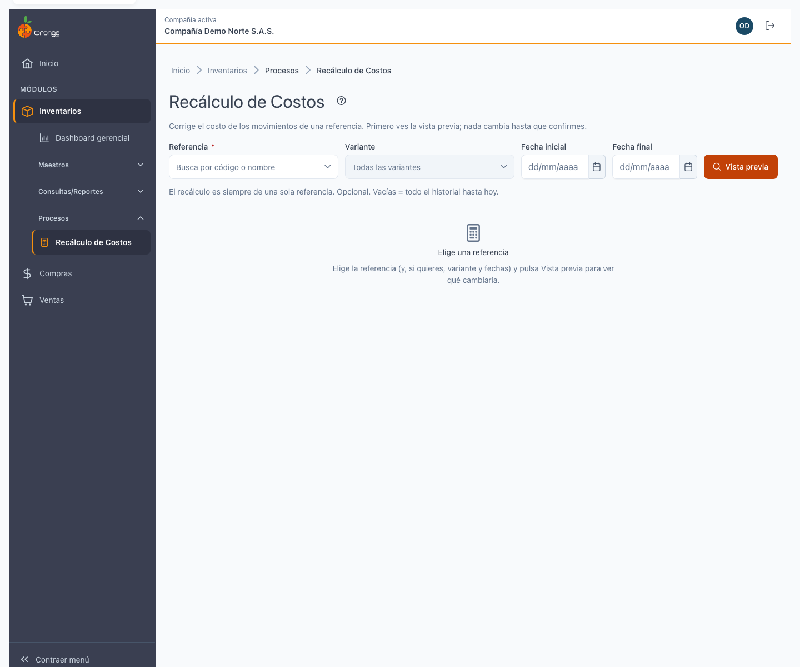

| Elemento | Para qué sirve |
|----------|----------------|
| **?** (junto al título) | Abre esta ayuda en un panel lateral. |
| **Referencia** | Escriba el código o el nombre de la referencia. Es obligatoria. Las referencias inactivas se marcan "(Inactiva)". |
| **Variante** (opcional) | Si la referencia tiene variantes (talla, color, etc.), elija una o déjela vacía para recalcular todas. Se habilita solo después de elegir la referencia. |
| **Fecha inicial** (opcional) | Por defecto, el primer movimiento de la referencia. La fecha no puede ser futura. |
| **Fecha final** (opcional) | Por defecto, hoy. La fecha no puede ser futura. Si la fecha inicial es posterior a la final, se rechaza. |
| **Vista previa** | Botón de búsqueda. Calcula qué cambiaría sin escribir nada aún. |

### Elegir una referencia

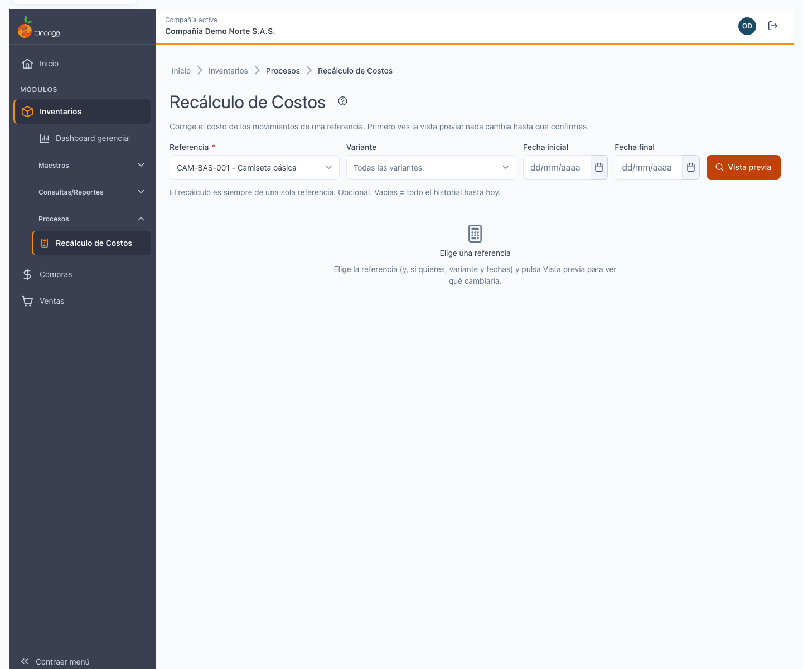

La referencia es obligatoria; puede elegir una inactiva, marcada con el texto "(Inactiva)". Los botones **Fecha inicial** y **Fecha final** no se aceptan si son futuras.

---

## 👁️ Vista previa

Pulse **Vista previa** para calcular qué cambiaría sin escribir nada. La vista previa es válida durante **15 minutos**. Si navega a otra pantalla y regresa en ese tiempo, verá la misma vista previa sin recalcular.

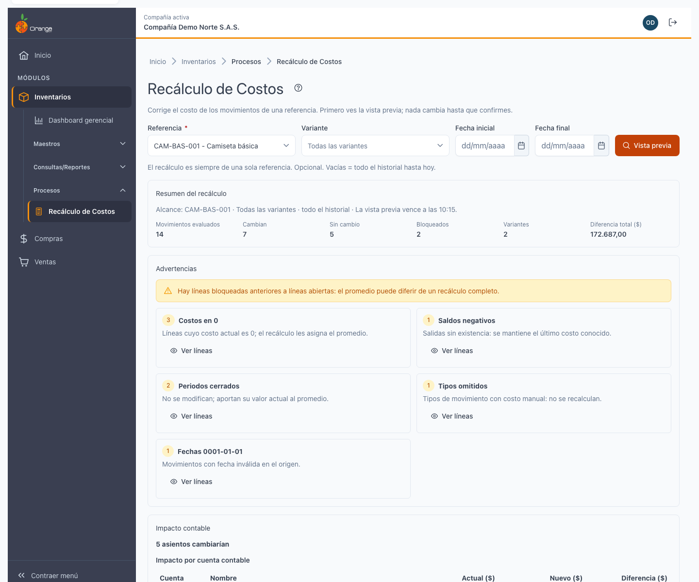

La vista previa muestra:

| Sección | Qué ve |
|---------|--------|
| **Resumen** | Cuántos movimientos se revisaron, cuántos cambiarán, cuántos no, cuántos están bloqueados (cerrados), cuántas variantes y la diferencia total en pesos. |
| **Advertencias** | Tarjetas con conteos si hay: costos en 0, saldos negativos, periodos cerrados bloqueados o entradas omitidas (tipos `Costos = 1`). **Ver líneas** filtra la tabla para mostrar solo las de esa advertencia. |
| **Impacto contable** | Tabla con las cuentas que cambiarían y el impacto de cada una (saldo actual, nuevo y diferencia). Si es un método estimado lo dice. Las filas suman al final. |
| **Líneas** | Tabla paginada (10, 25, 50 o 100 por página) con cada salida o movimiento: documento, fecha, tipo, variante, costo actual, costo nuevo, diferencia en pesos, **estado** (Cambia / Sin cambio / Bloqueado · motivo / Omitido) y si tiene asiento contable. |

### Errores comunes en la vista previa

**Ningún asiento cambiaría.** El recálculo no halló diferencias. Los costos ya son correctos o están intactos (ver *Qué no se recalcula*).

**Supera el tope de 3.000 líneas.** Acote la búsqueda por fechas más cortas o elija una variante específica.

**Periodo cerrado bloqueado.** El rango incluye fechas en un período que ya fue cerrado contablemente (ver *Períodos cerrados*).

---

## 📍 Períodos cerrados

Los **períodos cerrados** (meses, años o períodos especiales) **no pueden modificarse**. Si su rango incluye fechas de un período cerrado, la vista previa avisa que esos movimientos están **bloqueados** y no se recalcularán, incluso si tienen un costo incorrecto.

Por ejemplo, si cierra contablemente el mes de enero y luego intenta recalcular costos de una venta de enero, esa venta no cambia: está bloqueada por el cierre.

Para recalcular movimientos de períodos cerrados debe:
1. Abrir el período en **Configuración** (permiso de administrador).
2. Recalcular los costos.
3. Volver a cerrar el período.

---

## ⚙️ Qué se recalcula y qué no

### Se recalcula

- **Costo de salidas** (ventas, traslados, consumos internos): pasa del costo promedio anterior al costo promedio correcto según el historial de entradas.
- **Costo de movimientos** (reavalúos, ajustes): se recalcula si es correcto aplicar el promedio móvil.

### No se recalcula

- **Entradas** (compras, producciones): siempre mantienen su costo original, aunque esté en 0.
- **Movimientos de tipo `Costos = 1`**: son entradas que fijan un costo explícito; se protegen para no perder auditoría.
- **Salidas de referencias sin entradas** previas: la aplicación marca un aviso "Venta antes de la compra", pero el recálculo respeta lo registrado en lugar de asignar un costo imaginario.
- **Períodos cerrados**: los movimientos de períodos cerrados contablemente no se tocan.

---

## 💼 Aplicar el recálculo

Después de revisar la vista previa, pulse **Aplicar recálculo**. Se abrirá un diálogo de confirmación.

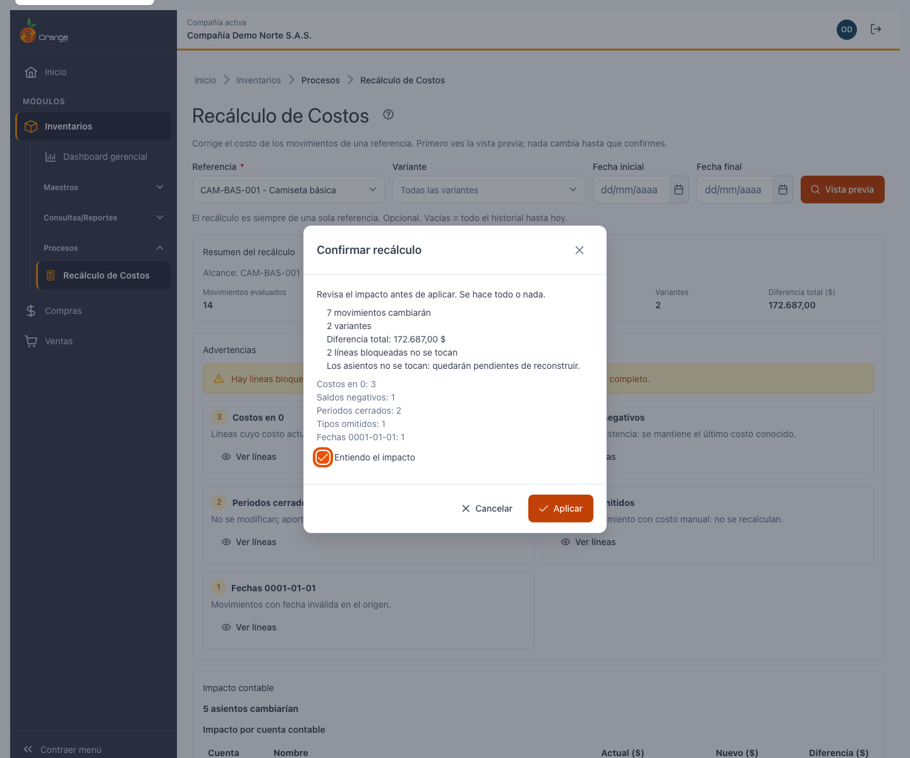

El diálogo muestra:
- El resumen del recálculo (cuántos cambiarán, cuántos bloqueados, cuántas variantes).
- La **diferencia total** en pesos.
- Una casilla **Entiendo el impacto** que debe marcar antes de confirmar.
- Botón **Aplicar** (solo se habilita al marcar la casilla).

### Casilla: Reconstruir también los asientos contables

En la vista previa, bajo el impacto por cuenta, hay una casilla **Reconstruir también los asientos contables**, **desmarcada por defecto**.

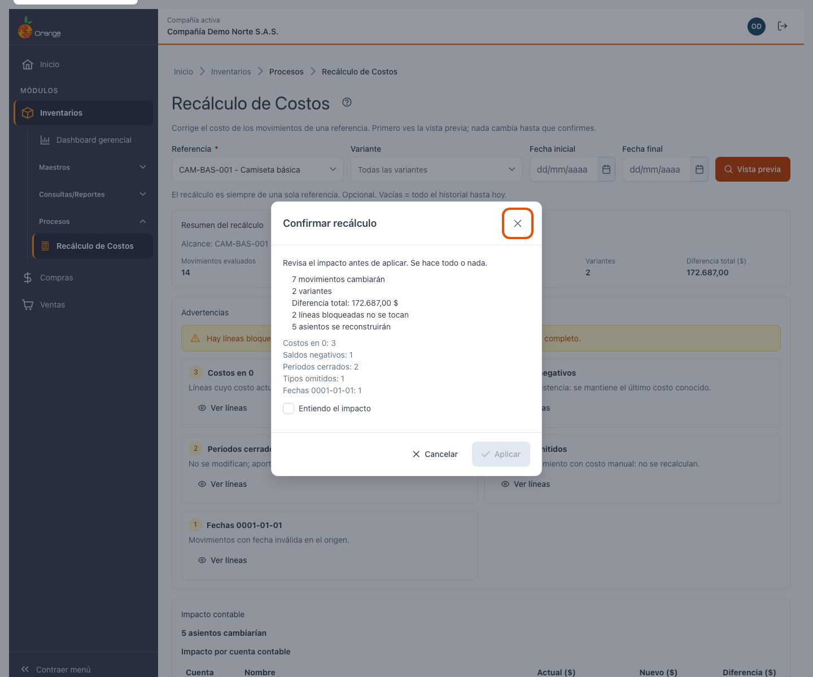

- Si **no la marca** (por defecto): los costos se actualizan en inventario, pero los asientos contables quedan desactualizados. Después del recálculo aparecerá un aviso con un botón **Reconstruir asientos** en el historial.
- Si **la marca**: los costos se actualizan y también se regeneran los asientos contables de una vez (requiere permiso **Crear**).

El cambio es importante: los asientos se regeneran cuando se construyeron desde costos promedio movibles. Si fueron registrados manualmente, regenerarlos puede perder auditoría.

---

## 📊 Progreso y resultado

Mientras se aplica el recálculo, ve un **indicador de progreso por etapas** (Validando, Actualizando costos, Reconstruyendo asientos [si lo marcó], Registrando en la bitácora, Confirmando). Es solo indicativo; la operación es atómica (todo o nada).

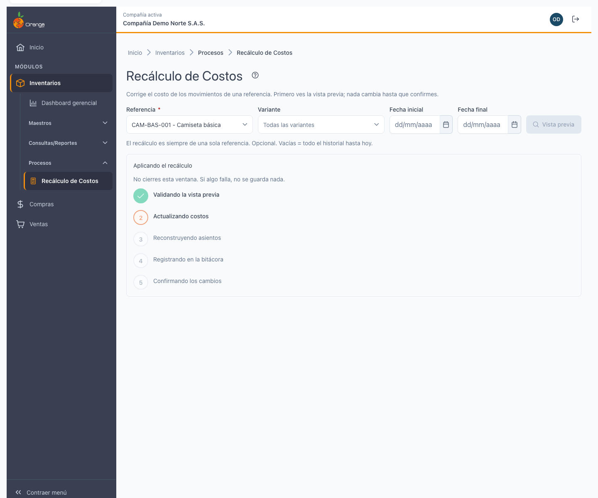

Al terminar verá:

**Resultado exitoso:**
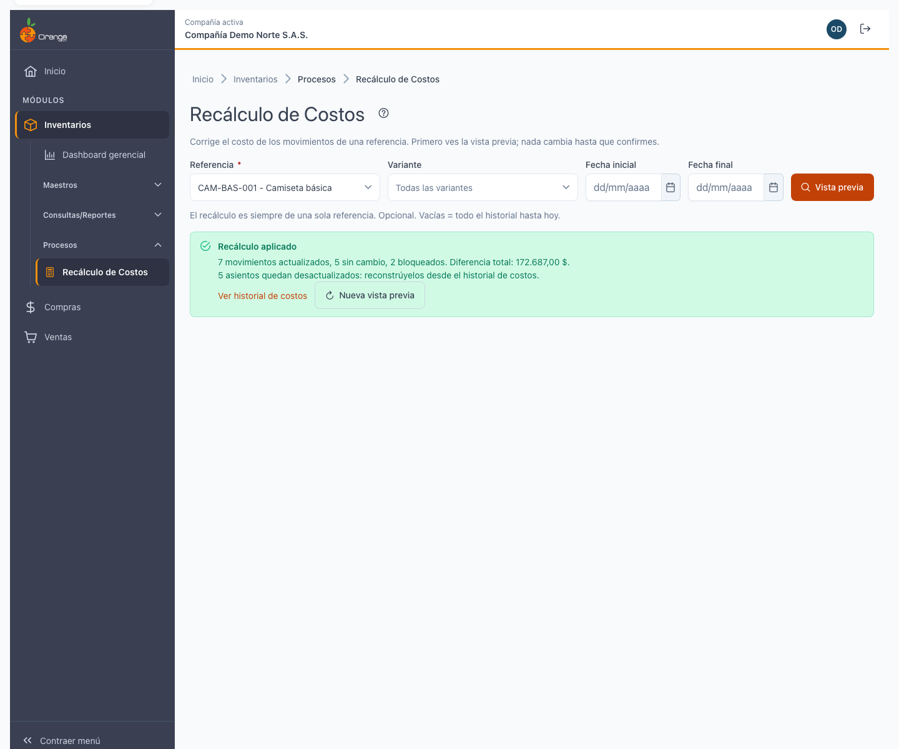

- Resumen con los conteos finales.
- Si regeneró asientos: cuántos se reconstruyeron.
- Si no: aviso de cuántos quedan desactualizados, con botón **Reconstruir asientos** en el historial.
- Enlace **Ver historial de costos** para auditar lo que cambió.
- Botón **Nueva vista previa** para otro recálculo.

**Error:**
Si algo falla (timeout, usuario sin permiso, etc.), verá el motivo real. La transacción es atómica: si falla a mitad, todo se revierte; nada quedó a medias.

---

## 🔄 Revertir un recálculo

El historial de costos de la referencia (pestaña **Historial de costos** en la ficha) muestra todos los recálculos realizados. Cada uno puede revertirse, restaurando los costos anteriores.

Para revertir:

1. En el historial, haga clic en el recálculo que quiere deshacer.
2. Se abre el detalle. Pulse **Revertir**.
3. Confirme en el diálogo.

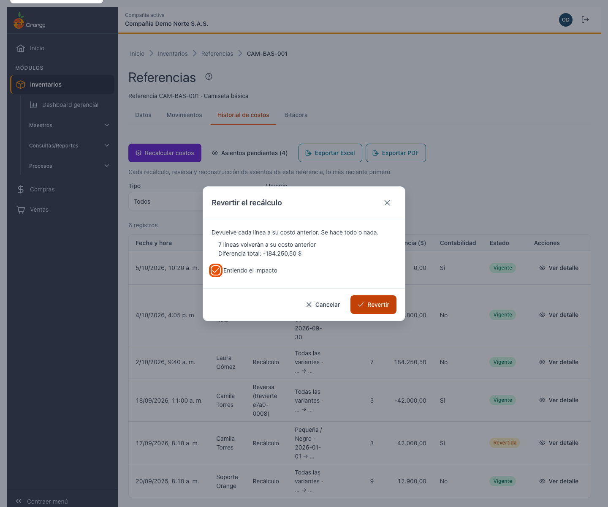

El diálogo muestra:
- Cuántas líneas volverán a su costo anterior.
- La diferencia total.
- Una nota: "Los asientos contables no se restauran": los asientos se regeneran sobre los costos nuevos (no regresan al contenido manual anterior, si lo había).
- Una casilla **Entiendo el impacto** que debe marcar.

Después de revertir:
- El estado del recálculo cambia a **Revertida** (con una insignia).
- Los costos vuelven a ser los de antes de ese recálculo.
- El historial conserva ambas entradas (el recálculo original y la reversa).

### Cuándo se puede revertir

No puede revertir un recálculo si:
- El período está **cerrado contablemente** (cerrada la auditoria).
- Ya fue **revertido** antes.
- El **historial fue depurado** (archivado después de mucho tiempo).
- Su usuario **no tiene permiso Anular** en la opción.

En estos casos, el botón **Revertir** está deshabilitado y muestra el motivo en texto.

---

## 📜 Historial de costos (ficha de la referencia)

La pestaña **Historial de costos** en la ficha de la referencia muestra el registro completo de todos los recálculos realizados y sus reversas.

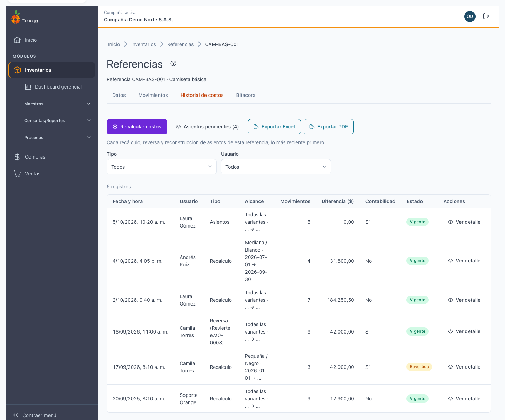

### Filtrar el historial

| Filtro | Opciones |
|--------|----------|
| **Tipo** | Recálculo · Reversa · Asientos (reconstrucciones) |
| **Usuario** | Quién ejecutó el recálculo |
| **Fecha desde / Fecha hasta** | Rango de fechas (opcional) |

### Columnas del listado

- **Fecha y hora** (zona de negocio).
- **Usuario** que ejecutó el recálculo.
- **Tipo**: "Recálculo", "Revierte e7a0-0008" (con el ID de lo que revierte), o "Asientos".
- **Alcance**: qué variante(s), rango de fechas.
- **Movimientos**: cuántos se evaluaron.
- **Diferencia $**: suma del impacto.
- **Contabilidad**: "Sí" si se reconstruyeron asientos, "No" si quedaron desactualizados.
- **Estado**: "Vigente" (en uso) o "Revertida" (desecha por una reversa posterior).
- **Ver detalle**: abre el modal con los datos completos.

### Detalle de un recálculo

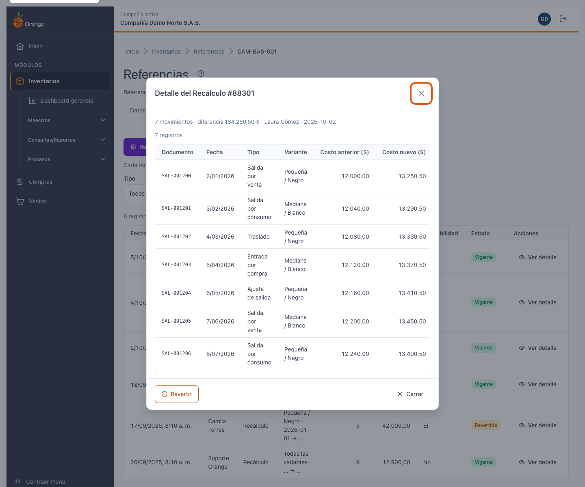

Muestra:
- Resumen (referencia, variante, fechas, conteos, diferencia).
- Tabla con cada movimiento: documento, fecha, tipo, variante, costo anterior y nuevo, diferencia, estado del asiento (Reconstruido / Desactualizado / Sin asiento / Bloqueado).
- Botón **Revertir** (si es aplicable).
- Botones **Exportar Excel** y **Exportar PDF** (solo con permiso **Exportar**).

### Asientos pendientes

Si quedaron asientos desactualizados (la casilla no se marcó al recalcular), aparecerá una vista "**Asientos pendientes**" en el historial con una lista de los movimientos que necesitan sus asientos reconstruidos.

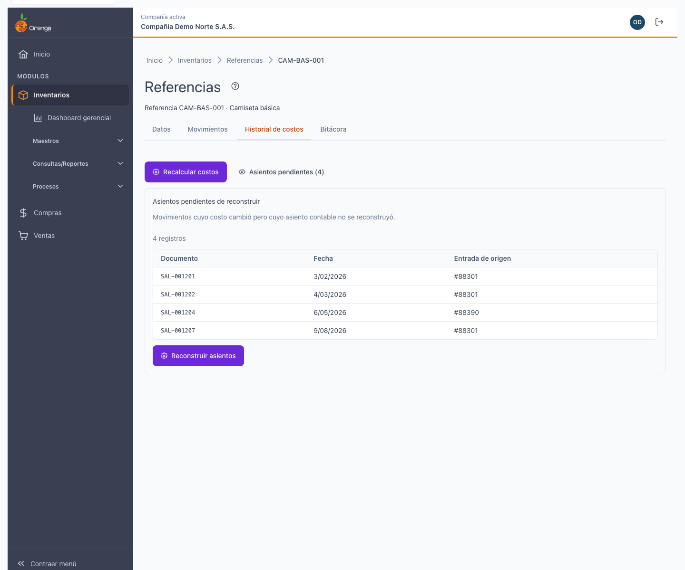

Pulse **Reconstruir asientos** para regenerarlos de una vez (requiere permiso **Crear**). El botón está deshabilitado con el motivo si no tiene el permiso.

---

## 📊 Bitácora del recálculo

El recálculo se registra en la **pestaña Bitácora** de la ficha de referencia con el rótulo "Recálculo de costos", mostrando:
- Quién lo hizo.
- Cuándo.
- Qué cambió (si se marca).
- Un enlace al historial de costos.

Esta entrada no se diferencia de la que aparece en **Historial de costos**: la Bitácora es un registro de cambios general, el Historial es específico de costos.

---

## 🏷️ Huella de la vista previa

Cada vista previa tiene una **huella** (una firma digital) para proteger contra cambios entre la vista previa y la aplicación:

- Si los datos de la referencia cambian entre que ve la vista previa y aplica (otro usuario editó un movimiento, por ejemplo), la huella no coincide y el recálculo **se rechaza**.
- Debe generar una **nueva vista previa** y confirmar de nuevo.

Esto garantiza que lo que aplica es lo que vio.

---

## 🔍 Cambios de otros usuarios en vivo

Si otro usuario actualiza movimientos de la misma referencia mientras está en la pantalla, la vista previa se invalida automáticamente. Verá un aviso "La información cambió; genere una nueva vista previa" con un botón **Nueva vista previa** para recalcular.

---

## ❓ Preguntas frecuentes

**¿Cuándo debo recalcular costos?** Cuando los costos no son consistentes con el cálculo de inventario (un promedio móvil da diferente resultado al costo que ve registrado). La mayoría de compañías nunca lo necesita; es para auditoría o ajustes especiales.

**¿Puedo recalcular todas las referencias a la vez?** No, siempre es una referencia a la vez. Si necesita recalcular muchas, use la pantalla varias veces.

**¿Qué pasa si hay periodos cerrados en mi rango?** El recálculo bloquea esos movimientos; no los cambia. Los movimientos abiertos sí se recalculan.

**¿Puedo deshacer un recálculo?** Sí, con el botón **Revertir** en el historial de costos de la referencia (pestaña **Historial de costos** en la ficha).

**¿Qué significa "Venta antes de la compra"?** Una salida registrada antes de sus entradas correspondientes, lo que produce costos negativos o en 0. El recálculo lo avisa, pero no lo corrige: la entrada debe registrarse en la fecha correcta.

**¿Qué son "asientos desactualizados"?** Costos recalculados en inventario pero asientos contables no regenerados (porque no marcó la casilla). Después del recálculo puede regenerarlos con el botón **Reconstruir asientos** en el historial.

**¿Cuál es la diferencia con el recálculo anterior (legado)?** El recálculo anterior calculaba toda la compañía si no elegía referencia (ahora es obligatorio elegirla una por una). No tenía vista previa ni reversa. Ahora tiene ambas, y auditoría completa en la bitácora.

**¿Puedo recalcular sin tocar la contabilidad?** Sí, deje la casilla **Reconstruir también los asientos contables** sin marcar (por defecto). Los costos cambian, pero los asientos quedan desactualizados hasta que los reconstruya después.

**¿Qué pasa si cambian los datos mientras estoy en la vista previa?** La huella lo detecta y rechaza el recálculo. Genere una nueva vista previa.

**¿Cuánto dura la vista previa?** 15 minutos. Después, si no aplicó, expira y debe generar una nueva.

---

## ⚠️ Advertencias comunes

- **Costos en 0:** algunas salidas no tienen costo. Revise si las entradas quedaron mal o están bloqueadas.
- **Saldos negativos:** hay más salidas que entradas. Registre las entradas en la fecha correcta.
- **Periodos cerrados:** sus movimientos no se tocan; abra el período si necesita recalcularlos.
- **Tipos omitidos:** las entradas con `Costos = 1` se protegen; no las cambia el recálculo.

---

## 🔐 Diferencias con el legado

| Aspecto | Legado | Ahora |
|--------|--------|-------|
| **Referencia** | Opcional (recalculaba toda la compañía) | Obligatoria (una a la vez) |
| **Vista previa** | No existía | Obligatoria antes de aplicar |
| **Reversa** | No existía | Sí, botón **Revertir** en el historial |
| **Asientos** | Se regeneraban sin avisar | Opción en una casilla, desmarcada por defecto |
| **Auditoría** | Sin registro | Bitácora completa con huella y entrada por cada ejecución |
| **Cerrojo** | Sin protección contra doble envío | Cerrojo por referencia; se rechaza si otro usuario está recalculando la misma |
| **Errores** | Se tragaban sin avisar | Motivo real, transacción atómica, sin cambios a medias |
| **Búsqueda** | Búsqueda de periodo solo | Búsqueda por referencia (obligatoria) + período opcional + variante |

---

[Regresar a Inventarios](../readme.md)
